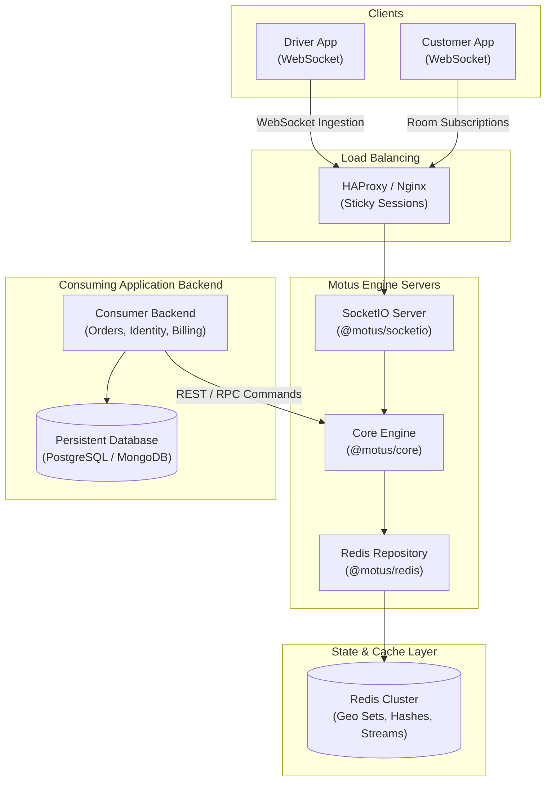
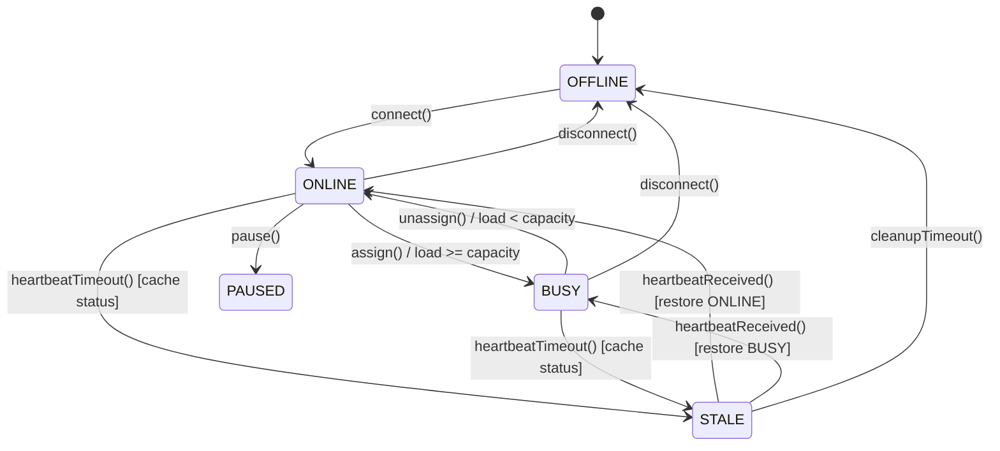
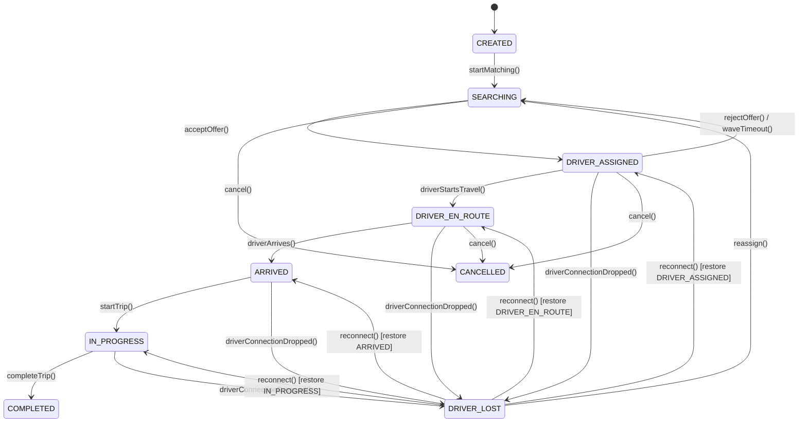

# System Architecture - Motus Platform

This document describes the technical architecture, package boundaries, data models, state machines, storage designs, and recovery mechanisms that power the Motus platform.

---

## 1. System Topology & Domain Contexts

Motus operates as a low-latency, real-time cache and event orchestrator sitting alongside, but decoupled from, your primary persistent transactional databases (RDBMS / Document DB).



---

## 2. Bounded Contexts (DDD Domain Model)

We partition the system into three primary Bounded Contexts:

### A. Driver Presence Context

Manages driver connection states, heartbeat statuses, load counts, and pre-stale presence restorations.

- **Aggregate Root:** `DriverPresenceProfile`
- **Entities:** `Driver`
- **Value Objects:** `LocationCoordinate` (lat, lng, accuracy, bearing, speed, timestamp)

### B. Dispatch Session Context

Coordinates the transient journey lifecycle, from creation and driver searching to trip completion.

- **Aggregate Root:** `DispatchSession`
- **Entities:** `Session`, `EventRecord`
- **Value Objects:** `LocationCoordinate`, `WaveDetails` (waveNumber, candidates, expiresAt), `TelemetryPath`

### C. Geofencing Context

Validates spatial coordinates against boundary definitions.

- **Aggregate Root:** `TenantProfile`
- **Entities:** `GeofenceZone`
- **Value Objects:** `PolygonCoordinates`

---

## 3. Package Boundaries & Dependency Flow

Motus strictly enforces package isolation to ensure circular dependencies do not occur. The package hierarchy is structured as follows:

```mermaid
flowchart TD
    Dashboard[@motus/dashboard]
    SocketIO[@motus/socketio]
    Notifications[@motus/notifications]
    Core[@motus/core]
    Redis[@motus/redis]
    Obs[@motus/observability]
    Testing[@motus/testing]
    Types[@motus/types]

    Dashboard --> Core
    SocketIO --> Core
    Notifications --> Core
    Core --> Redis
    Core --> Obs
    Redis --> Types
    Obs --> Types
    Testing --> Core
    Testing --> Redis
```

- **`@motus/types`**: Bottom of the chain. Contains strictly types, interfaces, enums, value objects, and schemas. Zero package dependencies.
- **`@motus/observability`**: Contains logger interfaces, tracer configurations, metrics registries, and diagnostic health checks. Depends only on `@motus/types`.
- **`@motus/redis`**: Contains the Redis storage repositories, Lua scripts, and client configuration handlers. It depends _only_ on `@motus/types` and `@motus/core` ports interfaces.
- **`@motus/core`**: Implements state machines, matching engine math, telemetry samplers, and worker loops. Depends on `@motus/types` and `@motus/observability`.
- **`@motus/notifications`**: Handles push notifications via FCM/APNs. Depends on `@motus/core`.
- **`@motus/socketio`**: Real-time websocket gateway layer. Depends on `@motus/core`.
- **`@motus/dashboard`**: UI pages and analytics server endpoints. Depends on `@motus/core`.

---

## 4. Redis Storage & Key Design

All transient real-time states are stored in Redis to achieve sub-millisecond latencies.

### A. Key Naming and Cluster Sharding

To support Redis Cluster sharding without cross-slot command errors, all keys incorporate **hash tags** (`{...}`) to force co-location of tenant-specific structures:

```
motus:tenant:{tenantId}:driver:{driverId}:presence
motus:tenant:{tenantId}:driver:{driverId}:location
motus:tenant:{tenantId}:session:{sessionId}:state
motus:tenant:{tenantId}:session:{sessionId}:telemetry
```

### B. Redis Data Structures

- **Presence Status:** Managed as a `Hash` with fields `status`, `previousPresenceStatus`, `currentLoad`, `capacity`, and `lastHeartbeat`.
- **Locations Spatial Index:** Stored in a Redis `Geo Set` (Sorted Set) at key `motus:tenant:{tenantId}:drivers:locations`.
- **Session State:** Stored as a `Hash` detailing the lifecycle status and active driver assignment.
- **Telemetry Path:** Buffered using `Redis Streams` for chronological, high-efficiency appends.
- **Offer Reservation Lock:** Stored as a `String` representing a Redlock lock for candidate exclusion.

### C. Eviction Policy

Motus mandates `noeviction`. Since Redis maintains critical state machine states, any out-of-memory key evictions would break session guarantees. Cluster scaling and short TTL policies (24 hours on completed trips, 5 minutes on offline driver location hashes) are used to manage memory.

---

## 5. Domain Services & State Machines

### A. Core Domain Services

- **`MatchingPipeline`**: Filters candidates using spatial range checks, vehicle requirements, load capacity, and location freshness.
- **`WaveDistributor`**: Manages progressive wave offers. In each wave, a subset of candidates is locked in Redis for 8 seconds, notifying the consumer. If rejected or timed out, the lock is released and the next wave is initiated.
- **`GeofenceAuditor`**: Uses a raycasting algorithm to check coordinate intersection with polygon coordinates.
- **`TelemetrySampler`**: Samples coordinate changes (filters out updates less than 10 seconds or 25 meters from the last registered coordinate).

### B. Driver Presence State Machine



### C. Dispatch Session State Machine



---

## 6. Real-time Websockets & Event outbox

### A. Socket.IO Transport Gateways

Websocket connections are segmented using dedicated namespaces:

- **`/drivers`**: Location heartbeat ingestion, offer notification channels, and acceptance commands.
- **`/sessions`**: Subscription rooms for consumers/customers to stream real-time coordinate broadcasts.

### B. Event Outbox Pattern

To isolate core processing from external network failures, state modifications synchronously publish events to a local `Redis Stream` (Outbox). An asynchronous worker reads from the stream, verifies event schemas using `EventGovernance`, and broadcasts them to Kafka, RabbitMQ, or webhooks.

---

## 7. Resiliency & Failure Recovery

1.  **Driver Reconnection Recovery:** If a driver drops connection while in `DRIVER_EN_ROUTE`, the session transitions to `DRIVER_LOST` (caching the prior state). If the driver reconnects within 120 seconds, the session returns to `DRIVER_EN_ROUTE`. Otherwise, the worker triggers `reassign()` to put the session back into `SEARCHING` for new candidates.
2.  **ETA Engine Fallback:** If the external ETA provider (e.g., OSRM, Google Maps API) undergoes a latency spike or outage, the `MatchingPipeline` falls back to a straight-line Haversine math calculation to ensure matching continues.
3.  **Redis Failover Recovery:** Repositories implement reconnect retry parameters. Active locks include unique UUID tokens inside values to prevent split-brain releases during master node failover operations.
