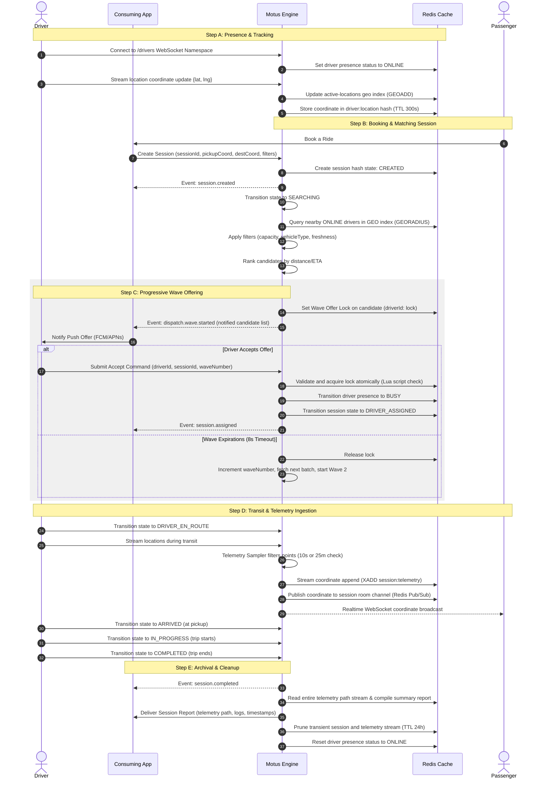
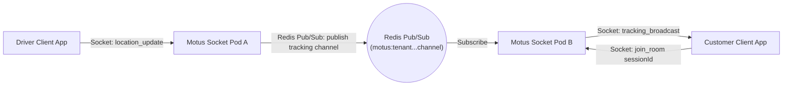
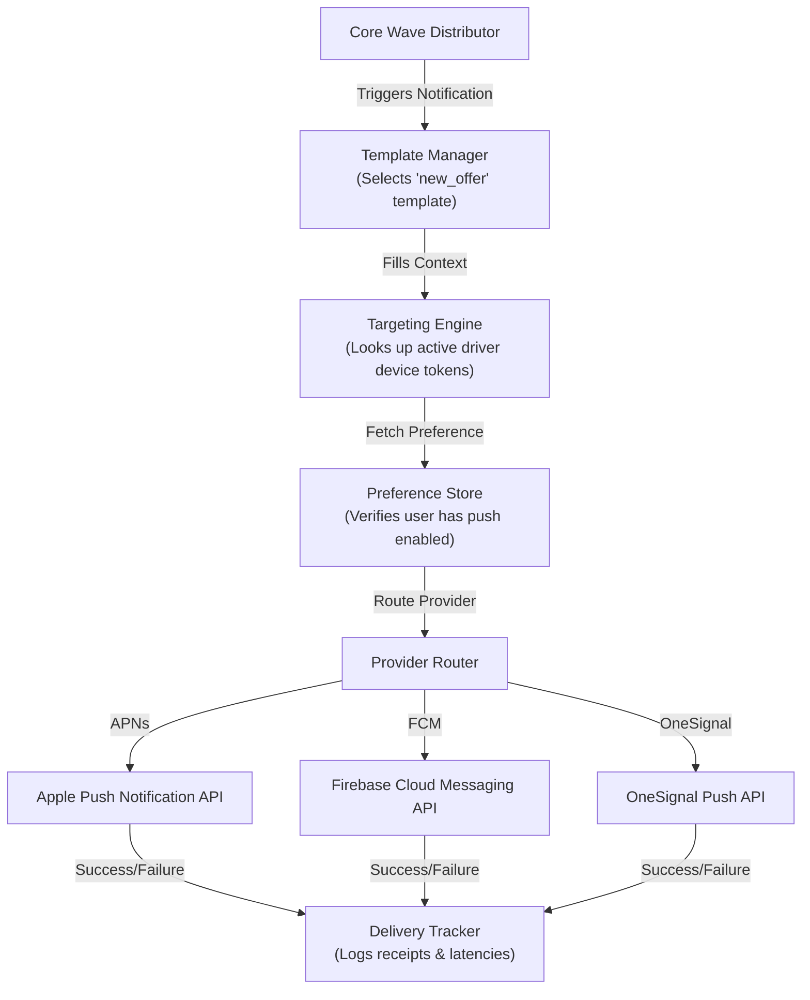

# Product Workflows & Data Flows - Motus Platform

This document describes the end-to-end business workflows, module interactions, data lifecycles, and realtime communication paths of the Motus engine.

---

## 1. End-to-End Dispatch Lifecycle Workflow

The core purpose of Motus is coordinating driver locations and dispatch sessions. Below is the complete sequence of events from driver onboarding to trip completion:



---

## 2. Platform Request Lifecycle

Requests entering the Motus system flow through two distinct channels:

### A. Control Path (REST API / Admin Commands)

Used by the Consuming Application to configure systems and manage static configurations:

1.  **Register Tenant:** Registers a new tenant and sets default configurations (radius, timeouts).
2.  **Register/Update Driver Master Data:** Saves driver capacities and vehicle specifications.
3.  **Create/Cancel/Reassign Sessions:** Triggers state changes from the booking backend.

### B. Realtime Path (WebSockets)

Used directly by mobile apps/drivers for high-frequency coordinate streaming and wave notifications:

1.  **Location Heartbeats:** High-speed coordinates ingested into the `/drivers` socket channel.
2.  **Tracking Subscriptions:** Customers subscribe to `/sessions` rooms to receive live coordinate updates.

---

## 3. Realtime Coordinate Stream & Pub/Sub Flow

To support scaling across multiple server pods, live tracking coordinates are broadcast using Redis Pub/Sub:



1.  **Ingestion**: Driver streams coordinates to the socket server pod they are connected to (Pod A).
2.  **Local Processing**: Pod A executes the Telemetry Sampler in `@motus/core`. If the update passes the distance/time threshold, it is stored in the Redis Stream.
3.  **Cluster Fanout**: Pod A publishes the coordinate to the Redis Pub/Sub channel associated with that specific session.
4.  **Distribution**: Pod B (which has the Customer Client connected to the session tracking room) receives the message from Redis Pub/Sub and emits the coordinate to the customer's web socket.

---

## 4. Notification Dispatch Pipeline

When the `WaveDistributor` starts a new wave, the notifications subsystem triggers push alerts:



---

## 5. Telemetry Path Sampling Flow

Raw GPS feeds contain coordinate drift and redundant stationary points. The `TelemetrySampler` filters points to minimize Redis storage:

```
                  +--------------------------------+
                  |  Raw Location Heartbeat Ingest |
                  +--------------------------------+
                                  |
                                  v
             Is this the first coordinate in the session?
               /                                  \
             YES                                  NO
             /                                      \
            v                                        v
     [Save Coordinate]                Is time delta since last point > 10s?
     [Emit telemetry.sampled]           OR distance movement since last point > 25m?
                                          /                            \
                                        YES                            NO
                                        /                                \
                                       v                                  v
                               [Save Coordinate]                 [Discard Heartbeat]
                               [Emit telemetry.sampled]          [Presence Updated Only]
```

1.  **Distance Calculation**: Evaluates distance using the Haversine formula (straight-line distance).
2.  **Sampling**: Saves points only if the driver has moved $\ge 25\text{ meters}$ or if $\ge 10\text{ seconds}$ have elapsed since the last saved point.
3.  **Compression**: When a session completes, the telemetry array is encoded using the Google Encoded Polyline format for low-payload transmission to the consuming application.
