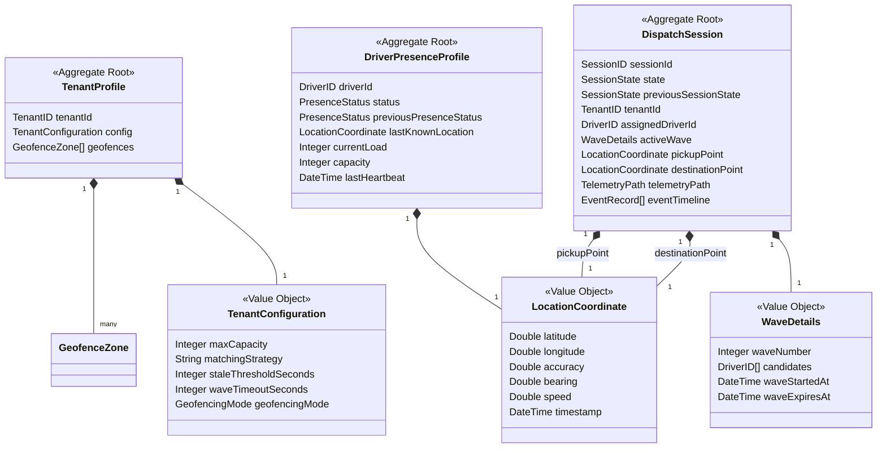
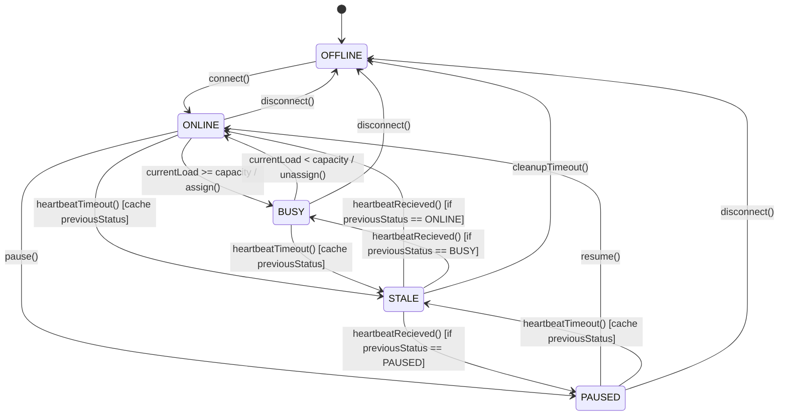
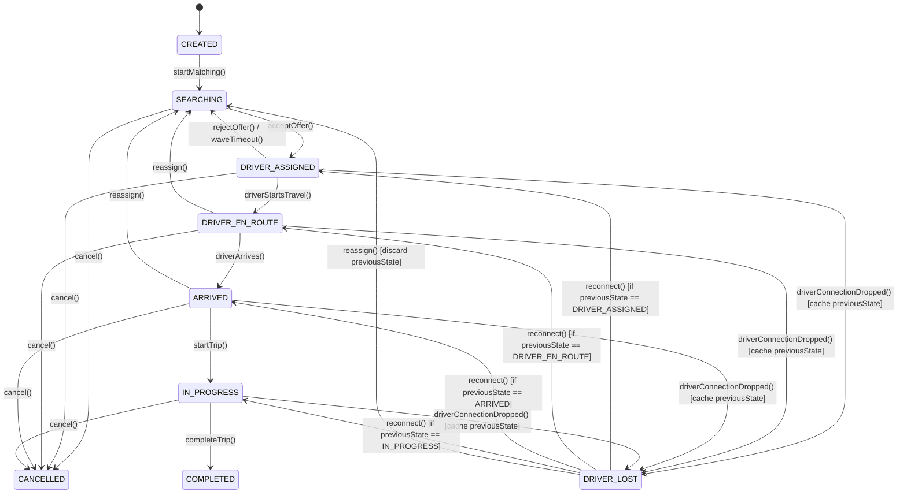

# 02 - Domain Model

This document outlines the Domain-Driven Design (DDD) model for the Motus engine. It specifies the Bounded Contexts, Aggregates, Entities, Value Objects, Domain Services, State Machines, and Domain Events that govern dispatching, tracking, and presence.

---

## Bounded Contexts & Aggregates

Motus is organized into isolated contexts with distinct language boundaries:

### 1. Driver Presence Context
Manages driver connection states, heartbeat statuses, load counts, and pre-stale presence restorations.
*   **Aggregate Root:** `DriverPresenceProfile`
*   **Entities:** `Driver`
*   **Value Objects:** `LocationCoordinate`

### 2. Dispatch Session Context
Coordinates the transient journey lifecycle, from creation and driver searching to trip completion.
*   **Aggregate Root:** `DispatchSession`
*   **Entities:** `Session`, `EventRecord`
*   **Value Objects:** `LocationCoordinate`, `WaveDetails`, `TelemetryPath`

### 3. Geofencing Context
Validates spatial coordinates against boundary definitions.
*   **Aggregate Root:** `TenantProfile`
*   **Entities:** `GeofenceZone`
*   **Value Objects:** `PolygonCoordinates`

---

## Domain Services

These are stateless services containing operations that do not naturally belong to a single entity or aggregate.

1.  **`MatchingPipeline`:** Orchestrates candidate discovery, applies filters (capacity, freshness, geofencing), and ranks matching drivers.
2.  **`WaveDistributor`:** Coordinates active waves, books temporary locks on candidates, schedules wave timeouts, and transitions state machines.
3.  **`GeofenceAuditor`:** Performs ray-casting polygon mathematical calculations to determine if a location coordinate lies within geofence parameters.
4.  **`TelemetrySampler`:** Samples raw coordinate queues, evaluating if the time gap (>10s) or distance movement (>25m) warrants appending the point to the session's historical telemetry route.

---

## State Machines

### 1. Driver Presence State Machine
Governs the presence status transitions. It features status recovery logic that restores pre-stale states upon client reconnection.

### 2. Dispatch Session State Machine
Controls session lifecycles, incorporating driver recovery features to prevent deadlocks when reconnecting.

---

## Domain Events

These represent historical occurrences that are immutable and published asynchronously.

*   `driver.presence.updated`: Emitted when presence status transitions.
*   `driver.stale`: Emitted when presence status transitions to `STALE` due to heartbeat timeout (>120s).
*   `driver.geofence.entered`: Emitted when coordinate updates cross boundary zones.
*   `driver.geofence.exited`: Emitted when coordinates exit boundaries.
*   `session.created`: Emitted when a new session is initialized.
*   `session.state.changed`: Emitted upon any valid transition within the session state machine.
*   `dispatch.wave.updated`: Emitted when candidates reject offers or waves time out.
*   `telemetry.sampled`: Emitted when a location point is successfully logged to a session's history path.

---

## Boundaries & Isolation

*   **Encapsulation of Invariants:** Entities execute status operations internally and emit events. A state transition cannot happen unless invariants (such as `currentLoad` validation or matching parameters) are satisfied.
*   **Separation of Event Distribution:** Domain state mutations are compiled synchronously into events, queued, and published using an outbox model to separate business rules from networking and event broker issues.

---

## Failure Scenarios

*   **Incorrect Location Ingestion (GPS Drift):** Large location jumps might trigger false geofence entries or exits. The `GeofenceAuditor` uses a hysteresis threshold (default 15m) to ensure state transitions don't bounce.
*   **Reconnection State Ambiguity:** If a driver drops connection and reconnects quickly, presence state or session state conflicts are resolved using timestamps and the `previousPresenceStatus` / `previousSessionState` fields.

---

## Tradeoffs

*   **State Machine Complexity vs. Loose Validation:** Structuring rigid state transitions prevents invalid actions (e.g. moving a trip straight from `SEARCHING` to `IN_PROGRESS`). However, this requires client clients to precisely synchronize their call sequences to avoid state conflicts.

---

## Future Considerations

*   **Composite Driver Status:** Supporting multiple sub-states (e.g. active but accepting pooling jobs vs. active but strictly exclusive).
*   **Dynamic Route Waypoints:** Adding a waypoint sequence sub-entity inside the `DispatchSession` aggregate root to handle multi-stop pooling matching patterns.
