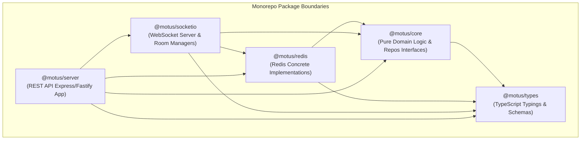

# 03 - Package Boundaries

This document defines the monorepo architecture and package boundaries of Motus. It details the component responsibilities, dependency flow guidelines, and API exposure models within a `pnpm` workspace structure.

---

## Monorepo Dependency Graph

Motus enforces a strict unidirectional dependency topology to prevent circular imports and keep infrastructural concerns decoupled from core domain logic.



---

## Package Definitions

### 1. `@motus/types`
*   **Responsibility:** Central definition of all domain models, configuration schemas, event contracts, interface signatures, and API input/output types.
*   **Dependencies:** None.
*   **Implementation Rules:** Pure TypeScript. Absolutely no executable JavaScript, database bindings, or server logic.
*   **Key Exports:** `DriverPresence`, `SessionState`, `Coordinate`, `EventEnvelope`, `TenantConfig`.

### 2. `@motus/core`
*   **Responsibility:** Contains the pure domain entities, state machine transitions, telemetry sampling math, matching filters, and geofencing verification algorithms.
*   **Dependencies:** `@motus/types`.
*   **Implementation Rules:** Stateless and engine-agnostic. It cannot import Redis, Socket.io, or Express drivers directly. Instead, it defines interfaces for persistence, pub/sub, lock managers, and external ETA clients (e.g. `ISessionRepository`, `ILockManager`, `IEtaProvider`).
*   **Key Exports:** `PresenceStateMachine`, `SessionStateMachine`, `MatchingPipeline`, `GeofencePolygonValidator`, `TelemetrySampler`.

### 3. `@motus/redis`
*   **Responsibility:** Implements core storage, indexing, locking, and stream operations using Redis.
*   **Dependencies:** `@motus/core`, `@motus/types`.
*   **Implementation Rules:** Encapsulates Redis Cluster connections, Lua script executions, key-naming strategies, and Redlock orchestration.
*   **Key Exports:** `RedisSessionRepository`, `RedisDriverPresenceRepository`, `RedlockManager`, `RedisEventStreamPublisher`.

### 4. `@motus/socketio`
*   **Responsibility:** Manages bidirectional WebSocket communication with driver clients (for locations and offers) and customer clients (for session tracking updates).
*   **Dependencies:** `@motus/core`, `@motus/redis`, `@motus/types`.
*   **Implementation Rules:** Sets up Socket.io server handlers, parses connection handshakes, binds tokens, registers drivers into location tracking channels, and manages room memberships.
*   **Key Exports:** `SocketIoManager`, `DriverConnectionHandler`, `TrackingRoomBroadcaster`.

### 5. `@motus/server`
*   **Responsibility:** Serves as the primary entrypoint execution layer, running the REST API server and composing the dependency injections for all other packages.
*   **Dependencies:** `@motus/socketio`, `@motus/redis`, `@motus/core`, `@motus/types`.
*   **Implementation Rules:** Configures Fastify/Express routers, serves OpenAPI/Swagger schemas, hooks Prometheus metrics, and manages server bootstrap and shutdown sequences.
*   **Key Exports:** `createHttpServer`, `startServer`, `stopServer`.

---

## Discarded Package Candidates

*   **`@motus/geofencing`:** Merged into `@motus/core` to prevent package fragmentation. Ray-casting polygon intersection routines are stateless math operations that fit naturally within the core domain logic.
*   **`@motus/client`:** Deferred to a distinct project scope. The client-side libraries for mobile and frontend integration should live in their own repository boundaries to decouple versioning from server orchestration releases.

---

## Public vs. Internal APIs

```
+-----------------------------------------------------------+
|                      @motus/server                        |
|   Exposes Public REST API & OpenAPI Schema Definitions   |
+-----------------------------------------------------------+
                             |
+---------------------------+-------------------------------+
|                           |                               |
v                           v                               v
+-----------------------+ +-----------------------+ +-----------------------+
|    @motus/socketio    | |     @motus/redis      | |      @motus/core      |
| WebSocket Connection  | | implements internal   | | Exposes core domain   |
|   Handlers & Rooms    | | repository interfaces | | business validation   |
+-----------------------+ +-----------------------+ +-----------------------+
```

*   **Public REST API:** Exposed by `@motus/server` for consumer backend integrations (e.g., creating sessions, registering tenants).
*   **Public WebSocket API:** Exposed by `@motus/socketio` for client driver telemetry streams and offer alerts.
*   **Internal Service API:** `@motus/core` defines interfaces that `@motus/redis` implements. This keeps the persistence layer swappable (e.g. for testing mock implementations) and prevents the core domain from leaking details of Redis keys.

---

## Failure Scenarios

*   **Circular Dependencies:** Avoided by enforcing the rule that no lower-level package (such as `@motus/core`) can import from a higher-level package (such as `@motus/redis` or `@motus/server`).
*   **Database Schema Drift:** If the Redis schema layout is modified without updating the type contracts, static typing in TypeScript will fail at build time inside `@motus/redis`.

---

## Tradeoffs

*   **Monorepo Overhead:** Using `pnpm` workspaces introduces some tool configuration complexity (e.g., compiler configurations, package linking). However, it prevents circular references, makes interfaces explicit, and enforces boundary integrity across developers.

---

## Future Considerations

*   **Extracting `@motus/core` as an SDK Node Library:** If consumers want to run matching pipelines locally inside their own server backends without running the entire Motus HTTP server, `@motus/core` can be packaged and distributed independently.
