# 04 - Redis Architecture

This document describes the Redis architecture for Motus. It defines the key naming strategies, data structures, Pub/Sub channels, streams, locking mechanisms, eviction parameters, and scalability options.

---

## Key Maming & Partitioning Strategy

To isolate multi-tenant workloads and facilitate Redis Cluster sharding, all keys follow a strict hierarchical structure where the Tenant ID is placed early in the key pattern to allow hashtag-based clustering.

```
Format: motus:tenant:{tenantId}:[module]:[entityId]:[sub-key]
```

To force all keys for a specific session or driver within a tenant to land on the same Redis cluster node, **hash tags** (`{...}`) should enclose the tenant ID or the entity grouping:
*   Standard Tenant Keys: `motus:tenant:{tenantId}:driver:123:presence`
*   Sharding Co-location: `motus:tenant:{tenantId}:session:987:state`

---

## Data Structure Schemas

```mermaid
erDiagram
    DRIVER-PRESENCE-HASH {
        string status "ONLINE | BUSY | PAUSED | STALE"
        string previousPresenceStatus "ONLINE | BUSY | PAUSED"
        integer currentLoad "Number of active assignments"
        integer capacity "Maximum capacity allowed"
        timestamp lastHeartbeat "Epoch millisecond"
    }
    DRIVER-LOCATION-HASH {
        double latitude "Coordinate lat"
        double longitude "Coordinate lng"
        double accuracy "Accuracy in meters"
        double bearing "Direction of travel"
        double speed "Speed in m/s"
        timestamp updatedAt "Epoch millisecond"
    }
    ACTIVE-LOCATIONS-GEOSET {
        string driverId "Member"
        double geohash "Score"
    }
    SESSION-STATE-HASH {
        string state "SessionState enum value"
        string previousSessionState "SessionState pre-DRIVER_LOST"
        string assignedDriverId "Reference to Driver"
        double pickupLat "Pickup latitude"
        double pickupLng "Pickup longitude"
        string metadata "JSON string"
        timestamp updatedAt "Epoch millisecond"
    }
    SESSION-EVENTS-STREAM {
        string eventId "Entry ID"
        string eventType "Event name"
        string payload "Event JSON data"
    }
    OFFER-LOCK-STRING {
        string lockId "Value: sessionId"
    }
```



### 1. Driver Presence Profile
*   **Key:** `motus:tenant:{tenantId}:driver:{driverId}:presence`
*   **Data Structure:** `Hash`
*   **TTL Policy:** 24 Hours (sliding window, refreshed on heartbeat). If a driver goes offline, this profile remains for auditing before auto-cleanup.
*   **Key Fields:** `status`, `previousPresenceStatus`, `currentLoad`, `capacity`, `lastHeartbeat`.

### 2. Driver Location Tracker
*   **Detailed Location Key:** `motus:tenant:{tenantId}:driver:{driverId}:location`
    *   **Data Structure:** `Hash`
    *   **TTL Policy:** 300 Seconds (auto-expires if heartbeats stop to prevent stale driver locations from being matched).
    *   **Key Fields:** `lat`, `lng`, `accuracy`, `bearing`, `speed`, `updatedAt`.
*   **Spatial Index Key:** `motus:tenant:{tenantId}:drivers:locations`
    *   **Data Structure:** `Geo Set` (Sorted Set behind the scenes)
    *   **TTL Policy:** Persistent (drivers are explicitly removed from this index via `GEODEL` when their presence changes to `STALE`, `PAUSED`, or `OFFLINE`).

### 3. Dispatch Session Profile
*   **Key:** `motus:tenant:{tenantId}:session:{sessionId}`
*   **Data Structure:** `Hash`
*   **TTL Policy:** 24 Hours after transition to `COMPLETED` or `CANCELLED` (ensures transient data is pruned once archived to event history).
*   **Key Fields:** `state`, `previousSessionState`, `assignedDriverId`, `pickupLat`, `pickupLng`, `destLat`, `destLng`, `metadata`, `updatedAt`.

### 4. Session Event Log
*   **Key:** `motus:tenant:{tenantId}:session:{sessionId}:events`
*   **Data Structure:** `Stream`
*   **TTL Policy:** 24 Hours (read by an asynchronous event outbox worker to publish to Kafka/RabbitMQ before expiration).

### 5. Candidate Wave Offer Lock
*   **Key:** `motus:tenant:{tenantId}:lock:driver:{driverId}`
*   **Data Structure:** `String` (used for Redlock mutual exclusion)
*   **TTL Policy:** 8 Seconds (coincides with the default wave timeout duration).
*   **Value:** `{sessionId}` (indicates which session currently holds the reservation on the driver).

### 6. Live Telemetry Buffer
*   **Key:** `motus:tenant:{tenantId}:session:{sessionId}:telemetry`
*   **Data Structure:** `Stream`
*   **TTL Policy:** 24 Hours (used for real-time replay compilations; contains filtered coordinates meeting the 25m/10s threshold rules).

---

## Event Pub/Sub & Socket Streaming

*   **Realtime Coordinate Channel:** `motus:tenant:{tenantId}:channel:session:{sessionId}:tracking`
    *   **Mechanism:** `Redis Pub/Sub`
    *   **Usage:** Live coordinates ingested by `@motus/socketio` are published here. All server pods hosting active tracking connections for `{sessionId}` subscribe to this channel and push updates instantly to their connected clients.

---

## Memory Management & Eviction

*   **Eviction Policy Recommendation:** `noeviction`
    > [!IMPORTANT]
    > Because Redis manages operational presence state, locks, and session state machines, automatic eviction of keys due to memory saturation could cause severe state corruption or double-bookings.
*   **Memory Safeguards:**
    *   Implement monitoring alerts at 70% and 80% memory allocation.
    *   Enforce short TTLs (24 hours) on transient session files.
    *   Utilize Redis Cluster sharding to scale RAM horizontally rather than relying on cache eviction.

---

## Redis Cluster considerations

*   **Multi-Key Lua Script Invariance:** When running Lua scripts (e.g., atomic wave updates or coordinate ingestions), all referenced keys must fall within the same hash slot. To guarantee this, wrap keys with Hash Tags:
    *   Incorrect: `KEYS[1] = driver:1:presence`, `KEYS[2] = driver:1:location`
    *   Correct: `KEYS[1] = motus:{tenant:T1}:driver:1:presence`, `KEYS[2] = motus:{tenant:T1}:driver:1:location`
*   **Node Distribution:** Partitioning based on `{tenantId}` ensures that all data for a single tenant is clustered together, making spatial proximity checks across that tenant's driver list performant.

---

## Failure Scenarios

*   **Split-Brain Partitioning:** In a Redis Cluster, if a network partition isolates a master node, client requests might write data to both partitions. We recommend configuring `min-replicas-to-write 1` to ensure writes are only accepted if at least one replica acknowledges, preserving consistency.
*   **Expired Offer Lock Race:** If a Redis lock expires exactly as a driver accepts an offer, the client uses optimistic locking (via Lua script checking if the string key value matches the target `sessionId`) to reject the transaction.

---

## Tradeoffs

*   **Redis Streams vs. Pub/Sub for Telemetry:** Using Redis Streams for telemetry buffer storage guarantees data retention in case client sockets disconnect briefly. However, it requires an explicit stream prune command to prevent unbounded memory growth, which we mitigate with the 24-hour TTL policy.
