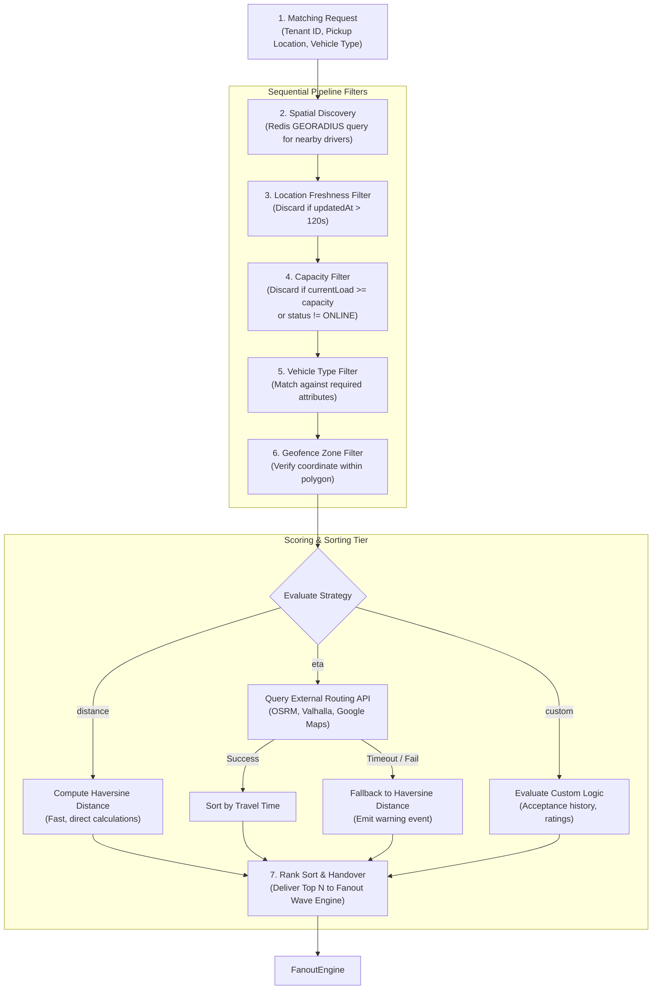

# 05 - Matching Architecture

This document details the architecture of the Motus Matching Engine. It describes the step-by-step pipeline used to discover, validate, score, and rank driver candidates for session assignments.

---

## The Matching Pipeline

The matching process is modeled as an ordered pipeline of stateless filters applied to a spatial query pool, terminating in a ranking engine and wave distributor.

---

## Pipeline Execution Stages

### 1. Spatial Discovery
*   **Action:** Motus performs a spatial query against the tenant's geo-index (`motus:tenant:{tenantId}:drivers:locations`) centering on the pickup coordinate.
*   **Parameters:** Configurable starting radius (e.g. 5000 meters).
*   **Output:** List of driver IDs within range, along with raw straight-line distance.

### 2. Location Freshness Filter
*   **Action:** Discards drivers whose location record is stale.
*   **Rule:** Fetches the location detail hash (`motus:tenant:{tenantId}:driver:{driverId}:location`) and checks `updatedAt`. If `currentTime - updatedAt > staleThresholdSeconds` (default 120s), the driver is filtered out to avoid assigning disconnected or stale clients.

### 3. Capacity & Status Filter
*   **Action:** Validates availability.
*   **Rule:** Fetches the presence profile hash (`motus:tenant:{tenantId}:driver:{driverId}:presence`). Discards the driver if:
    *   `status != 'ONLINE'` (e.g. driver is paused, offline, or busy).
    *   `currentLoad >= capacity` (driver is already at their concurrent allocation limit).

### 4. Vehicle Type Filter
*   **Action:** Restricts matches based on capability.
*   **Rule:** Matches tenant-specific driver metadata (e.g., sedan, delivery van, refrigerated truck) against the requested vehicle configuration.

### 5. Geofence Zone Filter
*   **Action:** Enforces geographical boundaries.
*   **Rule:** Invokes the `GeofenceAuditor` domain service to verify if both the pickup coordinate and the candidate driver location are inside the tenant's geofenced boundaries (if geofencing is enabled).

---

## Ranking Strategies

Once the pool of candidates passes all filters, they are ranked using one of three strategies configured per tenant:

### A. Distance Strategy (Haversine)
*   **Implementation:** Pure mathematical calculation based on spherical geometry.
*   **Pros:** Sub-millisecond latency, zero external dependencies.
*   **Cons:** Does not account for traffic, road barriers, or navigation topology.

### B. ETA Strategy (Routing Engine)
*   **Implementation:** Queries an `IEtaProvider` endpoint (e.g., OSRM, Valhalla, Google Maps) with coordinates for all candidates.
*   **Fallback Logic:**
    > [!IMPORTANT]
    > To prevent matching starvation in the event of routing provider failure or timeout (e.g. provider takes >500ms to respond), the pipeline falls back to the **Distance Strategy** automatically, logs the discrepancy, and raises a `matching.routing_fallback` telemetry event.

### C. Custom Strategy
*   **Implementation:** Tenant configurations can provide scoring criteria based on variables like driver ratings, historically calculated acceptance rates, or active shift durations.

---

## Failure Scenarios

*   **Zero Candidates Found:** If the initial spatial search returns no drivers, the engine triggers a `matching.no_candidates` event. The system then initiates a radius expansion (e.g. expanding search from 5km to 8km) for the subsequent wave.
*   **Routing API Outage:** Gracefully handled via the Haversine fallback loop.

---

## Tradeoffs

*   **Eager Filtering vs. Late Filtering:** Eagerly loading presence records for *all* candidates returned by `GEORADIUS` can strain Redis under high densities (e.g. 1000 drivers in a 5km radius). To mitigate this, spatial discovery results are capped (e.g. limit to nearest 50 candidates) before retrieving presence hashes.

---

## Future Considerations

*   **Dynamic Radius Adjustment:** Adapting the initial query radius based on historical supply-demand density in the zone (e.g., narrower radius in dense city centers, wider radius in rural areas).
*   **Batch Matching:** Running matching calculations in batches for multiple concurrent sessions to resolve global supply allocation issues (e.g. Hungarian algorithm) instead of processing sessions sequentially.
