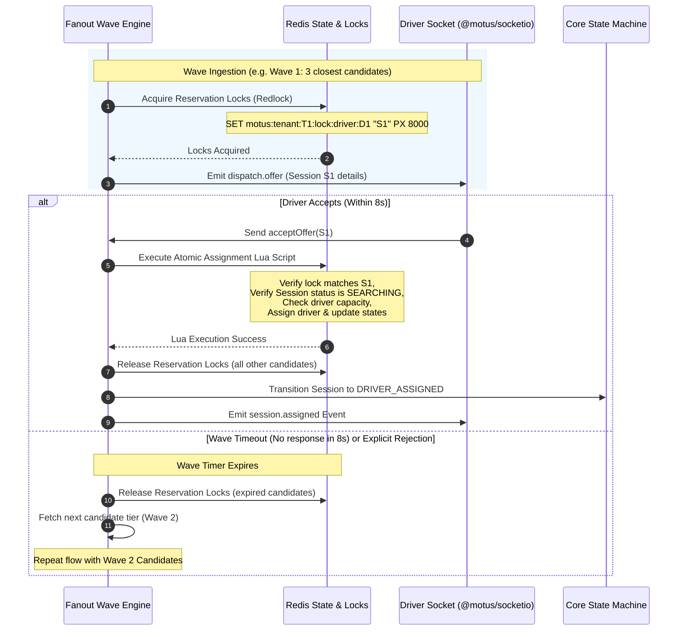

# 06 - Fanout Architecture

This document describes the design of the progressive wave fanout engine. It outlines the dispatch sequencing, wave timing mechanics, candidate reservation locking, and atomic acceptance flows.

---

## The Progressive Wave Cycle

The Fanout Engine distributes offers to candidates in sequential, time-limited groupings (waves) to minimize network overload and ensure optimal driver assignment.



---

## Wave Engine Mechanics

1.  **Wave Formation:** Candidates from the Matching Pipeline are divided into sequential segments. For example, a tenant's config specifies a wave size of 3.
    *   **Wave 1:** Drivers Ranked 1, 2, 3.
    *   **Wave 2:** Drivers Ranked 4, 5, 6.
2.  **Offer Reservation Locking:**
    Before offering, the system registers an exclusive lock for each driver in the active wave in Redis.
    *   **Key:** `motus:tenant:{tenantId}:lock:driver:{driverId}`
    *   **Value:** `{sessionId}`
    *   **Duration (TTL):** Equal to the wave timeout window (default 8 seconds).
    This lock prevents other concurrent matching queries from discovering or reserving this driver during this window.

---

## Timeout & Retry Engine

*   **Wave Timer:** A non-blocking asynchronous timer tracks the 8-second wave window.
*   **Expiration Workflow:** If the timer expires without acceptance, the reservation locks are released, and the wave index increments, triggering Wave 2.
*   **Radius Expansion & Backoff:**
    If all compiled candidates reject or time out, the system triggers the Retry Engine:
    *   It waits for a configured backoff cooldown (e.g. 10s).
    *   It triggers the matching pipeline again, expanding the search radius (e.g., adding 2,000 meters to the previous radius threshold).
    *   This cycle repeats up to a maximum limit (e.g. 3 retries, max radius 15km).
    *   If no driver is found, the session transitions to `SEARCHING` timeout (e.g. "No Driver Found") and emits `session.failed_no_driver`.

---

## Acceptance Handling & Concurrency Control

### Atomic Lua Script Design
To prevent double-allocation and solve race conditions where two drivers accept overlapping offers, acceptance is handled through a single transactional Lua script execution on Redis.

```lua
-- Lua script variables
local lockKey = KEYS[1]       -- motus:tenant:T1:lock:driver:D1
local presenceKey = KEYS[2]   -- motus:tenant:T1:driver:D1:presence
local sessionKey = KEYS[3]    -- motus:tenant:T1:session:S1
local sessionId = ARGV[1]
local driverId = ARGV[2]

-- 1. Check if the driver is locked for this specific session
local currentLock = redis.call('GET', lockKey)
if currentLock ~= sessionId then
    return {err = "LOCK_MISMATCH_OR_EXPIRED"}
end

-- 2. Verify driver capacity invariants
local currentLoad = tonumber(redis.call('HGET', presenceKey, 'currentLoad') or '0')
local capacity = tonumber(redis.call('HGET', presenceKey, 'capacity') or '1')
local status = redis.call('HGET', presenceKey, 'status')

if currentLoad >= capacity or status == 'PAUSED' or status == 'OFFLINE' then
    return {err = "DRIVER_CAPACITY_EXCEEDED_OR_UNAVAILABLE"}
end

-- 3. Verify session state is still SEARCHING
local sessionState = redis.call('HGET', sessionKey, 'state')
if sessionState ~= 'SEARCHING' then
    return {err = "SESSION_STATE_NOT_SEARCHING"}
end

-- 4. Apply atomic changes
redis.call('HSET', sessionKey, 'state', 'DRIVER_ASSIGNED')
redis.call('HSET', sessionKey, 'assignedDriverId', driverId)

local newLoad = currentLoad + 1
redis.call('HSET', presenceKey, 'currentLoad', tostring(newLoad))
if newLoad >= capacity then
    redis.call('HSET', presenceKey, 'status', 'BUSY')
end

-- 5. Delete lock key as the assignment is permanent
redis.call('DEL', lockKey)

return {ok = true}
```

---

## Failure Scenarios

*   **Driver Client Rejection:** If a driver explicitly declines an offer, the lock is deleted immediately in Redis, making the driver searchable again, and the wave proceeds without waiting for the timeout.
*   **Stale Lock Eviction:** If a driver accepts an offer after the 8-second window has expired and another session has since claimed the driver lock, the Lua script detects the lock value mismatch and declines the transaction, sending a conflict error back to the client.

---

## Tradeoffs

*   **Short Wave Windows vs. Driver Cognitive Load:** Short wave timeouts (e.g. 5 seconds) accelerate dispatching but cause driver frustration. Long windows (e.g. 15 seconds) slow down matching loops. An 8-second window is selected as the default balance between dispatch velocity and driver response latency.
*   **Single Lock vs. Multi-Lock:** Lock-based exclusion guarantees consistency but prevents drivers from seeing multiple concurrent offers. This is an intentional architectural decision to prioritize transaction safety and prevent high driver rejection rates.
