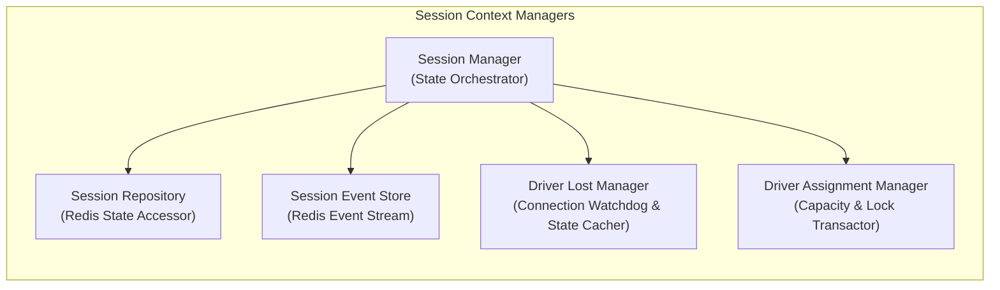
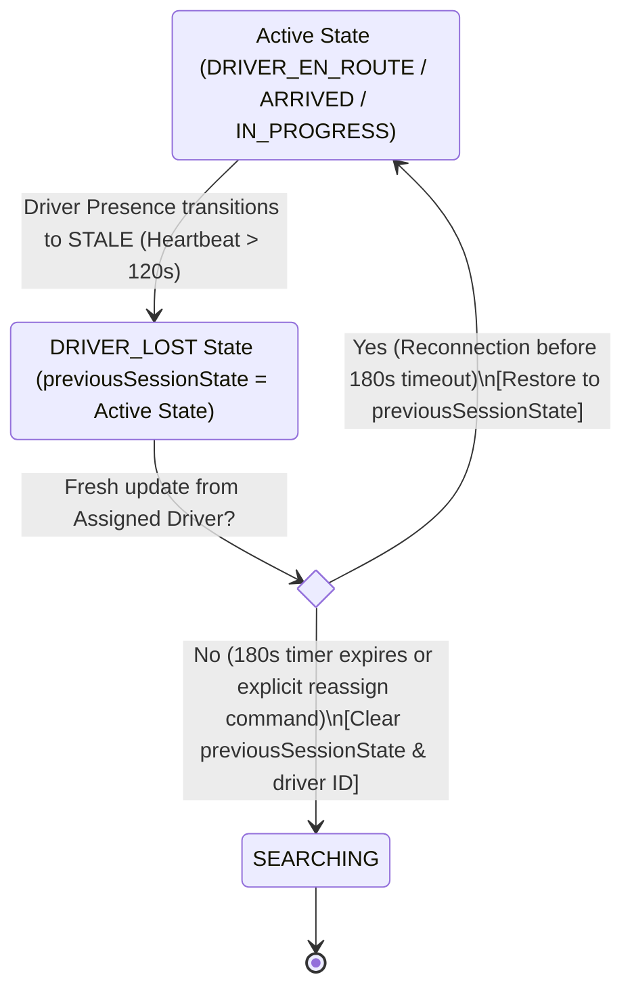

# 07 - Session Architecture

This document describes the design of the Session Lifecycle Engine. It details the Session Manager components, state machine execution, repository interface, and the Driver Lost Recovery process.

---

## Session Architecture Design

The Session Architecture manages transient journey records and coordinate assignments, tracking their transition from initiation to resolution.

---

## Component Responsibilities

### 1. Session Manager
*   Acts as the orchestrator for session workflows.
*   Enforces state transitions against invariants defined in the `SessionStateMachine`.
*   Invokes the Matching Pipeline when a session enters the `SEARCHING` state.

### 2. Session Repository
*   Reads and writes the transient session hashes in Redis (`motus:tenant:{tenantId}:session:{sessionId}`).
*   Caches pickup, destination, and configuration parameters.

### 3. Session Event Store
*   Appends every state transition and event mutation to the session event stream (`motus:tenant:{tenantId}:session:{sessionId}:events`).
*   Serves as the chronological audit trail for reporting compilation.

### 4. Driver Assignment Manager
*   Manages the link between a session and a driver.
*   Ensures that driver capacity changes (presence status shifts to `BUSY`, load increments) and session bindings happen atomically.

---

## The Driver Lost Recovery Process

To prevent state deadlocks (such as getting stuck when an assigned driver drops connection in traffic), Motus utilizes a status caching and restoration workflow.

### Lost Detection
When the presence watchdog shifts the assigned driver's status to `STALE` (no heartbeat for 120s):
1.  The `DriverLostManager` intercepts the event.
2.  It copies the current session state (e.g., `DRIVER_EN_ROUTE`, `ARRIVED`, or `IN_PROGRESS`) and writes it to the session hash field `previousSessionState`.
3.  It transitions the session state to `DRIVER_LOST`.
4.  It fires a `session.state.changed` (to `DRIVER_LOST`) event.
5.  It starts a configurable recovery timer (default 180 seconds).

### Recovery Options

#### Option A: Driver Reconnects (Success Path)
If the assigned driver submits a fresh location update or heartbeat socket message before the 180-second timeout:
1.  The system reads the session's cached `previousSessionState`.
2.  It restores the session state to that pre-lost value (e.g. `IN_PROGRESS`).
3.  It clears the `previousSessionState` field.
4.  It restores the driver's presence status to `BUSY` (since they still hold the active load).
5.  It emits corresponding state restoration events.

#### Option B: Timeout Expiry or Explicit Reassignment (Failure/Fallback Path)
If the 180-second window expires without reconnection, or if the consumer application invokes a `reassign` command:
1.  The `DriverLostManager` discards the `previousSessionState`.
2.  It clears the `assignedDriverId` in the session profile.
3.  It decrements the lost driver's `currentLoad` count.
4.  It transitions the session state back to `SEARCHING`.
5.  It launches a fresh matching wave to find a replacement driver.

---

## Failure Scenarios

*   **Race Conditions on Reassignment:** If a driver attempts to submit a location coordinate at the exact moment the 180s recovery window expires and the session is being reassigned, the system rejects the coordinate update for that session, as the state has shifted back to `SEARCHING`.

---

## Tradeoffs

*   **Pessimistic Lost State vs. Optimistic Continuation:** Rather than keeping the session in its active state when connection is lost, Motus shifts it to `DRIVER_LOST` to inform consumers. This adds state machine transitions but prevents false tracking assumptions and enables consumer applications to warn users.

---

## Future Considerations

*   **Predictive Recovery Windows:** Automatically scaling the recovery window based on local network connectivity profiles (e.g. wider windows inside tunnels or known dead zones).
