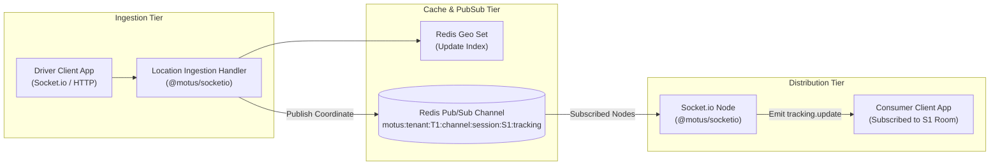

# 08 - Tracking Architecture

This document describes the Realtime Tracking Architecture for Motus. It details the ingestion pipeline, Redis Pub/Sub broadcasting setup, subscription channels, and session cleanup flows.

---

## Tracking Data Flow

Real-time tracking decouples driver coordinate ingestion from consumer map updates using a pub/sub channel.



---

## Architectural Details

### 1. Location Ingestion Pipeline
Driver clients submit location frames containing:
```json
{
  "latitude": 37.774929,
  "longitude": -122.419416,
  "accuracy": 5.2,
  "bearing": 180.5,
  "speed": 11.2,
  "timestamp": 1781222405000
}
```
*   **Ingestion Handlers:** Accept updates via Socket.io (`updateLocation` event) or HTTP POST `/drivers/location`.
*   **Validation:** Coordinates are validated for range (lat: -90 to 90, lng: -180 to 180).
*   **Index Updates:** The driver's location is saved in the detail hash, and their coordinate in the spatial Sorted Set is updated using `GEOADD`.

### 2. Location Broadcasting
If the driver is currently assigned to an active session (`DRIVER_ASSIGNED`, `DRIVER_EN_ROUTE`, `ARRIVED`, or `IN_PROGRESS`):
1.  The ingest worker reads the active `sessionId`.
2.  It publishes the coordinate payload to the Redis Pub/Sub channel:
    `motus:tenant:{tenantId}:channel:session:{sessionId}:tracking`
3.  Any Socket.io server pod hosting active client subscriptions for `{sessionId}` listens to this Redis Pub/Sub channel and broadcasts the update to its connected sockets.

### 3. Room Management & Subscriptions
*   **Room Key:** `tenant:{tenantId}:session:{sessionId}`
*   **Joining Room:** When a customer app starts, it sends a subscription request. The server verifies their JWT (authenticating that they have rights to track this session) and joins them to the Socket.io room.
*   **Horizontal Scaling:** Using the `socket.io-redis` adapter, room broadcasts are shared across all active server pods automatically.

### 4. Subscription Cleanup
To prevent memory leaks and idle room subscriptions:
1.  When a session moves to `COMPLETED` or `CANCELLED`, the Session Manager notifies the tracking engine.
2.  The Socket.io broadcaster sends a final `session.terminated` payload to the room.
3.  The server executes a disconnect loop, forcing all socket clients to exit the room:
    ```javascript
    io.in(`tenant:${tenantId}:session:${sessionId}`).disconnectSockets(true);
    ```
4.  The server unsubscribes from the corresponding Redis Pub/Sub channel, freeing up socket connection resources.

---

## Failure Scenarios

*   **Socket Reconnection Latency:** If a customer client drops connection and reconnects, they query the REST endpoint `/sessions/{id}` to fetch the current state, and then rejoin the Socket.io room to resume receiving live telemetry frames.

---

## Tradeoffs

*   **Raw Coordinates vs. Snapped Coordinates:** Broadcasting raw client GPS telemetry is fast and computationally cheap, but causes map markers to jitter or drift off roads. Map-matching/road-snapping calculations are deferred to the consumer client or post-telemetry processing to maintain low sub-millisecond propagation latencies in the tracking engine.

---

## Future Considerations

*   **Dynamic Update Backpressure:** Automatically throttling driver location update rates (e.g. from 1s to 5s intervals) when a driver is stationary (`speed == 0`) or when network congestion is detected, reducing server CPU and bandwidth.
