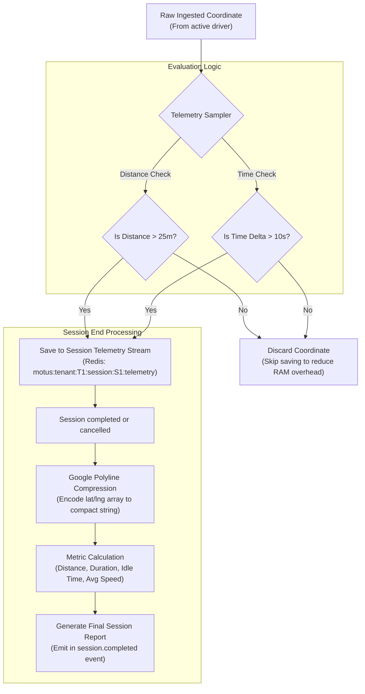

# 09 - Telemetry Architecture

This document describes the Telemetry Architecture of Motus. It outlines how historical path coordinates are sampled, filtered, compressed, stored, and aggregated to generate trip reports.

---

## Telemetry Pipeline

The Telemetry Engine separates raw live coordinates (used for tracking map views) from filtered path records (used for auditing and reporting).

---

## Technical Details

### 1. Telemetry Collector & Sampler
*   **Goal:** Maintain accurate path auditing while reducing memory storage by up to 90%.
*   **Sampling Rule:** When a new location frame arrives, the `TelemetrySampler` fetches the last sampled coordinate for the session. The new coordinate is appended to the telemetry log *only* if:
    *   $\Delta \text{ Distance} > 25 \text{ meters}$ (Haversine calculation), OR
    *   $\Delta \text{ Time} > 10 \text{ seconds}$.

### 2. Path Storage Layout
*   **Key:** `motus:tenant:{tenantId}:session:{sessionId}:telemetry`
*   **Data Structure:** `Redis Stream` (XADD)
*   **Entry Schema:** `time`, `lat`, `lng`, `speed`, `bearing`.
*   **TTL Policy:** 24 Hours. This stream is read and compiled upon session termination, after which the Redis stream key is deleted.

### 3. Compression Engine
Upon session termination, the raw coordinate array retrieved from the Redis Stream is compressed using **Google Polyline Encoding**.
*   **Input Array:** `[[37.77493, -122.41941], [37.77524, -122.41822], ...]`
*   **Output String:** `_p~iF~ps|U_ulLnnqC_xN` (Compact ASCII representation).
*   This compressed string is embedded in the final session report payload and domain events, saving network bandwidth and storage overhead in the consumer's long-term database.

### 4. Metrics & Report Compilation
The Session Report Generator evaluates the telemetry log to calculate metrics:
*   **Total Distance:** Sum of distances between successive telemetry points:
    $$D_{\text{total}} = \sum_{i=1}^{n-1} \text{Haversine}(P_i, P_{i+1})$$
*   **Total Duration:** $T_{\text{end}} - T_{\text{start}}$.
*   **Idle Duration:** Sum of time windows where `speed < 1.0 m/s` (e.g. vehicle waiting at traffic lights or passenger pickup).
*   **Average Speed:** $D_{\text{total}} / T_{\text{total}}$.

---

## Failure Scenarios

*   **Missing Coordinates (Network Outage):** If a driver loses cellular connection, telemetry updates stop. Upon reconnection, client apps push their locally buffered coordinates. The `TelemetrySampler` processes this buffer sequentially, applying the same 25m/10s filter rules to ensure path integrity is maintained.

---

## Tradeoffs

*   **Lossy Telemetry Sampling:** Filtering out points under 25m/10s means subtle driver movements (like parking maneuvers) are lost. This is an intentional tradeoff to prevent memory consumption from growing exponentially under scale (1M active drivers generating coordinates every second would consume gigabytes of RAM without sampling).

---

## Future Considerations

*   **Dynamic Sampling Rates:** Adapting the sampling threshold based on vehicle speed. (e.g., at highway speeds >60km/h, increase distance threshold to 50m; in dense slow traffic, decrease time threshold to 5s).
*   **Map Matching Integrations:** Snapping telemetry paths to road geometry using routing graphs (e.g. OSRM match service) before generating reports.
