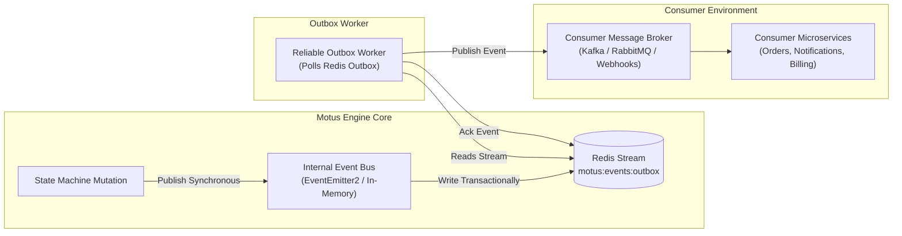

# 10 - Event Architecture

This document describes the Event Architecture for Motus. It details the internal event loop, external event bus outbox strategy, payload serialization schemas, and event versioning policies.

---

## Event Ingestion & Outbox Routing

To guarantee event delivery to consumer applications without blocking core engine loops, Motus implements the Transactional Outbox pattern using Redis Streams.



---

## Event Bus Mechanics

### 1. Internal Event Bus
*   **Purpose:** Coordinates reactions within the Node.js application process (e.g. telling Socket.io to join a driver to a tracking room when a session transitions to assigned).
*   **Implementation:** In-process event emitter (`EventEmitter2` or micro-pubsub), synchronous and fast.

### 2. External Event Bus (Outbox Pattern)
*   **Purpose:** Communicates state shifts securely to consumer microservices (e.g. order backend, notifications dispatchers).
*   **Implementation:**
    1.  Core actions append the event to the Redis outbox stream: `motus:events:outbox`.
    2.  A background worker reads the outbox stream (using a consumer group to allow scaling).
    3.  The worker attempts to publish the event to the configured external broker (Kafka, RabbitMQ, or an HTTP webhook handler).
    4.  Upon successful confirmation, the event is acknowledged (`XACK`) and marked for garbage collection.

---

## Event Schema Envelope (CloudEvents Compliance)

All external events emitted by Motus comply with the CNCF CloudEvents specification, ensuring standardized interoperability.

```json
{
  "specversion": "1.0",
  "id": "evt_72a19b88-cfb2-4ea5-8b38-e6b8c9d2f664",
  "source": "/motus/engine/node-4",
  "type": "motus.session.state_changed.v1",
  "datacontenttype": "application/json",
  "time": "2026-06-11T12:00:00.000Z",
  "tenantid": "tenant_12345",
  "data": {
    "sessionId": "session_f839c092",
    "oldState": "SEARCHING",
    "newState": "DRIVER_ASSIGNED",
    "driverId": "driver_d98341",
    "timestamp": 1781222400000
  }
}
```

---

## Event Catalog & Types

### 1. Driver Events
*   `motus.driver.presence_updated.v1`: Fired when presence status changes (e.g. ONLINE to BUSY).
*   `motus.driver.stale.v1`: Fired when a driver's heartbeat is missed (>120s).
*   `motus.driver.geofence_entered.v1`: Fired when coordinate updates intersect a geofenced area.
*   `motus.driver.geofence_exited.v1`: Fired when coordinate updates exit a geofenced area.

### 2. Dispatch Events
*   `motus.session.created.v1`: Fired when a session is initialized.
*   `motus.session.state_changed.v1`: Fired on any valid session state change.
*   `motus.dispatch.wave_updated.v1`: Fired when a candidate rejects an offer or a wave times out.
*   `motus.session.completed.v1`: Fired when a trip ends, carrying the final telemetry report payload.

---

## Versioning Strategy

*   **Major Revisions:** Encoded in the event type name (e.g. `motus.session.state_changed.v1` to `motus.session.state_changed.v2`). Different versions can run side-by-side during rolling upgrades.
*   **Minor Revisions:** Permitted as long as they are backward-compatible. This includes adding new optional fields to the `data` object. Field removals or changes to field data types are strictly treated as breaking and require a major version change.

---

## Failure Scenarios

*   **External Broker Outage:** If Kafka or the Webhook endpoint experiences downtime, the outbox worker retries delivery with exponential backoff. The events remain safely stored in the Redis Stream outbox, guaranteeing at-least-once delivery once the broker recovers.

---

## Tradeoffs

*   **At-Least-Once Delivery vs. Exactly-Once:** The outbox pattern guarantees that no event is lost, but network hiccups can cause duplicate emissions. Consuming applications must handle these events idempotently by validating the event `id` value.
