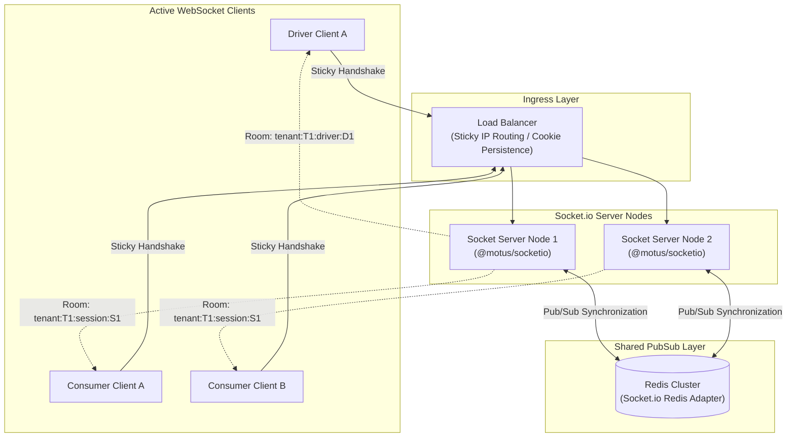

# 11 - Socket Architecture

This document describes the Socket Architecture for Motus. It details the connection channels, authentication handshakes, Room configurations, and the Redis Adapter clustering setup.

---

## WebSocket Cluster Topology

To support hundreds of thousands of concurrent client connections, Motus leverages a distributed Socket.io topology synchronized via a Redis Adapter.



---

## Technical Details

### 1. Authentication & Connection Handshake
*   **Mechanism:** Socket connections must provide a valid JSON Web Token (JWT) in the connection metadata query parameter or handshake headers:
    ```javascript
    const socket = io("https://api.motus.engine", {
      auth: { token: "eyJhbGciOi..." }
    });
    ```
*   **Verification:** The gateway verifies the token:
    *   Ensures expiration and signatures are valid.
    *   Extracts identity metadata: `tenantId`, `role` (`DRIVER`, `CUSTOMER`, or `ADMIN`), and `userId`.
    *   Binds the validated identity properties directly to the socket context (`socket.data`).
    *   Rejects the connection if validation fails.

### 2. Room Subdivisions & Messaging Channels

Sockets are automatically grouped into isolated rooms to restrict broadcasts to target devices:

#### A. Private Driver Channel
*   **Room Format:** `tenant:{tenantId}:driver:{driverId}`
*   **Description:** Joined automatically by the driver socket upon connection validation.
*   **Usage:** Private dispatch wave offers are sent directly to this room.
*   **Events In:** `updateLocation`, `presenceHeartbeat`, `respondToOffer`.
*   **Events Out:** `dispatch.offer`, `dispatch.cancel`.

#### B. Session Tracking Channel
*   **Room Format:** `tenant:{tenantId}:session:{sessionId}`
*   **Description:** Joined by clients tracking a specific dispatch journey.
*   **Usage:** Live coordinates are broadcast to this room.
*   **Events In:** `subscribeTracking`, `unsubscribeTracking`.
*   **Events Out:** `trackingFrame`, `session.terminated`.

### 3. Horizontal Scaling (Redis Adapter Usage)
*   **Adapter:** `@socket.io/redis-adapter`
*   **Purpose:** Coordinates room events across multiple independent server nodes.
*   **Action:** If a driver on Node 1 updates their location, Node 1 publishes the coordinate. If a customer tracking that session is connected to Node 2, the Redis Adapter publishes the event to Redis, which forwards it to Node 2 for broadcasting to the customer's socket.
*   **Sticky Sessions:** Enforced at the load balancer layer during WebSocket upgrade handshakes to prevent handshake conflicts and connection drops.

---

## Failure Scenarios

*   **Heartbeat Timeout (Connection Stale):** If the socket connection drops, the Socket.io server detects the ping timeout (default 25s). It triggers a cleanup that updates the driver's presence status to `STALE` and removes them from the active location indexes if they don't reconnect within 120s.

---

## Tradeoffs

*   **Polling vs. WebSockets:** WebSockets are selected over HTTP polling due to their lower latency, reduced overhead, and bi-directional communication capabilities. This choice requires maintaining stateful connections on the server, which is managed by using sticky load balancing and a Redis Adapter.

---

## Future Considerations

*   **Geographical Socket Routing:** Deploying regional Socket.io gateways closer to clients (e.g. edge nodes) to reduce ingestion latencies, with state synchronized back to a centralized cluster.
