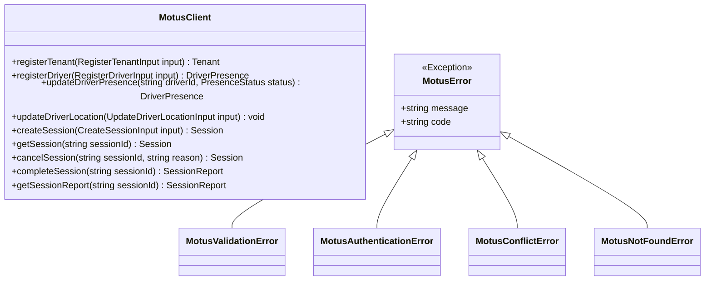

# 12 - SDK Design

This document details the Public SDK Design for Motus. It defines the public API interfaces, input/output validation contracts, and the error class hierarchy.

---

## SDK Architecture Overview

The Motus SDK is a TypeScript client library distributed via npm, allowing consumer applications (e.g. order systems, backend routing engines) to interact with the Motus engine.



---

## Method Contracts

### 1. `registerTenant`
*   **Signature:** `registerTenant(input: RegisterTenantInput): Promise<Tenant>`
*   **Input Contract:**
    ```typescript
    interface RegisterTenantInput {
      name: string;
      config: {
        matchingStrategy: 'distance' | 'eta' | 'custom';
        waveTimeoutSeconds?: number; // Default: 8
        staleThresholdSeconds?: number; // Default: 120
        maxCapacityPerDriver?: number; // Default: 1
      };
      geofences?: Array<{
        name: string;
        coordinates: Array<{ lat: number; lng: number }>; // Polygon boundaries
      }>;
    }
    ```
*   **Output Contract:** A `Tenant` object containing the generated `tenantId` and confirmation of configurations.

### 2. `registerDriver`
*   **Signature:** `registerDriver(input: RegisterDriverInput): Promise<DriverPresence>`
*   **Input Contract:**
    ```typescript
    interface RegisterDriverInput {
      tenantId: string;
      driverId: string;
      initialStatus?: 'ONLINE' | 'PAUSED'; // Default: ONLINE
      capacity?: number; // Default: 1
      metadata?: Record<string, any>; // Vehicle details, ratings, etc.
    }
    ```
*   **Output Contract:** A `DriverPresence` status profile confirming their active configuration.

### 3. `updateDriverLocation`
*   **Signature:** `updateDriverLocation(input: UpdateDriverLocationInput): Promise<void>`
*   **Input Contract:**
    ```typescript
    interface UpdateDriverLocationInput {
      tenantId: string;
      driverId: string;
      latitude: number;
      longitude: number;
      accuracy?: number;
      bearing?: number;
      speed?: number;
      timestamp: number; // Unix epoch millisecond
    }
    ```
*   **Output Contract:** `void` (resolves instantly upon transmission).

### 4. `createSession`
*   **Signature:** `createSession(input: CreateSessionInput): Promise<Session>`
*   **Input Contract:**
    ```typescript
    interface CreateSessionInput {
      tenantId: string;
      sessionId: string; // Unique reference mapping to an order or trip
      pickupLatitude: number;
      pickupLongitude: number;
      destinationLatitude: number;
      destinationLongitude: number;
      vehicleTypeRequired?: string;
      metadata?: Record<string, any>;
    }
    ```
*   **Output Contract:** A `Session` object in the `CREATED` or `SEARCHING` state.

### 5. `cancelSession`
*   **Signature:** `cancelSession(sessionId: string, reason?: string): Promise<Session>`
*   **Output Contract:** Returns the cancelled session confirmation, releasing any driver reservations.

### 6. `completeSession`
*   **Signature:** `completeSession(sessionId: string): Promise<SessionReport>`
*   **Output Contract:** Compiles and returns the finalized `SessionReport` containing telemetry stats and path polylines.

---

## Error Handling Hierarchy

The SDK throws structured exceptions that inherit from a base `MotusError` class, containing standard error codes.

1.  **`MotusValidationError`:** Thrown when parameters fail checks (e.g. invalid coordinates, missing IDs).
2.  **`MotusAuthenticationError`:** Thrown when keys are invalid or tokens have expired.
3.  **`MotusNotFoundError`:** Thrown if a requested `sessionId` or `driverId` does not exist.
4.  **`MotusConflictError`:** Thrown when a request violates state invariants:
    *   Examples: Calling `completeSession` on a session that has already been `CANCELLED`, or driver trying to accept an offer that expired.

---

## Failure Scenarios

*   **Network Timeouts:** The SDK client features auto-retry logic with exponential backoff for transient connections, throwing a timeout error only after 3 consecutive failures.

---

## Tradeoffs

*   **SDK Fat Clients vs Thin Clients:** Building validation logic directly into the SDK fat client reduces backend request volumes by filtering out bad parameters before transmission. However, this means any updates to the validation rules require upgrading the client package, whereas thin clients delegate all checks to the server API. We choose a balanced approach where basic formatting validation (e.g., coordinate ranges) is done in the SDK, and business validation is done on the server.
