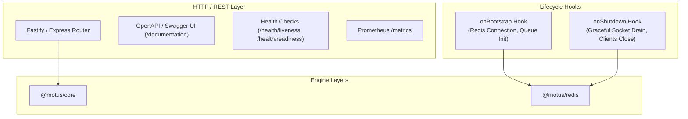

# 13 - Server Architecture

This document describes the design of the `@motus/server` package. It details the REST API routes, OpenAPI integration, Health Checks, Prometheus Metrics, and application lifecycle hooks.

---

## Server Layout

The server package acts as the orchestration shell, exposing external REST interfaces and coordinating startup, shutdown, and instrumentation.

---

## Technical Details

### 1. REST API Routing
The server hosts REST routers separated by functional areas:

#### A. Tenant Management
*   `POST /tenants`: Create a tenant profile.
*   `GET /tenants/:id`: Fetch configurations.

#### B. Driver Directory
*   `POST /tenants/:id/drivers`: Register drivers.
*   `GET /tenants/:id/drivers/:driverId/presence`: Check presence attributes.

#### C. Session Control
*   `POST /tenants/:id/sessions`: Initiate tracking sessions.
*   `GET /tenants/:id/sessions/:sessionId`: Fetch active state.
*   `POST /tenants/:id/sessions/:sessionId/cancel`: Cancel sessions.
*   `POST /tenants/:id/sessions/:sessionId/complete`: Complete sessions and generate reports.
*   `GET /tenants/:id/sessions/:sessionId/report`: Get reports.

### 2. Swagger / OpenAPI Integration
The server uses a Swagger library (e.g. `@fastify/swagger`) to auto-generate schema files from TypeScript contracts, exposing the dynamic documentation endpoint `/documentation`.

### 3. Health Checks (Probes)
*   **Liveness Probe (`GET /health/liveness`):** Returns `200 OK` instantly, confirming that the Node.js event loop is operational.
*   **Readiness Probe (`GET /health/readiness`):** Verifies that active cluster dependencies are operational. It runs a `PING` on the Redis client. Returns `503 Service Unavailable` if dependencies are down.

### 4. Prometheus Metrics (`GET /metrics`)
Exposes instrumentation gauges and counters to monitoring systems:
*   `motus_driver_presence_total{tenantId, status}`: Gauge tracking driver status distributions.
*   `motus_session_states_total{tenantId, state}`: Gauge tracking session state allocations.
*   `motus_dispatch_waves_total{tenantId}`: Counter recording wave activities.
*   `motus_api_request_duration_seconds{method, route, status}`: Histogram tracking HTTP latencies.
*   `motus_matching_routing_failures_total{tenantId}`: Counter tracking routing fallback events.

### 5. Lifecycle Hooks
The server provides lifecycle execution hooks:
*   **`onBootstrap`:** Runs before the server begins listening. Connects to the Redis cluster, registers outbox stream consumers, and checks routing engine availability.
*   **`onShutdown`:** Triggered by system signals (`SIGTERM`, `SIGINT`). It stops accepting new requests, terminates socket rooms by sending a final shutdown event, drains outstanding event outbox streams, and closes connection ports.

---

## Failure Scenarios

*   **Redis Disconnection on Bootstrap:** If the Redis client cannot connect during `onBootstrap`, the initialization throws a fatal exception, preventing the HTTP server from binding to ports and alerting orchestration managers (e.g., Kubernetes) to restart the container.

---

## Tradeoffs

*   **Fastify vs. Express:** Fastify is chosen over Express due to its higher throughput, schema validation support, and lower overhead. This is critical for matching operations where sub-millisecond latencies are required.
