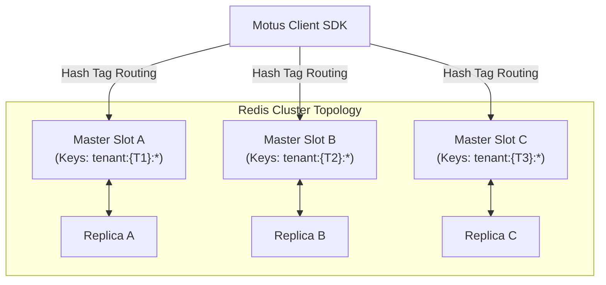

# 14 - Scalability

This document details the scalability architecture for Motus. It analyzes how the platform supports scale targets (10K, 100K, and 1M concurrent drivers) and estimates memory, socket, and storage growth constraints.

---

## Scaling Tier Specifications

| Scale Tier | Concurrent Drivers | Active Sessions / hr | Redis Setup | App Nodes | Telemetry Strategy |
| :--- | :--- | :--- | :--- | :--- | :--- |
| **10K** (City) | 10,000 | 5,000 | Master + Replica | 2-4 | Direct stream caching |
| **100K** (Metro) | 100,000 | 50,000 | Cluster: 3 Master / 3 Replica | 10-20 | Active 25m/10s Filtering |
| **1M** (Global) | 1,000,000 | 500,000 | Cluster: 16 Master / 16 Replica | 100+ | Filter + Polyline Offload |

---

## Redis Sharding & Clustering

Under 1M active drivers, a single Redis master node will become CPU and network-bound. Scaling is achieved by sharding states across a Redis Cluster:

*   **Key Partitioning (Hash Tags):** To perform atomic multi-key Lua scripts within single instances, all keys for a tenant must reside in the same slot. This is guaranteed by wrapping tenant identifiers in hash tags:
    *   `motus:{tenant:T1}:driver:123:presence`
    *   `motus:{tenant:T1}:drivers:locations`

---

## Socket Scaling & Heartbeat Optimization

Connecting 1M drivers via WebSockets introduces network overhead. We optimize this through several configurations:

*   **Connection Splitting:** Dedicate separate server clusters for REST APIs (CPU-bound matching) and WebSockets (I/O-bound tracking).
*   **Heartbeat Tuning:**
    *   Standard socket settings (25s pingInterval, 60s pingTimeout) for 1M clients generate ~40,000 network check-ins per second.
    *   Adjusting connections to a **60s pingInterval and 120s pingTimeout** reduces CPU utilization on Socket.io servers by over 50%.
*   **Sticky Load Balancing:** Essential to terminate SSL handshakes at the edge proxy (HAProxy/Nginx) and route connections consistently to prevent reconnect storms.

---

## Memory & Growth Projections

The following calculates the RAM footprint in Redis for 100K active drivers and 100K concurrent sessions:

### 1. Driver Presence Data (100K Drivers)
*   **Presence Hash:** 200 bytes per driver profile.
*   **Location Hash:** 150 bytes per driver location.
*   **Spatial Index:** 100 bytes per geo member.
*   **Calculation:**
    $$\text{RAM}_{\text{drivers}} = 100,000 \times (200 + 150 + 100) \text{ bytes} \approx 45 \text{ MB}$$

### 2. Session Data (100K Active Sessions)
*   **Session State Hash:** 500 bytes per active session.
*   **Calculation:**
    $$\text{RAM}_{\text{sessions}} = 100,000 \times 500 \text{ bytes} \approx 50 \text{ MB}$$

### 3. Telemetry Cache (100K Sessions, 1 hour trip)
*   **Without Filtering** (1 update/sec $\times$ 3,600s $\times$ 64 bytes per coordinate):
    $$\text{RAM}_{\text{unfiltered}} = 100,000 \times (3600 \times 64) \text{ bytes} \approx 23 \text{ GB}$$
*   **With 25m/10s Filtering** (Reduces coordinates by ~85%):
    $$\text{RAM}_{\text{filtered}} = 100,000 \times (540 \times 64) \text{ bytes} \approx 3.4 \text{ GB}$$

> [!TIP]
> This math demonstrates why the **Telemetry Sampling Engine** is a critical architectural requirement. It protects Redis from memory saturation by filtering out redundant coordinate data during tracking.

---

## Failure Scenarios

*   **Redis Cluster Resharding Outages:** During resharding, slots move between master nodes. The SDK handles this by catching `MOVED` and `ASK` Redis errors and dynamically updating its internal hash-slot routing tables without interrupting API requests.

---

## Tradeoffs

*   **At-the-Edge Decoupled Memory vs. Single-Instance DB:** Distributing states across master nodes prevents CPU bottlenecks, but means cross-tenant queries (like cross-tenant statistics for global dashboards) cannot be performed inside Redis. Since Motus isolates operations by tenant, this trade-off is accepted, and global queries are delegated to historical event logs.
