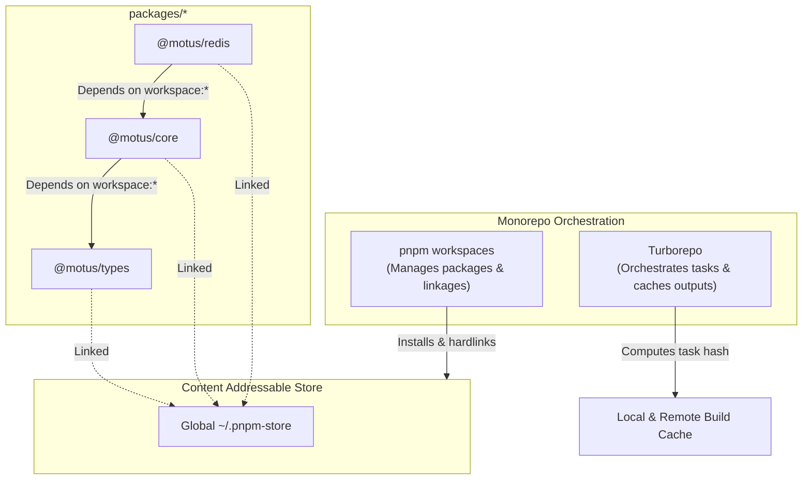

# 17 - Monorepo Strategy

This document designs the monorepo workspace strategy, evaluating and detailing the package manager selection, dependency hoisting rules, package linking, and release cycles.

---

## Purpose
This document establishes the monorepo architecture for Motus. It details the tools and configurations required to maintain, run, and release multiple packages from a single repository while ensuring dependency isolation.

---

## Goals
*   **Zero Phantom Dependencies:** Prevent packages from accessing libraries they do not explicitly declare in their own `package.json`.
*   **Optimal Installation Speeds:** Utilize a global content-addressable store to reduce installation overhead for developers and CI pipelines.
*   **Acyclic Task Scheduling:** Coordinate build, test, and lint tasks using dependency graphs.
*   **Simplified Contributor DX:** Provide a standard CLI experience for installing, linking, and testing code.

---

## Scope
This strategy applies to package management, versioning, and compilation boundaries across all projects inside `packages/`, `apps/`, and `examples/`.

---

## Design Decisions

### 1. Workspace Strategy Selection
Motus standardizes on **pnpm workspaces** as the package management engine, paired with **Turborepo** as the task runner.



### 2. Alternatives Evaluated

| Tool / Strategy | Speed / Efficiency | Strictness (No Phantom Deps) | Config Complexity | OSS Suitability | Decision |
| :--- | :--- | :--- | :--- | :--- | :--- |
| **pnpm workspaces** | **Excellent** (Global hard-link store) | **High** (Symlinks nested node_modules) | **Low** (Simple YAML configs) | **High** (Low contributor friction) | **Adopted (Package Manager)** |
| **npm workspaces** | Slow (Full duplicate node_modules download) | Low (Flattens store; allows phantom imports) | Low (Native npm) | High (Default tool) | Rejected (Slow, prone to dependency bugs) |
| **Yarn (v1/Classic)**| Slow (No global content store) | Low (Hoists all deps to root) | Low (Simple) | High (Familiar) | Rejected (Stale engine, legacy bugs) |
| **Yarn (Berry v3/v4 PnP)**| Fast (Zip-based imports) | High (Strict mapping) | High (Requires custom SDKs/IDE plugins) | Low (High IDE setup friction for contributors) | Rejected (Complex IDE integration steps) |
| **Nx** | Fast (Cache-heavy execution) | High (Allows strict boundaries) | High (Intrusive JSON configurations) | Medium (Heavy configuration footprints) | Rejected as primary PM; too heavy. |
| **Turborepo** | **Excellent** (Fast Rust-based execution runner) | N/A (Does not manage packages directly) | **Low** (Single JSON file) | **High** (Transparent cache matching) | **Adopted (Task Runner)** |
| **Rush** | Medium (Uses pnpm/npm under the hood) | High (Strict shrinkwraps) | High (Verbose multi-file JSON config structures) | Low (Complex configuration for simple edits) | Rejected (Designed for enterprise monorepos) |

### 3. Dependency Hoisting & Isolation
*   **Hoisting Configuration:** Motus enforces `"shamefully-hoist=false"` in `.npmrc`. This ensures that a package cannot import a library unless it is declared in its own `package.json`, preventing bugs caused by mismatched hoisted dependencies.
*   **Workspace Protocol:** Internal package linkages must utilize the `workspace:*` syntax. When publishing to npm, the release workflow replaces this with the target version string (e.g., `^1.0.0`).

### 4. Versioning and Release Management
*   **Changesets Selection:** Versioning is managed using **Changesets** (`@changesets/cli`).
*   **Developer Workflow:** When developers submit code modifications to `/packages`, they run `pnpm changeset` to generate a markdown file detailing the change type (patch, minor, major).
*   **Automated Releases:** The CI pipeline parses these changeset files, bumps versions, updates internal packages, and publishes changes to npm.

---

## Alternatives Considered

### 1. Monorepo Task Running with Nx
*   **Approach:** Use Nx for package linking, task execution, and dependency graphing.
*   **Why Rejected:** Nx is highly capable but introduces significant configuration overhead and a large dependency footprint. Turborepo provides a simpler configuration experience while delivering similar task caching and speed, which helps lower the entry barrier for open-source contributors.

### 2. Semantic Release (Automated Commit Parsing)
*   **Approach:** Parse git history (using Conventional Commits) to automatically determine version bumps.
*   **Why Rejected:** Automated commit parsing can be fragile in monorepos, where a change in one package might trigger unintended version bumps in others. Changesets provide developers with explicit control over package versioning in a collaborative environment.

---

## Tradeoffs

*   **Learning Curve for Contributors:** Contributors must install `pnpm` and use workspace-specific commands (such as `pnpm --filter`). This is mitigated by documenting common commands in the repository's readme file.
*   **Symlink Resolution with Downstream Tools:** Nested symlinks inside `.pnpm/` can occasionally cause issues with older compilers or testing tools. This is resolved by using modern, symlink-aware tools (such as TypeScript 5 and Vitest).

---

## Recommended Standards

### 1. Root `pnpm-workspace.yaml` Structure
The workspace root directory must define package boundaries:
```yaml
packages:
  - 'packages/*'
  - 'apps/*'
  - 'examples/*'
```

### 2. Dependency Single-Version Policy
To prevent runtime class mismatch errors, external dependencies that are shared across multiple packages (e.g., `typescript`, `ioredis`, `socket.io`) must be pinned to the same version.

---

## Risks
*   **Lockfile Churn:** Simultaneous pull requests can modify `pnpm-lock.yaml`, leading to git merge conflicts. This risk is managed by using standard merge-conflict resolution patterns (`pnpm install` handles lockfile reconciliation automatically).
*   **Cache Poisoning:** Changes to global environment variables or machine setups can lead to incorrect cache hits in Turborepo. This risk is addressed by configuring explicit cache keys in `turbo.json`.

---

## Future Considerations
*   **Remote Cache Nodes:** Integrating with a shared remote caching service (such as Vercel Remote Cache) to share build artifacts across CI runners, reducing pull request check times.
*   **NPM Provenance Signing:** Integrating secure provenance signing into the GitHub Actions release workflow to verify the origin of published packages.
