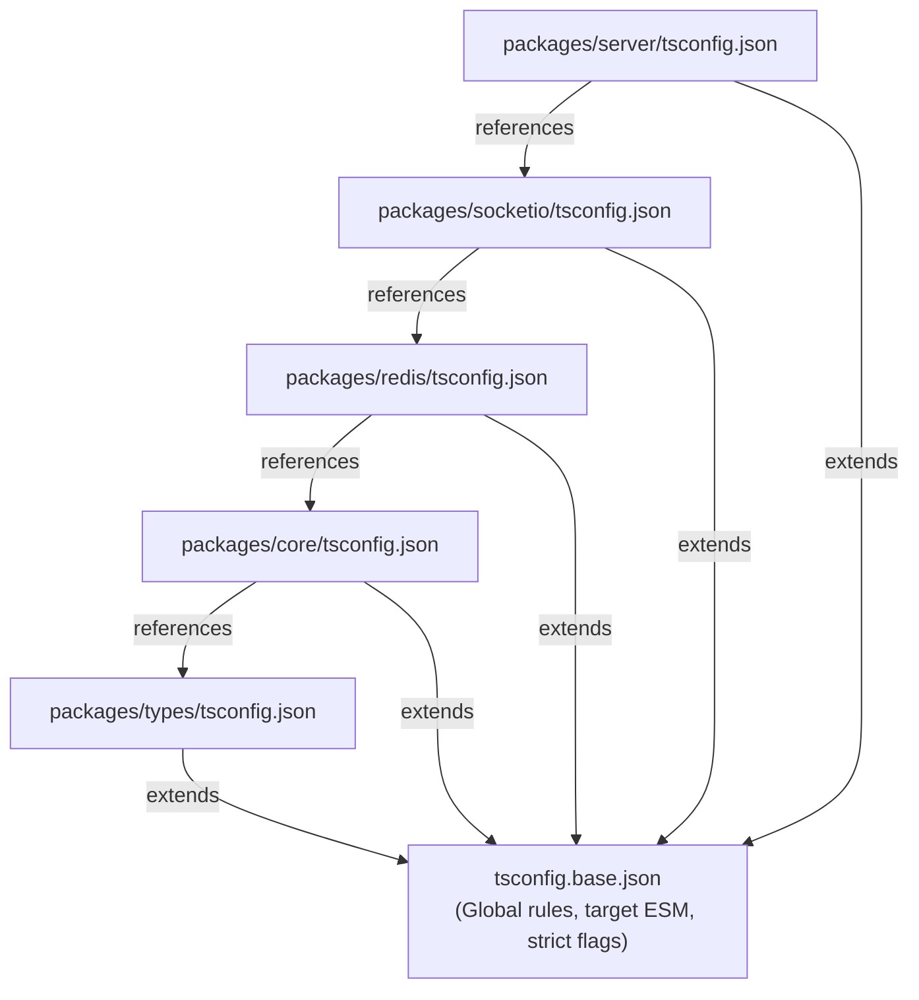

# 18 - TypeScript Standards

This document establishes the TypeScript compilation system, strictness guidelines, module resolution settings, and incremental build paths for the Motus project.

---

## Goals
*   **Compile-Time Type Safety:** Enforce strict type checking across all packages to intercept bugs before execution.
*   **ESM-First Delivery:** Build for modern Node.js environments using native ECMAScript Modules (ESM).
*   **Optimized Compile Loops:** Utilize Project References to build packages incrementally and avoid redundant type checks.
*   **Uniform Configurations:** Ensure consistent coding rules and module resolution pathways across the entire workspace.

---

## Compilation Hierarchy

The TypeScript compilation pipeline utilizes an inheritance model where workspace packages extend a global configuration base.



---

## Design Decisions

### 1. TypeScript Version and Native ESM Configuration
Motus adopts **TypeScript 5.x** with native ESM target configurations.
*   **Module Settings:** The compilation target is set to `"module": "NodeNext"` and `"moduleResolution": "NodeNext"`.
*   **Why ESM?** Node.js natively runs ESM, enabling top-level await, efficient tree shaking, and removing the build overhead of wrapping ESM packages into CommonJS wrappers.
*   **Preserve Symlinks:** `"preserveSymlinks": true` is enabled to allow proper module resolution when using pnpm workspaces.

### 2. Strict Compiler Rules
To maximize the benefits of static typing, Motus mandates a strict typing checklist. The following compiler configurations are configured in the base tsconfig file:
*   `"strict": true` (Enables strict null checks, strict bind/call/apply, and strict property initialization).
*   `"noImplicitAny": true` (Prevents compilation of variables and parameters resolving to dynamic `any` types).
*   `"noImplicitReturns": true` (Ensures all paths in code functions return a value).
*   `"noUnusedLocals": true` and `"noUnusedParameters": true` (Removes dead variables and args).
*   `"exactOptionalPropertyTypes": true` (Prevents assigning `undefined` to optional fields that should be omitted).

### 3. Project References (`tsconfig.json` references)
To optimize build speed, Motus uses TypeScript Project References.
*   **Incremental Builds:** Setting `"composite": true` in individual package tsconfig files enables the TS compiler to generate `.tsbuildinfo` files.
*   **Fast Compiler Validation:** Instead of recompiling all source files across the monorepo, running `tsc --build` allows the compiler to detect which package files have changed and recompiles only those packages and their dependent layers.

---

## Alternatives Considered

### 1. Unified Monorepo Single-Compile
*   **Approach:** Place a single `tsconfig.json` at the root and compile the entire repository in one invocation of `tsc`.
*   **Why Rejected:** This approach causes namespace leakage and breaks encapsulation. Package boundaries can be bypassed since the compiler treats all source files as a single project, allowing illegal imports to build successfully.

### 2. CommonJS (CJS) Compilation Target
*   **Approach:** Target CJS and compile to standard CommonJS modules.
*   **Why Rejected:** CommonJS is legacy and complicates integration with modern asynchronous ESM libraries. Compiling to ESM simplifies external integrations and aligns with Node.js LTS standards.

---

## Tradeoffs

*   **Explicit File Extensions:** Native ESM in NodeNext requires that relative imports in TS source files explicitly declare the output file extension (e.g. `import { Session } from "./session.js"` instead of `"./session"`). This can be unintuitive for developers accustomed to bundler-style path resolutions, but is required for spec-compliant Node.js execution.
*   **Build Setup Overhead:** Each package must maintain its own `tsconfig.json` containing composite reference arrays to its dependencies.

---

## Future Considerations

*   **Strict Property Check Exceptions:** In packages that perform database operations (like `@motus/redis`), relaxing property initialization rules selectively when entities are instantiated dynamically by ORMs or custom parsing routines.
*   **Isolated Modules Compatibility:** Enabling `"isolatedModules": true` to prepare the repository for future light-speed transpilers (such as `swc` or `oxc`) that compile files individually without full type graph resolution.

---

## Recommended Standards

### 1. The Global `tsconfig.base.json` Configuration
This config resides at the repository root and is extended by all packages:
```json
{
  "compilerOptions": {
    "target": "ES2022",
    "module": "NodeNext",
    "moduleResolution": "NodeNext",
    "lib": ["ES2022"],
    "strict": true,
    "noImplicitAny": true,
    "strictNullChecks": true,
    "strictFunctionTypes": true,
    "noImplicitThis": true,
    "alwaysStrict": true,
    "noUnusedLocals": true,
    "noUnusedParameters": true,
    "noImplicitReturns": true,
    "noFallthroughCasesInSwitch": true,
    "exactOptionalPropertyTypes": true,
    "declaration": true,
    "declarationMap": true,
    "sourceMap": true,
    "incremental": true,
    "esModuleInterop": true,
    "forceConsistentCasingInFileNames": true,
    "skipLibCheck": true
  }
}
```

### 2. Package-Specific Configuration Example (`packages/core/tsconfig.json`)
```json
{
  "extends": "../../tsconfig.base.json",
  "compilerOptions": {
    "outDir": "./dist",
    "rootDir": "./src",
    "composite": true
  },
  "include": ["src/**/*"],
  "references": [
    { "path": "../types" }
  ]
}
```
