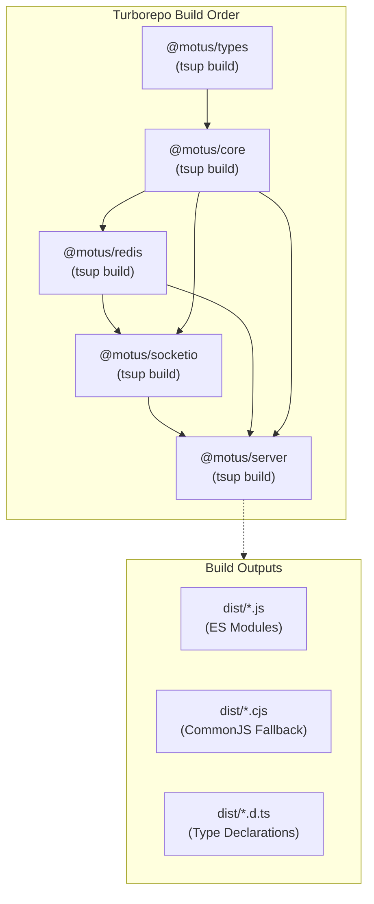

# 19 - Build System

This document designs the build architecture, compiler runtimes, bundler configurations, and optimization flows for the Motus packages.

---

## Goals
*   **High Performance Compiling:** Maximize build speeds using modern, compiler-optimized bundlers.
*   **Clean Dependency Bundling:** Prevent external NPM dependencies from being bundled into internal libraries, leaving them as runtime imports.
*   **Robust Typings Delivery:** Output highly accurate TypeScript declarations (`.d.ts`) alongside transpiled JavaScript.
*   **Dual Target Support:** Maintain native ESM builds while retaining compatibility mappings for CommonJS environments where necessary.

---

## Workspace Build Flow

The monorepo build pipeline executes in a strict topology determined by Turborepo, compiling lower-level dependencies first.



---

## Design Decisions

### 1. Build System Selection: `tsup`
Motus standardizes on **tsup** as its core packaging and compilation tool.
*   **Esbuild Under the Hood:** `tsup` wraps `esbuild` for ultra-fast transpilation, compiling large TypeScript libraries in milliseconds compared to seconds with standard `tsc`.
*   **Out-of-the-Box TS Support:** Handles source maps, minification, and multi-format outputs without requiring complex plugin chains.

### 2. Dual-Format Bundling
To ensure maximum compatibility, packages are built to export both ESM (ECMAScript Modules) and CJS (CommonJS).
*   **ESM First:** The primary target format is ESM, outputting modern `.js` structures.
*   **CJS Fallback:** A CommonJS version is bundled as `.cjs` to support legacy backend systems integrating with Motus libraries.
*   **Declaration Bundling:** `tsup` handles generating clean type definition files (`.d.ts`) matching both export targets.

### 3. Separation of Transpilation and Type-Checking
*   **Fast Compiler Iterations:** Since `esbuild` strips TypeScript types without validating them, the build process divides compile and check into two parallel workflows.
*   **CI Pipeline Division:**
    *   **Build Task:** `tsup` builds targets instantly.
    *   **Type-check Task:** `tsc --noEmit` runs as a quality gate in CI to verify the type graph. This ensures fast developer feedback loops while maintaining strict type validation.

---

## Alternatives Considered

### 1. Rollup
*   **Approach:** Build a custom Rollup build pipeline with plugins for TypeScript and commonjs resolution.
*   **Why Rejected:** Rollup is highly flexible but requires complex configuration files per package. The build performance of Rollup (which is JS-based) is significantly slower than `esbuild` (which is Go-based).

### 2. Pure TypeScript Compiler (`tsc`)
*   **Approach:** Compile packages using `tsc -p tsconfig.json`.
*   **Why Rejected:** `tsc` cannot easily bundle output files or generate dual ESM/CJS exports in a single compile pass. It also does not support minification or clean path-aliasing rewriting out-of-the-box.

---

## Tradeoffs

*   **Esbuild Limitations:** `esbuild` does not support certain advanced TS features like `const enum` rewriting or experimental decorators. Motus avoids these patterns to maintain compatibility with the speed benefits of the `esbuild` parser.
*   **Type-checking Overhead:** Developers must remember that a green build on their local computer (`pnpm build`) does not guarantee there are no TypeScript compile errors. They must run `pnpm typecheck` locally or rely on their editor's language server to catch issues.

---

## Future Considerations

*   **SWC Integration for Runtime Compilation:** If Motus introduces runtime test execution or dynamic plugin compilations, incorporating `swc` (Rust-based TypeScript compiler) to handle JIT compilation tasks.
*   **Bundled API Client (SDK):** When shipping the public client SDK, bundling all internal helpers into a single minified `.js` file to simplify browser-based client installations.

---

## Recommended Standards

### 1. Standard package `tsup.config.ts` Template
This configuration is placed in each package directory:
```typescript
import { defineConfig } from 'tsup';

export default defineConfig({
  entry: ['src/index.ts'],
  format: ['esm', 'cjs'],
  dts: true,
  splitting: true,
  sourcemap: true,
  clean: true,
  minify: process.env.NODE_ENV === 'production',
  external: [
    // Mark core internal peer deps or dependencies as external
    'redis',
    'socket.io',
    'express',
    'fastify'
  ],
  treeshake: true,
});
```

### 2. Root Build Pipeline Command Orchestration
The root `package.json` coordinates workspace builds using Turborepo to leverage caching:
```json
"scripts": {
  "build": "turbo run build",
  "dev": "turbo run dev --parallel",
  "typecheck": "turbo run typecheck"
}
```
And `turbo.json` configuration coordinates the tasks:
```json
{
  "$schema": "https://turbo.build/schema.json",
  "pipeline": {
    "build": {
      "dependsOn": ["^build"],
      "outputs": ["dist/**"]
    },
    "typecheck": {
      "dependsOn": ["^build"]
    },
    "dev": {
      "cache": false,
      "persistent": true
    }
  }
}
```
