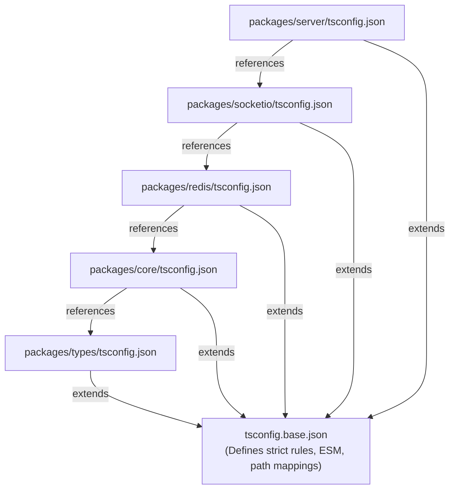

# 19 - TypeScript Standards

This document establishes the TypeScript compilation system, module resolution pathways, configuration hierarchies, and type checking strictness rules for Motus.

---

## Purpose
This document provides a technical standard for compiling and type-checking the Motus codebase. It defines how configurations are extended across packages, how dependencies are linked, and how type safety is enforced during development and CI pipelines.

---

## Goals
*   **Compile-Time Verification:** Catch runtime bugs (such as undefined variables or null pointer dereferences) at compile-time using strict type parameters.
*   **Native ESM Target:** Align compilation outputs with standard ECMAScript Modules (ESM) to support modern Node.js environments.
*   **Acyclic Type Dependency Validation:** Link package compilation steps using project references to reflect package architectural boundaries.
*   **Optimize Developer Typing DX:** Provide clean declaration source maps that point back to original source code during debugging.

---

## Scope
These compiler standards apply to all TypeScript files within `/packages`, `/apps`, `/examples`, and `/test`.

---

## Design Decisions

### 1. TypeScript Version Policy
Motus standardizes on **TypeScript 5.x** to leverage features like const modifiers on type parameters, faster type checking, and improved module resolution checks.

### 2. Native ESM Target Configuration
Motus compiles exclusively to native ECMAScript Modules (ESM).
*   **Compiler Mappings:** The base configuration enforces `"module": "NodeNext"` and `"moduleResolution": "NodeNext"`.
*   **Why ESM?** Native ESM avoids CommonJS transpilation overhead, enables tree-shaking, and aligns with the standard import specifications of Node.js and modern runtime environments.

### 3. Project References and tsconfig Hierarchy
To optimize compilation performance and maintain package encapsulation, Motus uses TypeScript **Project References**.



*   **Composite Compiles:** Each package tsconfig sets `"composite": true`, enabling the compiler to output `.tsbuildinfo` cache files.
*   **Incremental Builds:** The compiler (`tsc --build`) only recompiles packages that have changed, checking their cached build states to speed up development cycles.

### 4. Strict Type-Checking Rules
The following compiler strictness flags are configured in the base `tsconfig.base.json`:
*   `"strict": true` (Enables strict null checks, strict bind/call/apply, and strict property initialization).
*   `"noImplicitAny": true` (Prevents compilation of variables and parameters resolving to dynamic `any` types).
*   `"noImplicitReturns": true` (Ensures all paths in code functions return a value).
*   `"noUnusedLocals": true` and `"noUnusedParameters": true` (Removes dead variables and args).
*   `"exactOptionalPropertyTypes": true` (Prevents assigning `undefined` to optional fields that should be omitted).

### 5. Path Aliases
To prevent issues with published packages, Motus **discourages path aliases** in public code (e.g. mapping `import { X } from "@/utils"`). Path aliases can lead to broken declaration files (`.d.ts`) for downstream consumers unless resolved by a bundler. Instead, relative pathways (e.g., `import { X } from "../utils/x.js"`) must be used for internal package files.

---

## Alternatives Considered

### 1. Dual-Compiling to ESM and CommonJS via `tsc`
*   **Approach:** Maintain two configuration sets to compile TS source code twice—once to ESM and once to CommonJS.
*   **Why Rejected:** Running double compilation passes through `tsc` increases build times and configuration complexity. Instead, transpilation is delegated to `tsup` (esbuild), which handles dual-output bundling in a single pass, leaving `tsc` focused on type checking.

### 2. Single Flat Monorepo Compile (No Project References)
*   **Approach:** Compile the entire codebase as a single project using a root-level `tsconfig.json`.
*   **Why Rejected:** A flat compilation model does not enforce package isolation, allowing developers to import code across package boundaries without compiler warnings. Project references help enforce structural isolation at the type level.

---

## Tradeoffs

*   **Explicit File Extensions:** Native ESM resolution (`NodeNext`) requires relative imports in TS source files to declare the output file extension explicitly (e.g. `import { Session } from "./session.js"` instead of `./session`). While this can be counterintuitive initially, it is required for standard Node.js module resolution.

---

## Recommended Standards

### 1. Root `tsconfig.base.json` Configuration
This config is placed at the root of the workspace:
```json
{
  "compilerOptions": {
    "target": "ES2022",
    "module": "NodeNext",
    "moduleResolution": "NodeNext",
    "lib": ["ES2022"],
    "strict": true,
    "noImplicitAny": true,
    "strictNullChecks": true,
    "strictFunctionTypes": true,
    "noImplicitThis": true,
    "alwaysStrict": true,
    "noUnusedLocals": true,
    "noUnusedParameters": true,
    "noImplicitReturns": true,
    "noFallthroughCasesInSwitch": true,
    "exactOptionalPropertyTypes": true,
    "declaration": true,
    "declarationMap": true,
    "sourceMap": true,
    "incremental": true,
    "esModuleInterop": true,
    "forceConsistentCasingInFileNames": true,
    "skipLibCheck": true,
    "preserveSymlinks": true
  }
}
```

### 2. Package-Specific tsconfig Template (`packages/core/tsconfig.json`)
```json
{
  "extends": "../../tsconfig.base.json",
  "compilerOptions": {
    "outDir": "./dist",
    "rootDir": "./src",
    "composite": true
  },
  "include": ["src/**/*"],
  "references": [
    { "path": "../types" }
  ]
}
```

---

## Risks
*   **Out-of-Sync References:** If a developer adds a workspace dependency to `package.json` but forgets to add it to the `references` array in `tsconfig.json`, compilation may fail. This is mitigated by CI checks that validate reference alignments.
*   **Type Resolution Errors:** Legacy third-party libraries that do not export standard ESM type maps can cause compilation issues. These are addressed by declaring explicit module overrides in a global types file.

---

## Future Considerations
*   **Typechecking with Swc/Oxc compiler runners:** When alternative compilers support type checking, they can be evaluated to replace the default type checking steps in CI, while retaining `tsc` for declaration file generation.
