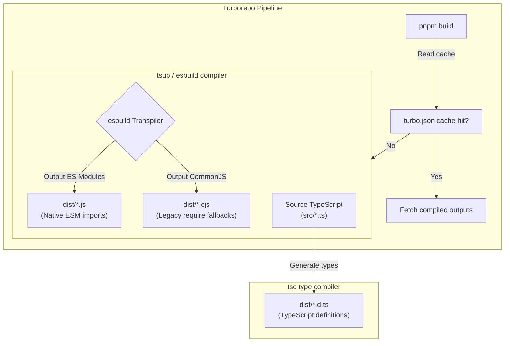

# 20 - Build System

This document designs the build system, compilation engine, bundling rules, and task orchestration pipelines for Motus.

---

## Purpose
This document establishes the build infrastructure for the codebase. It details the tools used for transpilation, tree-shaking, packaging, and type definition generation across all workspace libraries.

---

## Goals
*   **Maximize Compilation Speed:** Minimize transpilation times using compiler backends.
*   **Deliver Clean Dual Formats:** Output ESM and CommonJS formats to support both modern and legacy Node.js environments.
*   **Enforce Dependency Externalization:** Prevent external npm dependencies from being bundled into internal libraries, leaving them as runtime imports.
*   **Isolate Compiling and Verification:** Split transpilation and type-checking tasks to ensure fast feedback loops for developers.

---

## Scope
These build standards apply to all packages in `/packages` and apps in `/apps`. They do not apply to manual documentation or integration test suites.

---

## Design Decisions

### 1. Build Engine Selection: `tsup`
Motus standardizes on **tsup** (powered by `esbuild`) for compiling workspace libraries.



### 2. Alternatives Evaluated

| Build Engine | Compilation Speed | Multi-Format Outputs | Config Overhead | Type Generation | Decision |
| :--- | :--- | :--- | :--- | :--- | :--- |
| **tsup (esbuild)** | **Fast** (Go-based compiler) | **High** (ESM & CJS in single pass) | **Low** (Zero-config presets) | Yes (Hooks into tsc for dts output) | **Adopted (Package Builder)** |
| **tsc** | Slow (Full type analysis overhead) | Low (Single target format per run) | Low (tsconfig default) | Yes (Native) | Rejected (Slow, does not bundle dual outputs) |
| **unbuild** | Medium (Rollup wrapper) | High (ESM/CJS/DTS outputs) | Medium (Config preset files) | Yes (Rollup dts plugin) | Rejected (Lower compilation speed) |
| **rollup** | Slow (JS-based pipeline) | High (Custom bundles) | High (Complex plugin chains) | Yes (Via plugins) | Rejected (Slow, high config overhead) |
| **vite** | Medium (Dev server focus) | Low (Client-side assets focus) | High (Webpack style) | No (Requires plugins) | Rejected (Optimized for SPAs, not backend libs) |

### 3. Bundling and Externalization Strategy
*   **Externalize Dependencies:** To prevent package bloat and duplicate code, tsup configurations must mark all third-party dependencies (e.g. `ioredis`, `socket.io`) and internal workspace packages (e.g. `@motus/core`) as **external**.
*   **Tree Shaking:** Enforce tree-shaking configurations (`treeshake: true`) to strip unused code from the output bundles.

### 4. Development vs. Production Configurations
*   **Development Build Strategy:** Developers run `pnpm dev` to launch tsup in watch mode (`tsup --watch`) alongside Turborepo's parallel task manager, recompiling changes on save.
*   **Production Build Strategy:** Production builds minify output bundles, generate sourcemaps for debugging, and clean the output directories (`dist/`) before compilation.

---

## Alternatives Considered

### 1. Unified Compilation via `tsc`
*   **Approach:** Compile all packages using standard `tsc -p tsconfig.json`.
*   **Why Rejected:** `tsc` cannot output ESM and CommonJS in a single build pass without maintaining duplicate configs, and it does not support minification or clean path-aliasing rewriting.

### 2. Custom Rollup Configurations
*   **Approach:** Build a custom Rollup compilation file with plugins for TypeScript.
*   **Why Rejected:** While highly flexible, Rollup requires verbose configuration files and runs significantly slower than `esbuild`.

---

## Tradeoffs

*   **Type-checking Decoupling:** `esbuild` strips type annotations without validating them. A package can compile successfully even if it contains type errors. This is accepted to optimize compile times, but requires a separate type-checking step (`tsc --noEmit`) in the CI pipeline to catch type errors.

---

## Recommended Standards

### 1. Standard package `tsup.config.ts` Template
```typescript
import { defineConfig } from 'tsup';

export default defineConfig({
  entry: ['src/index.ts'],
  format: ['esm', 'cjs'],
  dts: true,
  splitting: true,
  sourcemap: true,
  clean: true,
  minify: process.env.NODE_ENV === 'production',
  external: [
    'redis',
    'socket.io',
    'express',
    'fastify'
  ],
  treeshake: true,
});
```

### 2. Root Build Commands (`package.json`)
```json
"scripts": {
  "build": "turbo run build",
  "dev": "turbo run dev --parallel",
  "typecheck": "turbo run typecheck"
}
```

---

## Risks
*   **Type mismatch in packages:** If dependencies are not compiled before building dependent packages, compilation can fail. This is mitigated by configuring Turborepo tasks to follow dependency chains (`"dependsOn": ["^build"]`).
*   **Module Resolving Failures:** Differences between ESM and CommonJS resolution rules can cause errors at runtime. This risk is managed by validating build outputs across both targets before releases.

---

## Future Considerations
*   **SWC/Oxc Compilation:** Evaluating Rust-based compilers (such as SWC or Oxc) if they provide faster type checking and declaration generation capabilities.
*   **SDK Bundling:** If a public SDK is released for browsers, bundling helper libraries into a single file while keeping server-side packages externalized.
