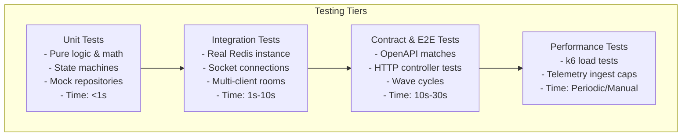

# 20 - Testing Strategy

This document establishes the testing architecture, validation frameworks, testing environments, and code quality requirements for Motus.

---

## Goals
*   **Fast Test Feedback Loop:** Enable rapid execution of tests during local development and CI runs.
*   **Decoupled Environments:** Ensure stateful dependencies (such as Redis) do not pollute test executions or cause cross-test state leakage.
*   **High Functional Coverage:** Enforce strict quality gates with minimum code coverage thresholds for core modules.
*   **E2E Real-Time Verification:** Validate complex, multi-client real-time workflows (such as dispatch matching waves) with mock drivers.

---

## Testing Tiers Hierarchy

The validation flow consists of progressively integration-heavy stages to ensure both speed and reliability:



---

## Design Decisions

### 1. Test Framework Selection: `Vitest`
Motus standardizes on **Vitest** for its primary testing runner.
*   **ESM First:** Vitest handles TypeScript and modern ESM source imports out-of-the-box, avoiding the heavy transpilation configs and helper plugins required by Jest in ESM projects.
*   **High Performance:** Vitest runs tests concurrently using worker pools and shares the compilation graph with our dev utilities, resulting in rapid launch speeds.
*   **Compatible API:** Reuses the familiar Jest matchers and mock interfaces (e.g. `vi.mock` replacing `jest.mock`).

### 2. Isolated Integration Testing Strategy
Testing modules like `@motus/redis` and `@motus/socketio` requires a live database.
*   **Isolated Redis Databases:** Tests spin up a dedicated Redis container locally or run against a designated test database index (e.g. DB index 15).
*   **Deterministic State Cycles:** To prevent state contamination between test suites:
    1.  Every integration test suite runs `flushdb` or namespace clears during `beforeEach` and `afterEach` hooks.
    2.  Redis key names are prefixed with unique test execution IDs.
*   **Mock Socket.io Clients:** Sockets are tested by instantiating real WebSocket client connections to a test-scoped port and listening to events asynchronously using promise wrappers.

### 3. Coverage Thresholds
*   **Quality Gates:** The CI pipeline enforces a global minimum coverage threshold of **80% statements, branches, functions, and lines**.
*   **Core Isolation:** Critical packages like `@motus/core` (containing state machines and matching logic) enforce a strict **95% coverage** requirement.

---

## Alternatives Considered

### 1. Jest
*   **Approach:** Config Jest with `ts-jest` to transpile and run the test suite.
*   **Why Rejected:** Jest has legacy ESM support. Running dual ESM/CJS exports and relative imports using `.js` extensions inside a Jest monorepo requires complex transpilation configuration blocks and custom resolver overrides, making configuration fragile.

### 2. Node.js Native Test Runner (`node:test`)
*   **Approach:** Use Node's built-in testing functions (`test` and `assert`).
*   **Why Rejected:** While fast and dependencies-free, the native runner lacks mature mocking APIs, watcher capabilities, and HTML/console coverage reports out-of-the-box.

---

## Tradeoffs

*   **Network Dependency for Sockets/Redis:** Pure integration tests require a running Redis service on the machine (or Docker daemon available). To avoid blocking offline developer workflows, tests are segmented so that unit tests (`pnpm test:unit`) can execute completely offline, while integration suites (`pnpm test:integration`) require the environment.

---

## Future Considerations

*   **Testcontainers for Node:** Incorporating `testcontainers` NPM package to programmatically spin up, coordinate, and tear down ephemeral Docker containers containing Redis or Kafka instances directly inside the test runner initialization hooks.
*   **Visual Dispatch Sandbox:** Integrating automated frontend integration tests using Playwright against the React client examples.

---

## Recommended Standards

### 1. Standard package `vitest.config.ts` Template
```typescript
import { defineConfig } from 'vitest/config';

export default defineConfig({
  test: {
    globals: true,
    environment: 'node',
    include: ['src/**/*.test.ts'],
    coverage: {
      provider: 'v8',
      reporter: ['text', 'json', 'html'],
      thresholds: {
        statements: 80,
        branches: 80,
        functions: 80,
        lines: 80,
      },
    },
    // Prevent overlapping test instances from colliding in Redis
    threads: true,
    singleThread: false,
  },
});
```

### 2. Integration Test Lifecycle Pattern
This model shows how to safely coordinate database tests:
```typescript
import { describe, it, expect, beforeAll, afterAll, beforeEach } from 'vitest';
import Redis from 'ioredis';

describe('Redis Integration Test Suite', () => {
  let client: Redis;

  beforeAll(async () => {
    // Connect to test-dedicated Redis instance
    client = new Redis(process.env.TEST_REDIS_URL || 'redis://127.0.0.1:6379/15');
  });

  beforeEach(async () => {
    // Clear all test database keys to reset state
    await client.flushdb();
  });

  afterAll(async () => {
    // Close connections gracefully
    await client.quit();
  });

  it('should successfully write and read values', async () => {
    await client.set('test-key', 'motus-val');
    const val = await client.get('test-key');
    expect(val).toBe('motus-val');
  });
});
```
