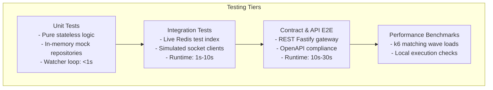

# 21 - Testing Strategy

This document establishes the testing architecture, validation frameworks, testing environments, and code quality requirements for Motus.

---

## Purpose
This document defines the testing strategy for the Motus project. It details the tools used for unit, integration, contract, and performance testing, and establishes coverage requirements for the codebase.

---

## Goals
*   **Fast Test Iterations:** Provide a test runner that executes tests concurrently during local development and CI.
*   **Isolated Integration Environments:** Ensure stateful dependencies (such as Redis) do not pollute test runs or cause cross-test state leakage.
*   **Enforce Quality Gates:** Establish code coverage thresholds to verify that core packages are tested.
*   **E2E Workflow Verification:** Validate real-time scenarios (such as driver location ingestion and dispatch waves) using test suites.

---

## Scope
This strategy applies to all test suites, including unit, integration, contract, and performance tests, located in `/packages`, `/apps`, `/benchmarks`, and `/test`.

---

## Design Decisions

### 1. Test Runner Selection: `Vitest`
Motus standardizes on **Vitest** for its primary testing runner.



### 2. Alternatives Evaluated

| Test Runner | ESM Support | Speed / HMR | Mocking APIs | Workspace Filtering | Decision |
| :--- | :--- | :--- | :--- | :--- | :--- |
| **Vitest** | **Native** (Vite-powered) | **Fast** (Instant compilation cache) | **High** (Compatible with Jest matchers) | **High** (Pnpm filter compatible) | **Adopted (Core Runner)** |
| **Jest** | Legacy (Requires complex custom resolvers) | Slow (Transpilation overhead) | High (Native) | Medium (Requires custom configuration arrays) | Rejected (High friction in ESM monorepos) |
| **Node Test Runner** | Native (Built-in) | Slow (Lacks interactive watcher) | Low (Minimal native mocks) | Low (Lacks filter options) | Rejected (Immature feature set) |

### 3. Isolated Integration Testing Strategy
Testing modules like `@motus/redis` and `@motus/socketio` requires a live database.
*   **Isolated Redis Databases:** Integration tests run against a dedicated Redis test database index (e.g. DB index 15) to prevent modifying production or local development data.
*   **State Reset:** Every integration test suite runs `flushdb` or namespace clears during `beforeEach` and `afterEach` hooks to prevent state contamination between test runs.
*   **Mock Socket.io Clients:** Websocket interactions are tested by instantiating client connections on a test-scoped port and listening to events asynchronously using promise wrappers.

### 4. Coverage Requirements and Ownership Rules
*   **Coverage Gates:** The CI pipeline enforces a global minimum coverage threshold of **80% statements, branches, functions, and lines**.
*   **Core Logic Gate:** Critical packages like `@motus/core` (containing state machines and matching logic) enforce a strict **95% coverage** requirement.
*   **Test Ownership:** Developers are responsible for writing and maintaining tests for any new code they introduce.

---

## Alternatives Considered

### 1. Jest with ts-jest Transpilation
*   **Approach:** Configure Jest to run TS tests.
*   **Why Rejected:** Jest has legacy ESM support. Running dual ESM/CJS exports and relative imports using `.js` extensions inside a Jest monorepo requires complex transpilation configurations, which can be fragile.

### 2. Mocking Databases in Integration Tests
*   **Approach:** Use in-memory mock databases (e.g., `redis-mock`) instead of a live Redis instance.
*   **Why Rejected:** Mock databases often do not support advanced features like spatial indexing (`GEOADD`, `GEODIST`) or Redis Streams, which are critical to the Motus engine.

---

## Tradeoffs

*   **Network Dependency for Integration Tests:** Integration tests require a running Redis service (or local Docker daemon). To avoid blocking offline developer workflows, tests are segmented so that unit tests (`pnpm test:unit`) can execute completely offline, while integration suites (`pnpm test:integration`) require the environment.

---

## Recommended Standards

### 1. Standard package `vitest.config.ts` Template
```typescript
import { defineConfig } from 'vitest/config';

export default defineConfig({
  test: {
    globals: true,
    environment: 'node',
    include: ['src/**/*.test.ts'],
    coverage: {
      provider: 'v8',
      reporter: ['text', 'json', 'html'],
      thresholds: {
        statements: 80,
        branches: 80,
        functions: 80,
        lines: 80,
      },
    },
    threads: true,
    singleThread: false,
  },
});
```

### 2. Integration Test Lifecycle Pattern
```typescript
import { describe, it, expect, beforeAll, afterAll, beforeEach } from 'vitest';
import Redis from 'ioredis';

describe('Redis Integration Test Suite', () => {
  let client: Redis;

  beforeAll(async () => {
    client = new Redis(process.env.TEST_REDIS_URL || 'redis://127.0.0.1:6379/15');
  });

  beforeEach(async () => {
    await client.flushdb();
  });

  afterAll(async () => {
    await client.quit();
  });

  it('should successfully write and read values', async () => {
    await client.set('test-key', 'motus-val');
    const val = await client.get('test-key');
    expect(val).toBe('motus-val');
  });
});
```

---

## Risks
*   **Flaky Websocket Connections:** Real-time socket tests can be unstable due to network delays. This risk is managed by using helper functions with timeout-safe retry logic for client handshakes and event checking.
*   **Database Lock Collision:** Concurrent integration tests running on the same Redis DB can cause lock collisions. This risk is mitigated by using unique key prefixes for each test run.

---

## Future Considerations
*   **Testcontainers Integration:** Incorporating the `testcontainers` library to spin up ephemeral Docker containers containing Redis or Kafka instances directly inside the test runner initialization hooks.
*   **Distributed Load Benchmarks:** Automating load and performance checks using distributed k6 runner pools inside the CI/CD pipeline on release tags.
