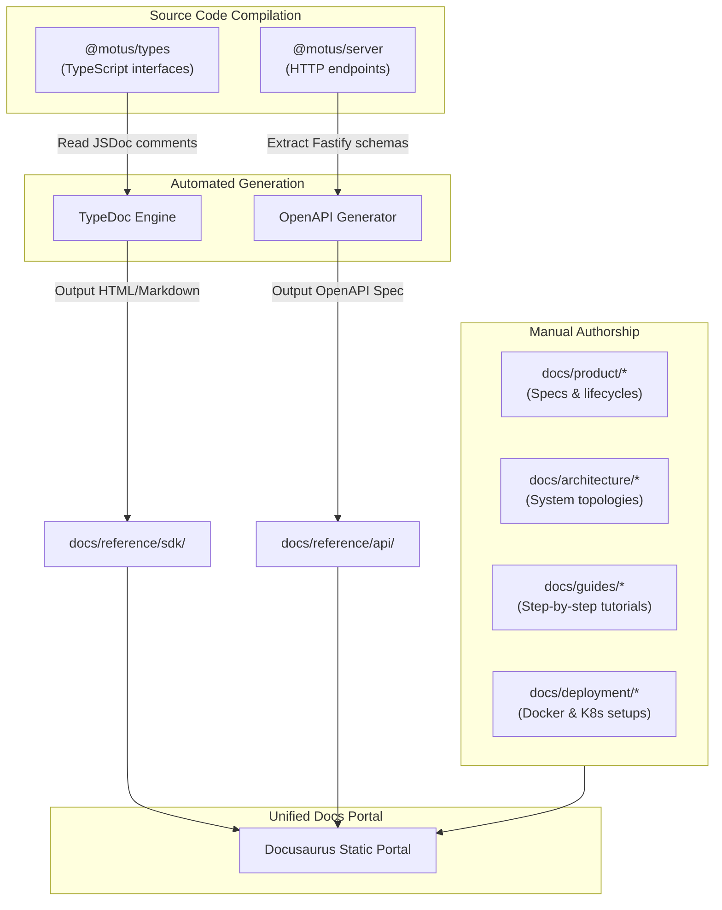

# 22 - Documentation Strategy

This document establishes the system of record for Motus documentation, detailing manual authorship directories, automated reference generation pipelines, quality assurance checks, and distribution models.

---

## Goals
*   **Documentation-Code Parity:** Ensure that SDK libraries and REST endpoints reflect real implementation logic without manual drift.
*   **Segmented Audiences:** Tailor documentation directories specifically to their primary consumer profiles (e.g. business logic vs. integration APIs vs. DevOps setups).
*   **Automated Link Integrity:** Guard the documentation workspace against dead or broken cross-references using automated CI checks.
*   **Version-Synced Docs:** Keep documentation releases aligned with the core engine versions.

---

## Documentation Flow

The documentation pipeline combines manually authored Markdown guides and automatically compiled code interfaces into a unified documentation workspace.



---

## Design Decisions

### 1. Manual Documentation Boundaries
Manual documents are hand-written in Markdown and structured by category as defined in [15-documentation-structure.md](file:///c:/Mohit/Projects/motus/docs/architecture/15-documentation-structure.md).
*   **Product specifications (`docs/product/`)** describe domain rules.
*   **Architecture specifications (`docs/architecture/`)** describe system topology and technical decisions.
*   **Guides (`docs/guides/`)** provide tutorials.
*   **Deployment guides (`docs/deployment/`)** explain setup options.

### 2. Automated API and SDK Documentation
To eliminate manual documentation drift:
*   **SDK Reference Generation via TypeDoc:** TypeDoc extracts docstrings and TypeScript types from `@motus/types` and `@motus/core` to generate a searchable API catalog of classes, functions, and interfaces, written to `docs/reference/sdk/`.
*   **REST API OpenAPI Reference:** `@motus/server` utilizes schema validators (like Fluent-Schema or TypeBox) attached to Express or Fastify routes. A CLI build script bootstraps a server instance in-memory, extracts the compiled schemas, and writes a standard `openapi.yaml` configuration to `docs/reference/api/`.

### 3. Markdown Link Validation in CI
*   **Broken Link Prevention:** To verify the validity of cross-links between documentation files, the CI pipeline runs a link checking tool (specifically `lychee` or `markdown-link-check`) on every code change.
*   **Link Verification:** Checks local file pathways (e.g. `../product/02-driver-lifecycle.md`) and validates external URLs for HTTP success.

### 4. Versioning Strategy
*   **Co-located Docs:** Documentation resides in the main codebase repository, ensuring docs are version-controlled alongside implementation code.
*   **Static Site Releases:** During publishing stages, the docs folder is processed by Docusaurus. When a new major release occurs (e.g., `v2.0.0`), a snapshot version of the docs is created and stored in Docusaurus's history list, allowing developers to view older documents.

---

## Alternatives Considered

### 1. Separate Documentation Repository
*   **Approach:** Maintain a distinct Git repository for documentation.
*   **Why Rejected:** This leads to documentation drift. Developers tend to forget to clone and update the documentation repository when making code or API changes. Keeping documentation alongside code allows changes to be submitted in the same pull request.

### 2. Purely Manual Reference Writing
*   **Approach:** Manually author REST API endpoints list and SDK interfaces in markdown tables.
*   **Why Rejected:** Highly prone to error and drift. A minor change in parameter names or object interfaces would instantly invalidate the documentation, leading to developer confusion.

---

## Tradeoffs

*   **JSDoc Maintenance Overhead:** Automatic reference generation requires developers to write structured docstrings for all exported interfaces and methods. This adds writing friction during code updates, but is accepted to guarantee SDK accuracy.

---

## Future Considerations

*   **Interactive Sandbox (Swagger UI Integration):** Hosting a Swagger UI playground inside the static portal, enabling users to test REST endpoints against a staging environment directly from the documentation.
*   **Auto-generated Examples:** Extracting code blocks from unit test suites to automatically inject real, working usage snippets into guides and reference files.

---

## Recommended Standards

### 1. Document Format Guidelines
*   Every markdown document must contain a main `<h1>` title corresponding to its file sequencing prefix (e.g. `# 22 - Documentation Strategy`).
*   Documents must begin with a clear introduction paragraph describing the scope.
*   Images and diagrams must be embedded using absolute workspace paths or relative Markdown tags.

### 2. Code Docstring Standard
TypeScript source functions must utilize structured JSDoc comments:
```typescript
/**
 * Calculates the ETA and route path for a given dispatcher candidate.
 * 
 * @param origin - Coordinates representing the start location.
 * @param destination - Coordinates representing the target location.
 * @param mode - Travel routing options (e.g. 'driving', 'walking').
 * @returns An object containing routing distance in meters and time duration.
 * @throws {@link RoutingTimeoutError} When the external mapping engine times out.
 */
export async function calculateRoute(
  origin: Coordinate,
  destination: Coordinate,
  mode: TravelMode
): Promise<RouteResult> {
  // Implementation
}
```

### 3. CI Link-Check Command Pattern
```bash
# Run lychee markdown link check locally or in GitHub Actions
lychee "docs/**/*.md" --verbose --no-progress
```
