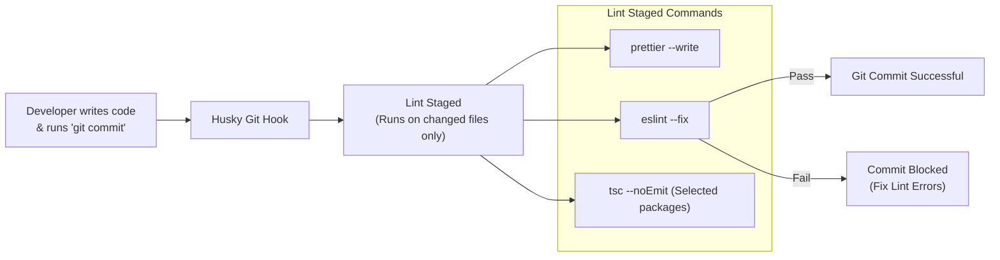

# 22 - Linting & Quality

This document defines the static analysis configurations, formatting rules, import sorting structures, code quality metrics, and git hooks designed to maintain code health across the Motus repository.

---

## Purpose
This document establishes the linting and code quality standards for the Motus project. It details the tools and configurations used to enforce style guidelines, catch coding errors, and automate formatting verification during local development and CI runs.

---

## Goals
*   **Enforce Style Consistency:** Ensure code styling is unified across all workspace modules to reduce formatting changes in PRs.
*   **Prevent Runtime Errors:** Hook compiler-level plugins to catch common errors (such as unhandled promises or misused types) during development.
*   **Automate Code Formatting:** Enforce auto-formatting on commit, reducing manual review checks.
*   **Secure Quality Gates:** Run validation checks on changed code before it can be merged into `main`.

---

## Scope
These quality standards apply to all TypeScript, JavaScript, JSON, and Markdown files located in `/packages`, `/apps`, `/examples`, `/tools`, and `/scripts`.

---

## Design Decisions

### 1. Code Quality Verification Pipeline
Static analysis and quality controls are integrated directly into the developer workflow and CI gatekeeping:



### 2. ESLint Flat Config Selection
Motus adopts the **ESLint Flat Config** standard (`eslint.config.js`).
*   **Cascading Configurations:** Flat configs eliminate complex legacy overrides hierarchies (`.eslintrc` in every package) in favor of a single cascading configuration file at the repository root.
*   **TS-ESLint Integration:** Employs `@typescript-eslint/parser` and `@typescript-eslint/eslint-plugin` to check TypeScript syntax, enforcing rules like:
    *   `no-floating-promises` (requires handling asynchronous outputs explicitly).
    *   `await-thenable` (prevents calling `await` on non-promise statements).
    *   `no-misused-promises` (prevents passing promises to synchronous handlers).

### 3. Separation of Linting and Formatting
*   **Prettier Formatter:** Code formatting (indentation, line lengths, quotes) is delegated entirely to **Prettier**.
*   **Rule Isolation:** To prevent rule overlap and performance lags, the linter and formatter are separated:
    *   Prettier is run as a separate tool in parallel.
    *   `eslint-config-prettier` is applied to ESLint to turn off all style-related rules, reserving ESLint strictly for code-quality checks.

### 4. Automated Import Sorting
To keep file imports clean and readable, the ESLint configuration includes `eslint-plugin-simple-import-sort`. Imports are grouped and sorted in the following order:
1.  Node.js built-ins (`fs`, `path`, `crypto`).
2.  External NPM dependencies (`express`, `ioredis`, `socket.io`).
3.  Internal monorepo workspace packages (`@motus/core`, `@motus/types`).
4.  Relative local file imports (`./session`, `../utils`).

### 5. Git Hooks with Husky and Lint-Staged
*   **Pre-Commit Hooks:** To avoid forcing developers to run a full workspace lint pass before every commit, **Husky** hooks the Git `pre-commit` event to trigger **Lint-Staged**.
*   **Targeted Validation:** Lint-Staged runs ESLint and Prettier exclusively against the modified files staged in Git, keeping commits fast.

---

## Alternatives Considered

### 1. Biome (Rome Evolution)
*   **Approach:** Use Biome as a unified compiler, formatter, and linter written in Rust.
*   **Why Rejected:** While Biome is faster than ESLint, its plugin ecosystem is not yet as mature. Advanced rules for TypeScript (like parsing type graphs across project references for custom framework rules) and community integrations are not as robust as the ESLint/TypeScript ecosystem.

### 2. Running Formatting within ESLint via plugins
*   **Approach:** Run Prettier formatting checks as an ESLint rule.
*   **Why Rejected:** This causes significant performance issues during large workspace lint passes, as Prettier calculations are executed through the ESLint parsing overhead. Keeping them separate runs formatting check at native speed.

---

## Tradeoffs

*   **Config Syntax Drift:** Flat configuration syntax differs from traditional legacy configs (JSON objects, glob filters, and plug-in declarations). This is accepted since flat config is the modern standard for ESLint and reduces multi-package configuration overhead.

---

## Recommended Standards

### 1. The Global `eslint.config.js` Configuration
This config is placed at the root of the workspace:
```javascript
import eslint from '@eslint/js';
import tseslint from 'typescript-eslint';
import prettierConfig from 'eslint-config-prettier';
import simpleImportSort from 'eslint-plugin-simple-import-sort';

export default tseslint.config(
  eslint.configs.recommended,
  ...tseslint.configs.recommendedTypeChecked,
  prettierConfig,
  {
    languageOptions: {
      parserOptions: {
        project: [
          './tsconfig.base.json',
          './packages/*/tsconfig.json',
          './apps/*/tsconfig.json'
        ],
        tsconfigRootDir: import.meta.dirname,
      },
    },
    plugins: {
      'simple-import-sort': simpleImportSort,
    },
    rules: {
      'simple-import-sort/imports': 'error',
      'simple-import-sort/exports': 'error',
      '@typescript-eslint/no-floating-promises': 'error',
      '@typescript-eslint/await-thenable': 'error',
      '@typescript-eslint/no-unused-vars': [
        'error',
        { argsIgnorePattern: '^_', varsIgnorePattern: '^_' }
      ],
      'no-console': ['warn', { allow: ['warn', 'error', 'info'] }],
      'eqeqeq': ['error', 'always'],
    },
  },
  {
    ignores: ['**/dist/**', '**/node_modules/**', '**/coverage/**'],
  }
);
```

### 2. The `.prettierrc` Format Rules
This config is placed at the root of the workspace:
```json
{
  "singleQuote": true,
  "trailingComma": "all",
  "printWidth": 100,
  "tabWidth": 2,
  "useTabs": false,
  "semi": true,
  "bracketSpacing": true,
  "arrowParens": "always"
}
```

### 3. Naming Conventions Checklist
*   **Directories and Files:** Must use `kebab-case` (e.g. `driver-presence-repository.ts`).
*   **Classes & Interfaces:** Must use `PascalCase` (e.g. `RedisSessionRepository`). Interfaces must not use the `I` prefix (e.g. use `SessionRepository` instead of `ISessionRepository`, except when explicitly differentiating abstract contracts from implementations).
*   **Functions, Variables & Methods:** Must use `camelCase` (e.g. `calculateDistance`).
*   **Constants:** Must use `UPPER_CASE` (e.g. `EARTH_RADIUS_KM`).

---

## Risks
*   **Lint Config Out of Sync:** Overriding lint configurations inside individual package folders can lead to fragmented code quality rules. This risk is addressed by code reviews that block the introduction of package-level overrides.
*   **Pre-commit Hook Bypass:** Developers can bypass hooks using the `--no-verify` flag. This is mitigated by enforcing the lint checking steps in the CI pipeline.

---

## Future Considerations
*   **Automated Architectural Boundaries Enforcement:** Writing custom ESLint rules (such as `eslint-plugin-import` rules) to block illegal dependencies (e.g., throwing a lint error if `@motus/core` attempts to import from `@motus/redis` or `@motus/server`).
*   **Lint Autofix Action:** Integrating a GitHub Action that automatically commits basic lint and formatting fixes on PR branches.
