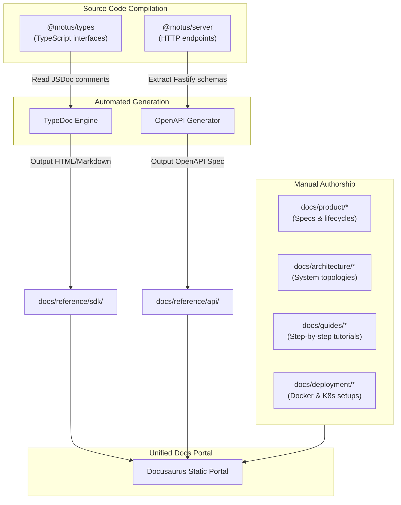

# 23 - Documentation Strategy

This document defines the documentation strategy, manual writing directories, automated reference generation pipelines, quality assurance checks, and documentation versioning workflows for Motus.

---

## Purpose
This document establishes the documentation standards for the Motus workspace. It maps documentation folders, defines ownership, and outlines automated validation checks to prevent documentation drift.

---

## Goals
*   **Prevent Documentation Drift:** Ensure programmatic references (such as SDK APIs and REST gateways) are dynamically compiled from source code definitions.
*   **Establish Clear Ownership:** Partition documentation folders by content types and assign explicit review responsibilities.
*   **Enforce Link Integrity:** Automatically validate cross-links to prevent broken references in the docs.
*   **Sync Documentation Releases:** Co-locate documentation with code to ensure docs versioning aligns with engine releases.

---

## Scope
This strategy applies to all Markdown files in `/docs`, JSDoc comments in `/packages`, and dynamic OpenAPI schema outputs from `/packages/server`.

---

## Design Decisions

### 1. Documentation Integration Flow
The documentation workspace combines manually authored guides and automatically generated code reference documents:



### 2. Documentation Ownership and Structure

Manual documents reside in the `/docs` folder as defined in [15-documentation-structure.md](file:///c:/Mohit/Projects/motus/docs/architecture/15-documentation-structure.md).

| Category / Directory | Target Audience | Content Focus | Primary Owner | Review Process |
| :--- | :--- | :--- | :--- | :--- |
| **`docs/product/`** | Product Managers / Devs | Functional requirements, domain lifecycles, and roadmap plans. | Product Lead | Checked by PMs on feature additions. |
| **`docs/architecture/`**| Architects / Tech Leads | Technical design, package boundaries, and database layouts. | Technical Lead | Approved by architects on system modifications. |
| **`docs/guides/`** | Application Developers | Setup tutorials, integration checklists, and custom filters guides. | Developer Relations | Validated against example code sandboxes. |
| **`docs/deployment/`** | DevOps Engineers / SREs | Docker compose configs, Kubernetes charts, and scaling metrics. | DevOps Lead | Reviewed during infrastructure shifts. |
| **`docs/reference/`** | Integration Developers | Automatically generated SDK parameter tables and API definitions. | Automation CI | Regenerated on build pipelines. |

### 3. Automated Reference Generation Strategy
To eliminate manual documentation drift:
*   **SDK Reference Generation via TypeDoc:** TypeDoc extracts JSDoc annotations and TypeScript interfaces from `@motus/types` and `@motus/core` to generate a searchable API catalog of classes, functions, and interfaces, written to `docs/reference/sdk/`.
*   **REST API OpenAPI Reference:** `@motus/server` utilizes schema validators attached to routes. A build script bootstraps an in-memory server instance, extracts the compiled schemas, and writes a standard `openapi.yaml` configuration to `docs/reference/api/`.

### 4. Link Integrity Checks in CI
*   **Link Verification:** To prevent broken cross-links, the CI pipeline runs `lychee` on every code change, checking local file paths and validating external URLs for HTTP success.

---

## Alternatives Considered

### 1. Separate Documentation Repository
*   **Approach:** Maintain documentation in a separate Git repository.
*   **Why Rejected:** This leads to documentation drift. Developers tend to forget to clone and update the documentation repository when making code or API changes. Keeping documentation alongside code allows changes to be submitted in the same pull request.

### 2. Manually Written API References
*   **Approach:** Manually author REST API endpoints list and SDK interfaces in markdown tables.
*   **Why Rejected:** Highly prone to error and drift. A minor change in parameter names or object interfaces would instantly invalidate the documentation, leading to developer confusion.

---

## Tradeoffs

*   **JSDoc Maintenance Overhead:** Automatic reference generation requires developers to write structured docstrings for all exported interfaces and methods. This adds writing friction during code updates, but is accepted to guarantee SDK accuracy.

---

## Recommended Standards

### 1. Document Format Guidelines
*   Every markdown document must contain a main `<h1>` title corresponding to its file sequencing prefix (e.g. `# 23 - Documentation Strategy`).
*   Documents must begin with a clear introduction paragraph describing the scope.
*   Images and diagrams must be embedded using absolute workspace paths or relative Markdown tags.

### 2. Code Docstring Standard
TypeScript source functions must utilize structured JSDoc comments:
```typescript
/**
 * Calculates the ETA and route path for a given dispatcher candidate.
 * 
 * @param origin - Coordinates representing the start location.
 * @param destination - Coordinates representing the target location.
 * @param mode - Travel routing options (e.g. 'driving', 'walking').
 * @returns An object containing routing distance in meters and time duration.
 * @throws {@link RoutingTimeoutError} When the external mapping engine times out.
 */
export async function calculateRoute(
  origin: Coordinate,
  destination: Coordinate,
  mode: TravelMode
): Promise<RouteResult> {
  // Implementation
}
```

---

## Risks
*   **Stale Developer Guides:** Unlike API references, step-by-step guides can drift when UI elements or configuration patterns change. This risk is managed by testing guides against the code examples in `/examples` on major releases.
*   **Unreachable URLs in CI:** The link checker can fail when checking dynamic external links that are temporarily unavailable. This is mitigated by configuring a whitelist of allowed domains in `lychee.toml`.

---

## Future Considerations
*   **Static Documentation Portal (Docusaurus):** Deploying a searchable Docusaurus static site on GitHub Pages on tag releases.
*   **Interactive REST Playground:** Integrating Swagger UI into the documentation site to enable testing REST API endpoints against a staging environment.
