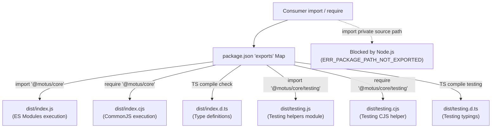

# 24 - Package Export Strategy

This document establishes the packaging standards, module export maps, type resolution configurations, and API encapsulation guidelines for all published Motus packages.

---

## Goals
*   **Enforce API Encapsulation:** Prevent consumer applications from importing internal helper modules or private files directly.
*   **Support Dual Resolving:** Enable runtime environments to resolve ECMAScript Modules (ESM) or CommonJS (CJS) outputs automatically based on user import type.
*   **Accurate Types Resolution:** Ensure TypeScript can resolve package type definitions under both ESM and CJS compilation targets.
*   **Define Clear Entrypoints:** Expose clean subpath exports (such as testing utilities or adapters) separate from the main package root.

---

## Package Resolving Topology

The following diagram illustrates how the `exports` block in `package.json` resolves compiler and execution lookups:



---

## Design Decisions

### 1. The Standard `exports` Field
All Motus packages utilize the modern `exports` configuration in `package.json` rather than relying solely on the legacy `"main"` property.
*   **Encapsulation Boundary:** Node.js blocks imports that attempt to resolve paths not explicitly declared in the `exports` block. This prevents consumer applications from building dependencies on internal files (e.g. `import { helper } from '@motus/core/dist/utils/internal.js'`), allowing developers to refactor internal helpers without breaking compatibility.

### 2. Dual ESM/CJS Export Syntax
To support dual module resolution, each export target defines specific conditions:
```json
"exports": {
  ".": {
    "types": "./dist/index.d.ts",
    "import": "./dist/index.js",
    "require": "./dist/index.cjs"
  }
}
```
*   **Condition Ordering:** The `"types"` key must always reside as the first field inside the export mapping. This is required by TypeScript to resolve typings correctly prior to processing the JavaScript execution pathways.
*   **`import` vs `require`:** Node.js resolves to `"import"` when the consumer code utilizes standard `import` syntax, and falls back to `"require"` when the consumer code executes inside a `require()` CommonJS script.

### 3. Subpath Exports
For packages that bundle utilities that are not required for standard runtimes (such as testing mocks, custom filters, or CLI tools), subpath exports are exposed:
```json
"exports": {
  ".": { ... },
  "./testing": {
    "types": "./dist/testing.d.ts",
    "import": "./dist/testing.js",
    "require": "./dist/testing.cjs"
  }
}
```
This isolates testing weight from standard runtime imports, keeping bundle footprints small for typical deployments.

---

## Alternatives Considered

### 1. Legacy Single Entrypoint Configuration
*   **Approach:** Declare `"main": "dist/index.js"` and `"types": "dist/index.d.ts"` inside `package.json` without an `exports` block.
*   **Why Rejected:** This structure does not natively support dual module configurations, leading to errors in CommonJS Node.js projects (such as "cannot use import statement outside a module"). It also exposes the entire internal filesystem to imports, which breaks API isolation.

### 2. Exporting Pure TS Source Files
*   **Approach:** Direct consumers to compile raw TS files located inside `src/`.
*   **Why Rejected:** This forces consumer compilation configurations to conform exactly to Motus standards, causing version conflicts in tsconfig targets, dependencies, and build pipelines.

---

## Tradeoffs

*   **Syntax Complexity:** The package configuration boilerplate is larger. Every folder path exposed to the public must be explicitly maintained in the `exports` configuration.
*   **Strict Resolution Paths:** Developers cannot quickly test local file additions in downstream packages without adding them to the package export configuration. This is accepted to maintain clean, isolated APIs.

---

## Future Considerations

*   **Export Verification Checks (`are-the-types-wrong`):** Integrating tools like `@arethetypeswrong/cli` into the CI test pipeline to automatically verify that dual package exports are completely compatible and resolve cleanly across all module formats.

---

## Recommended Standards

### 1. Standard package `package.json` Configuration
This template defines the baseline metadata, exports, and types structures for a workspace package:
```json
{
  "name": "@motus/core",
  "version": "1.0.0",
  "description": "Pure domain state and matching logic for Motus",
  "type": "module",
  "main": "./dist/index.js",
  "module": "./dist/index.js",
  "types": "./dist/index.d.ts",
  "exports": {
    ".": {
      "types": "./dist/index.d.ts",
      "import": "./dist/index.js",
      "require": "./dist/index.cjs"
    },
    "./testing": {
      "types": "./dist/testing.d.ts",
      "import": "./dist/testing.js",
      "require": "./dist/testing.cjs"
    }
  },
  "files": [
    "dist"
  ],
  "scripts": {
    "build": "tsup",
    "dev": "tsup --watch",
    "clean": "rimraf dist"
  }
}
```

### 2. The `files` Array Rule
Every package must declare a `"files"` array containing exclusively the compiled build directory (`["dist"]`), ensuring that source files (`src/`), local tests (`__tests__/`), and config files are omitted from the published npm tarball.
