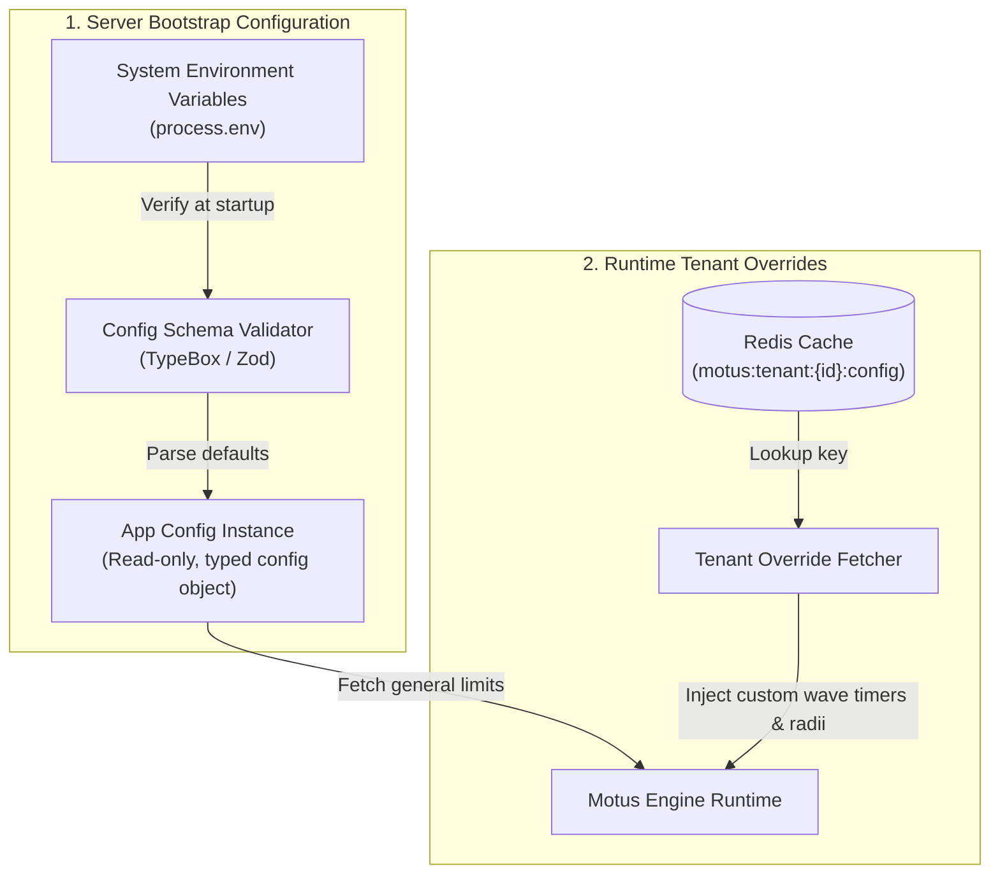

# 26 - Configuration Strategy

This document establishes the configuration architecture, environment variable validation schemas, default value hierarchies, multi-tenant runtime overrides, and feature flag management for Motus.

---

## Purpose
This document defines the technical standards for configuring the Motus engine. It outlines validation workflows to ensure parameters are verified on startup and provides guidelines for managing multi-tenant runtime overrides.

---

## Goals
*   **Fail-Fast Validation:** Validate environment variables and configuration parameters at startup, preventing runtime crashes due to missing parameters.
*   **Decouple Config and Code:** Prevent direct calls to `process.env` inside domain code, routing config values through validated objects.
*   **Isolate Multi-Tenant Parameters:** Provide a mechanism to fetch tenant-specific configuration overrides (e.g. matching timers or search radii) at runtime.
*   **Enable Stateless Configuration:** Ensure server nodes can load configurations dynamically from environment variables, facilitating container scaling.

---

## Scope
This strategy applies to runtime variables, environment setups, and configuration layers across all packages in `/packages` and apps in `/apps`.

---

## Design Decisions

### 1. Configuration Lifecycle Architecture
The configuration pipeline validates environment inputs at startup and processes tenant overrides at runtime:



### 2. Startup Validation
To prevent runtime configuration errors:
*   **Schema Enforcement:** Environment variables are validated on startup against a strict schema (using Zod or TypeBox).
*   **Type Coercion:** String inputs from environment variables are converted to their target types (e.g. `PORT="3000"` is parsed as `number`).
*   **Startup Block:** If validation fails, the process outputs validation errors and exits immediately with code `1`.

### 3. Multi-Tenant Runtime Overrides
Global configurations define fallback defaults, while tenant-specific parameters are stored in Redis:
*   **Storage Pattern:** Tenant configs are stored in Redis under the `motus:tenant:{tenantId}:config` hash.
*   **Dynamic Resolution:** The matching pipeline fetches these parameters from Redis at the start of a dispatch wave, applying custom thresholds (such as max search distance or wave timeout limits) dynamically.
*   **Fallback Sequence:** If no tenant overrides exist, the engine falls back to the global configurations.

### 4. Feature Flags
To support staged rollouts, feature flags are managed dynamically:
*   **Runtime Flags:** Environment flags enable or disable engine features globally.
*   **Tenant Flags:** Custom metadata flags in the tenant config enable features for specific clients (e.g., enabling advanced telemetry sampling).

---

## Alternatives Considered

### 1. Ad-hoc Direct Lookups (process.env)
*   **Approach:** Reference `process.env.VARIABLE_NAME` directly within domain services.
*   **Why Rejected:** Direct lookups make it difficult to identify missing configuration parameters until the code path is executed. They also make unit testing harder, as tests must modify global process variables.

### 2. Static Configuration Files (JSON/YAML Overrides)
*   **Approach:** Load configuration parameters from files (e.g. `config.production.json`).
*   **Why Rejected:** Static config files do not align with cloud-native container standards, which favor environment variables. Changing configurations would require rebuilding or redeploying container instances.

---

## Tradeoffs

*   **Type Conversion Complexity:** Environment variables are always string values. Coercing and validating these values on startup requires configuration schemas, which adds minor bootstrap overhead but prevents type mismatch errors at runtime.

---

## Recommended Standards

### 1. Conceptual Configuration Validator
This design demonstrates how configurations are validated on startup:
```typescript
import { Type } from '@sinclair/typebox';
import { TypeCompiler } from '@sinclair/typebox/compiler';

const ConfigSchema = Type.Object({
  NODE_ENV: Type.Union([
    Type.Literal('development'),
    Type.Literal('production'),
    Type.Literal('test')
  ]),
  PORT: Type.Number({ default: 3000 }),
  REDIS_URL: Type.String({ format: 'uri' }),
  JWT_SECRET: Type.String({ minLength: 32 }),
  MATCHING_DEFAULT_RADIUS_METERS: Type.Number({ default: 5000 }),
});

const compiler = TypeCompiler.Compile(ConfigSchema);

export function validateConfig(env: Record<string, unknown>) {
  if (typeof env.PORT === 'string') env.PORT = parseInt(env.PORT, 10);
  if (typeof env.MATCHING_DEFAULT_RADIUS_METERS === 'string') {
    env.MATCHING_DEFAULT_RADIUS_METERS = parseInt(env.MATCHING_DEFAULT_RADIUS_METERS, 10);
  }

  const isValid = compiler.Check(env);
  if (!isValid) {
    const errors = [...compiler.Errors(env)];
    console.error('Configuration validation failed:', JSON.stringify(errors, null, 2));
    throw new Error('Invalid environment configuration parameters');
  }

  return env;
}
```

---

## Risks
*   **Missing Variables on Startup:** Missing environment variables will block container orchestration. This risk is addressed by setting safe default values for non-critical configuration parameters.
*   **Redis Latency Spikes:** Fetching tenant overrides on every matching wave can introduce latency if Redis is under heavy load. This is mitigated by caching tenant configurations in application memory for short intervals (e.g. 10 seconds).

---

## Future Considerations
*   **Centralized Configuration Service Integration:** Planning for integrations with configuration servers (such as HashiCorp Vault or AWS AppConfig) to support encrypted runtime parameters.
