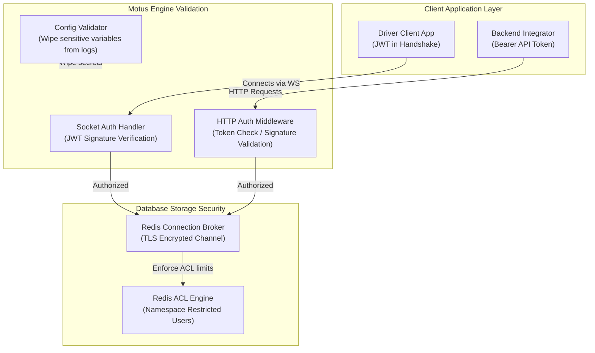

# 26 - Security Foundations

This document defines the security architecture, authentication standards, database connection security, secret management policies, and supply chain safeguards for Motus.

---

## Goals
*   **Prevent Secret Exposure:** Ensure API keys, database credentials, and token secrets are excluded from source control.
*   **Verify Client Identity:** Enforce secure, stateless authentication on all REST and WebSocket connections.
*   **Secure Redis Storage:** Protect data-in-transit and control namespace actions within the Redis layer.
*   **Guard the Supply Chain:** Verify the integrity of external package dependencies and sign build artifacts.
*   **Establish Vulnerability Paths:** Provide a clear, secure channel for community security disclosures.

---

## Security Architecture

The Motus security model isolates credentials, verifies client connections, and encrypts transit communications:



---

## Design Decisions

### 1. Stateless WebSocket Authentication
*   **JWT Handshake Validation:** Socket.io connections must pass a valid JSON Web Token (JWT) during the connection handshake phase. Sockets attempting connection without a token, or with an invalid signature, are rejected immediately.
*   **Connection Lifecycles:** Tokens store a standard expiration timestamp (`exp`). Upon token expiration during active driving sessions, the server prompts the client to refresh the token, terminating the socket connection if re-authentication fails within a timeout window.
*   **Room Isolation:** Sockets are restricted to joining tracking rooms that match their validated token payload details (e.g. a driver with ID `driver_123` is blocked from joining room `session:driver_456`).

### 2. Redis Connection Security (TLS & ACLs)
*   **Encrypted In-Transit:** Production connections to Redis Cluster must enforce Transport Layer Security (TLS v1.3) to protect telemetry data in transit.
*   **Restricted Access Control Lists (ACLs):** Motus connects to Redis using specific ACL user accounts. Rather than using the default root admin account, the Motus user profile is restricted to:
    *   Command namespaces: `GEODIST`, `GEOADD`, `GEORADIUS`, `SET`, `GET`, `DEL`, `XADD`, `XREAD`.
    *   Key namespaces: `motus:tenant:{tenantId}:*` pattern restrictions.
    *   Blocked commands: `KEYS`, `FLUSHALL`, `CONFIG`.

### 3. Secret Management & Schema Validation
*   **Strict Environment Extraction:** App configurations are loaded from system environment variables (`process.env`). Secret files (`.env`) are explicitly ignored in `.gitignore`.
*   **Launch Schema Verification:** To prevent runtime crashes, the server validates its environment variables on startup against a strict schema (using TypeBox or Zod), checking for required fields like `JWT_SECRET` and `REDIS_PASSWORD`.
*   **Log Redaction:** The logger configuration automatically sanitizes and redacts common secret patterns (such as `"password"`, `"secret"`, `"token"`, `"authorization"`) from log payloads before outputting JSON.

### 4. Supply Chain & Code Signing
*   **Automated CVE Audits:** The CI pipeline runs `audit-ci` on commits, failing the build if high or critical dependencies vulnerabilities are identified.
*   **Artifact Provenance:** Published packages generate and publish build provenance statements using GitHub’s OIDC token provider to verify that build artifacts originate from the official repository release pipelines.

---

## Alternatives Considered

### 1. Session-Cookie Socket Authentication
*   **Approach:** Validate socket connections against a stateful session database.
*   **Why Rejected:** Stateful sessions complicate horizontal scaling, requiring socket servers to query a central database for every handshake. Stateless JWT validation allows individual socket nodes to verify connections independently using a public key.

### 2. Password-Only Redis Security
*   **Approach:** Connect to Redis using a single global AUTH password.
*   **Why Rejected:** Password-only access does not prevent commands like `FLUSHALL` or namespace overlap, exposing the entire database to data deletion if a single application node is compromised.

---

## Tradeoffs

*   **Setup Complexity:** Implementing TLS, certificate authorities, and custom Redis ACL configs adds configuration steps for local development. This is addressed by providing pre-configured developer Docker containers that simulate these permissions.

---

## Future Considerations

*   **Runtime Secrets Rotation:** Supporting dynamic configuration updates (e.g. from HashiCorp Vault or AWS Secrets Manager) to rotate Redis passwords and JWT signing keys without requiring application restarts.
*   **mTLS (Mutual TLS):** Enforcing mutual TLS between client backend applications and the Motus REST server to verify identities at the network layer.

---

## Recommended Standards

### 1. The Environment Variable Validator Pattern
This code defines the launch checks:
```typescript
import { Type } from '@sinclair/typebox';
import { TypeCompiler } from '@sinclair/typebox/compiler';

const ConfigSchema = Type.Object({
  NODE_ENV: Type.Union([
    Type.Literal('development'),
    Type.Literal('production'),
    Type.Literal('test')
  ]),
  PORT: Type.Number({ default: 3000 }),
  REDIS_URL: Type.String({ format: 'uri' }),
  JWT_SECRET: Type.String({ minLength: 32 }),
  LOG_LEVEL: Type.String({ default: 'info' }),
});

const compiler = TypeCompiler.Compile(ConfigSchema);

export function validateConfig(env: Record<string, unknown>) {
  // Convert PORT to number before validation
  if (typeof env.PORT === 'string') {
    env.PORT = parseInt(env.PORT, 10);
  }
  
  const isValid = compiler.Check(env);
  
  if (!isValid) {
    const errors = [...compiler.Errors(env)];
    console.error('Configuration validation failed:', JSON.stringify(errors, null, 2));
    throw new Error('Invalid environment configuration parameters');
  }
  
  return env;
}
```

### 2. Standard Redis ACL Policy for Motus
This rule configuration should be applied to the Redis user database:
```
user motus-engine on ~motus:* +@read +@write +@connection +@pubsub +@geo -@admin
```

### 3. Vulnerability Reporting (`SECURITY.md` guideline)
*   Do not open GitHub issues for security vulnerabilities.
*   Report security issues privately to the security team (e.g., `security@motus.org`).
*   The team will acknowledge receipt within 48 hours and coordinate a public advisory within 90 days of resolution.
