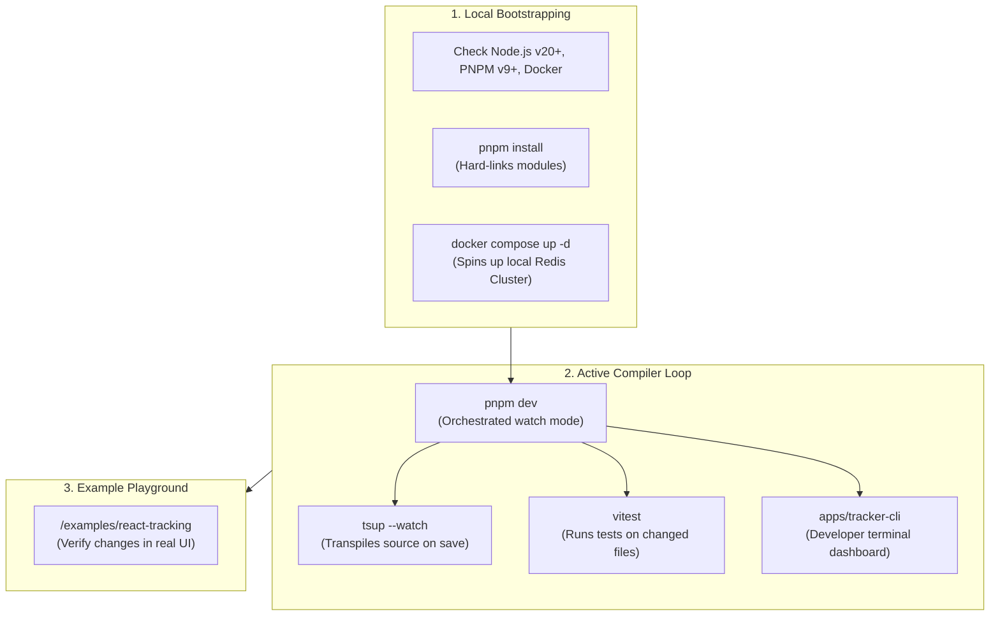

# 27 - Developer Experience

This document establishes the developer experience (DX) standards, local development workflows, workspace orchestration commands, example playground setups, and git submission guidelines for Motus.

---

## Goals
*   **One-Command Dev Bootstrap:** Allow new developers to download, configure, and boot the entire system with a single environment command.
*   **Rapid Compilation Iterations:** Optimize compiler loop speeds using build caches.
*   **Standardized Workflows:** Set clear guidelines for code changes, branching models, and documentation updates.
*   **Rich Client Playgrounds:** Provide sandbox folders for testing real-time changes without code deployments.

---

## Local Development Workflow

The local development pipeline uses Docker to run dependencies and Turborepo to orchestrate builds in watch mode:



---

## Design Decisions

### 1. Unified Task Orchestration via Turborepo
Motus standardizes on **Turborepo** to manage workspace pipelines.
*   **Dependency-Aware Task Execution:** When a developer runs a task (e.g. `build`), Turborepo resolves the package dependency graph to compile dependency libraries (like `@motus/types`) before compiling target entry points (like `@motus/server`).
*   **Local Caching:** Turborepo hashes file states. If a package's files have not changed, running the build task retrieves outputs from the local cache, reducing rebuild times to milliseconds.

### 2. Sandbox Integration Folders
*   **Isolated Playgrounds:** The `/examples/` folder provides fully operational, standalone projects (such as a basic React visualizer or an Express endpoint integration) that link back to the local workspace packages using the `workspace:*` protocol.
*   **Manual Testing:** This setup allows developers to manually verify real-time Socket.io and Redis data flows without deploying code to staging environments.

### 3. Contribution Rules and Changeset Audits
*   **Explicit Workflows:** Contributions are managed through feature branches (e.g. `feat/`, `fix/`, `docs/`) targeting the `main` branch.
*   **Changeset Requirement:** If a pull request modifies files inside `/packages/`, the developer must attach a changeset file (`pnpm changeset`) describing the change, version impact, and affected packages. The CI validation checks for this file and blocks merges if it is missing.

---

## Alternatives Considered

### 1. Manual Script Sequencing (Without Turborepo)
*   **Approach:** Run custom bash/npm scripts sequentially (e.g. `pnpm --filter @motus/types run build && pnpm --filter @motus/core run build...`).
*   **Why Rejected:** Highly fragile and slow. Developers would need to manually adjust compilation scripts whenever package dependencies change, and the build process would lack performance-enhancing file hashes and local build caching.

### 2. Lerna / Nx
*   **Approach:** Use Lerna or Nx for workspace caching and task running.
*   **Why Rejected:** While powerful, Lerna and Nx introduce extensive configurations and large dependencies. Turborepo is light-weight, configures with a single `turbo.json` file, and integrates with the pnpm package manager.

---

## Tradeoffs

*   **Docker Requirement:** Running integration tests and local development servers requires Docker to spin up a Redis cluster. While this adds dependency overhead for the developer's local machine, it is necessary to guarantee behavior parity with the production environment.

---

## Future Considerations

*   **GitHub Codespaces Configuration:** Providing a pre-configured `.devcontainer/` folder. This would allow contributors to bootstrap a complete development environment (including Node, pnpm, Docker, and Redis) inside a secure browser-based VM in seconds.

---

## Recommended Standards

### 1. Baseline Developer Scripts Catalog
These common scripts are exposed in the root `package.json`:
```json
"scripts": {
  "setup": "pnpm install && docker compose up -d",
  "build": "turbo run build",
  "dev": "turbo run dev --parallel",
  "test": "turbo run test",
  "test:watch": "turbo run test:watch",
  "typecheck": "turbo run typecheck",
  "lint": "turbo run lint",
  "format": "prettier --write \"**/*.{ts,js,json,md}\"",
  "changeset": "changeset"
}
```

### 2. Pull Request Template (`.github/pull_request_template.md`)
```markdown
## Description
Provide a concise summary of the changes introduced by this pull request.

## Type of Change
- [ ] Bug fix (non-breaking change which fixes an issue)
- [ ] New feature (non-breaking change which adds functionality)
- [ ] Breaking change (fix or feature that would cause existing functionality to change)
- [ ] Documentation update

## Checklist
- [ ] I have read the [Contributing Guidelines](CONTRIBUTING.md).
- [ ] I have added tests that prove my fix is effective or that my feature works.
- [ ] I have executed local checks (`pnpm lint`, `pnpm typecheck`, `pnpm build`) and all checks pass.
- [ ] I have created a changeset file by running `pnpm changeset` (required if any packages are modified).
```

### 3. Git Branching Naming Standard
*   Features: `feat/<scope>-<description>` (e.g. `feat/matching-wave-timeouts`)
*   Fixes: `fix/<scope>-<description>` (e.g. `fix/redis-lock-leak`)
*   Docs: `docs/<description>` (e.g. `docs/update-observability-metrics`)
