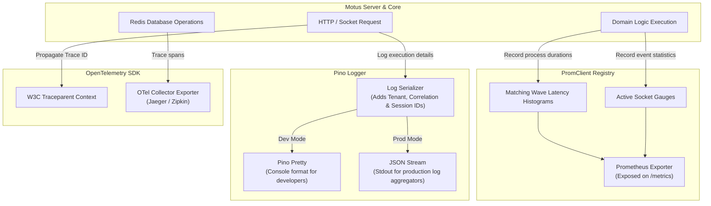

# 27 - Observability Foundations

This document establishes the telemetry design, structured logging specifications, runtime metric collections, distributed tracing propagation standards, and error handling structures for Motus.

---

## Purpose
This document defines the observability standards for the Motus project. It details the tools used for logging, metrics collection, and distributed tracing, and outlines the error handling patterns designed to maintain system visibility.

---

## Goals
*   **Structured Operational Logs:** Write all runtime logs in machine-readable JSON formats to enable querying in central log aggregators.
*   **Low-Overhead Telemetry:** Ensure logging and metrics libraries do not introduce CPU performance bottlenecks.
*   **Expose Prometheus Metrics:** Export standard engine metrics to support Grafana monitoring dashboards.
*   **Support Distributed Tracing:** Design context propagation using OpenTelemetry (OTel) standards to trace requests from client entry points down to database operations.
*   **Establish Clear Errors:** Define custom domain error classes with unique error codes to prevent vague stack traces.

---

## Scope
These observability guidelines apply to logging interfaces, metric registries, trace spans, and error classes used across all packages in `/packages` and apps in `/apps`.

---

## Design Decisions

### 1. Telemetry and Logging Architecture
The telemetry pipeline coordinates log outputs, Prometheus metric collections, and OpenTelemetry trace spans:



### 2. Structured Logging with `Pino`
Motus standardizes on **Pino** as its structured logging engine.
*   **High Performance:** Pino operates with minimal processing overhead, formatting logs asynchronously to prevent blocking the event loop.
*   **JSON Format:** Logs are written as single-line JSON objects to standard output (`stdout`).
*   **Contextual Payload Serialization:** Every log entry must enrich its payload with standard operational fields:
    *   `timestamp` (ISO-8601 string).
    *   `level` (mapped to numerical levels e.g. 30 for info, 50 for error).
    *   `tenantId` (to isolate logs per tenant).
    *   `sessionId` (to group tracking session execution logs).
    *   `correlationId` (to trace a single request's execution path across services).

### 3. Metric Collection with `prom-client`
Motus implements Prometheus metrics using the standard Node.js `prom-client` registry, exporting endpoints via `/metrics` on `@motus/server`. Key metrics include:
*   `motus_active_connections_count` (Gauge tracking active client sockets).
*   `motus_session_state_total` (Counter tracking sessions transitions by status e.g. matching, active, completed).
*   `motus_matching_wave_duration_seconds` (Histogram tracking candidate matching matching execution times).
*   `motus_redis_operation_duration_seconds` (Histogram tracking Redis transaction latencies).

### 4. OpenTelemetry Tracing Prep
To support future APM systems:
*   **W3C Context Propagation:** All server handlers and client websockets accept standard `traceparent` headers to carry trace context.
*   **Trace Context Extraction:** The trace ID is extracted and injected into the Pino log context as `trace_id` and `span_id` to correlate logs and traces.

### 5. Class-Based Error Hierarchy
Motus establishes a base error class `MotusError` that extends the native JavaScript `Error` class.
*   **Unique Error Codes:** Every thrown error must define a string code (e.g. `MOTUS_ERR_SESSION_NOT_FOUND`) to simplify frontend parsing and monitoring alerts.
*   **Metadata Payloads:** Errors carry an optional `context` object containing safe debug parameters (such as the requested session ID) while stripping sensitive user fields.

---

## Alternatives Considered

### 1. Winston
*   **Approach:** Use Winston as the logging engine due to its multi-transport capabilities.
*   **Why Rejected:** Winston is significantly slower than Pino due to its complex runtime dependency chains and logging formats. In high-throughput tracking engines (e.g., handling 10,000 location telemetry streams per second), logger performance is a critical factor.

### 2. Ad-hoc Custom Error Objects
*   **Approach:** Throw generic error objects (e.g. `throw new Error('session failed')`).
*   **Why Rejected:** Generic errors make it difficult to determine the cause of a failure programmatically, requiring fragile string matching on error messages to set the correct HTTP status code.

---

## Tradeoffs

*   **Production vs. Development Log Formatting:** Raw JSON logs are difficult for developers to read in a local terminal window. To resolve this, the local development script pipes stdout into the `pino-pretty` CLI tool. This approach isolates development-friendly formatting from the production environment.

---

## Recommended Standards

### 1. Base Domain Error Class Definition
This design defines the base custom error class:
```typescript
export class MotusError extends Error {
  public readonly code: string;
  public readonly httpStatus: number;
  public readonly context?: Record<string, unknown>;

  constructor(
    message: string,
    code: string,
    httpStatus: number = 500,
    context?: Record<string, unknown>
  ) {
    super(message);
    this.name = this.constructor.name;
    this.code = code;
    this.httpStatus = httpStatus;
    this.context = context;
    Error.captureStackTrace(this, this.constructor);
  }
}

// Subclass Example
export class SessionNotFoundError extends MotusError {
  constructor(sessionId: string) {
    super(
      `Tracking session with ID ${sessionId} was not found`,
      'MOTUS_ERR_SESSION_NOT_FOUND',
      404,
      { sessionId }
    );
  }
}
```

### 2. Structured Logging Interface Usage Pattern
```typescript
import pino from 'pino';

const logger = pino({
  level: process.env.LOG_LEVEL || 'info',
  formatters: {
    level: (label) => ({ level: label.toUpperCase() }),
  },
});

export function dispatchSession(sessionId: string, tenantId: string) {
  const log = logger.child({ sessionId, tenantId });
  log.info('Initiating matching wave for session');
  try {
    // Dispatch logic
  } catch (error) {
    log.error({ err: error }, 'Failed to dispatch matching wave');
    throw error;
  }
}
```

---

## Risks
*   **Performance overhead under high load:** Executing tracing instrumentation on every telemetry check can introduce CPU latency. This risk is managed by implementing trace sampling rules, only exporting a percentage of spans (e.g., 5% of traces).
*   **Disk space exhaustion:** Verbose logs written to stdout can exhaust host storage. This is addressed by configuring appropriate retention policies and log rotation rules in the hosting environment.

---

## Future Considerations
*   **Auto-Instrumentation:** Adding the `@opentelemetry/sdk-trace-node` module to automatically hook common database modules (such as `ioredis`) to collect database span timings without manual wrapper functions.
