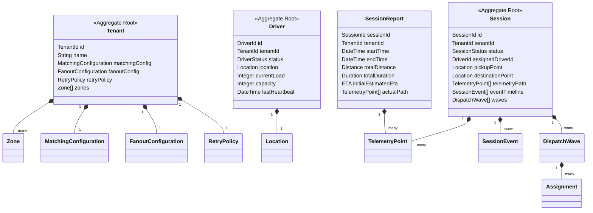

# 28 - Domain Models

This document defines the core domain entities and aggregates of the Motus engine. These models govern real-time dispatching, driver presence, geofencing, and telemetry ingestion.

---

## Domain Overview & Boundaries

The Motus domain is divided into distinct bounded contexts. The boundaries define ownership and transaction limits for aggregates, entities, and value objects.

---

## Domain Entity Specifications

### 1. Tenant
An enterprise partition within the Motus multi-tenant runtime.
*   **Responsibilities:** Holds operational configuration, geofenced operating boundaries, wave dispatch preferences, and matching strategy logic.
*   **Attributes:**
    *   `id` (TenantId): Unique tenant identifier.
    *   `name` (String): Human-readable tenant name. Must be non-empty, max 100 characters.
    *   `matchingConfig` (MatchingConfiguration): Configuration rules for finding driver candidates.
    *   `fanoutConfig` (FanoutConfiguration): Configuration for dispatch notification waves.
    *   `retryPolicy` (RetryPolicy): Configures session escalation if no drivers are found.
    *   `zones` (Zone[]): List of active service polygons defining spatial boundaries.
*   **Ownership:** Geofencing and Administrative Bounded Context.
*   **Relationships:** Aggregates a list of service Zones and configuration models.
*   **Validation Rules:**
    *   Must contain at least one configured zone if geofencing is enabled.
    *   TenantId must conform to standardized tenant identifier rules.

### 2. Driver
Represents a physical courier, vehicle, or agent available to accept dispatch assignments.
*   **Responsibilities:** Represents presence, active location tracking, load limits, and connection state.
*   **Attributes:**
    *   `id` (DriverId): Unique driver identifier.
    *   `tenantId` (TenantId): Associated tenant partition.
    *   `status` (DriverStatus): Presence status state.
    *   `location` (Location): Current spatial location (lat, lng, accuracy, bearing, speed).
    *   `currentLoad` (Integer): Count of current concurrent assignments. Must be non-negative.
    *   `capacity` (Integer): Maximum concurrent assignments allowed. Must be $\ge 1$.
    *   `lastHeartbeat` (DateTime): UTC timestamp of the last heartbeat update.
*   **Ownership:** Driver Presence Bounded Context (Aggregate Root).
*   **Lifecycle:** Transitions between Offline, Online, Busy, Paused, and Stale.
*   **Validation Rules:**
    *   `currentLoad` must not exceed `capacity`.
    *   `lastHeartbeat` must not be set to a future timestamp.

### 3. Session
Orchestrates a single dispatch order, from creation to completion or cancellation.
*   **Responsibilities:** Houses coordinates for the job, tracks matching waves, records historic events, and buffers telemetry points.
*   **Attributes:**
    *   `id` (SessionId): Unique session reference.
    *   `tenantId` (TenantId): Associated tenant.
    *   `status` (SessionStatus): Current lifecycle state of the session.
    *   `assignedDriverId` (DriverId, Optional): Driver selected to fulfill the session.
    *   `pickupPoint` (Location): Origin coordinates.
    *   `destinationPoint` (Location): Destination coordinates.
    *   `telemetryPath` (TelemetryPoint[]): Chronological history of sampled points.
    *   `eventTimeline` (SessionEvent[]): History of state changes and events.
    *   `waves` (DispatchWave[]): Records of all matching waves executed.
*   **Ownership:** Dispatch Session Bounded Context (Aggregate Root).
*   **Lifecycle:** Transitions from Created -> Searching -> Driver Assigned -> Driver En Route -> Arrived -> In Progress -> Completed (or Cancelled).
*   **Validation Rules:**
    *   Origin and destination coordinates must be valid and non-identical.
    *   If `assignedDriverId` is populated, the status must not be `CREATED` or `SEARCHING`.

### 4. SessionReport
A summarized post-mortem aggregate of a completed dispatch session.
*   **Responsibilities:** Formulates completed metrics for payment, billing, and historic analytics.
*   **Attributes:**
    *   `sessionId` (SessionId): Reference to the completed session.
    *   `tenantId` (TenantId): Associated tenant.
    *   `startTime` (DateTime): Time the session entered `DRIVER_EN_ROUTE` or `IN_PROGRESS`.
    *   `endTime` (DateTime): Time the session reached `COMPLETED` or `CANCELLED`.
    *   `totalDistance` (Distance): Sum of distance travelled during the trip.
    *   `totalDuration` (Duration): Absolute time elapsed during the fulfillment phase.
    *   `initialEstimatedEta` (ETA): Estimated travel duration recorded at assignment.
    *   `actualPath` (TelemetryPoint[]): Filtered trajectory records.
*   **Ownership:** Reporting Bounded Context.
*   **Validation Rules:**
    *   `endTime` must be strictly greater than `startTime`.
    *   `totalDistance` and `totalDuration` must be non-negative.

### 5. TelemetryPoint
A record of a single coordinate point registered during an active session.
*   **Responsibilities:** Stores raw telemetry logs containing direction, speed, and accuracy thresholds.
*   **Attributes:**
    *   `latitude` (Double): Coordinate latitude.
    *   `longitude` (Double): Coordinate longitude.
    *   `accuracy` (Double, Optional): Horizontal accuracy circle in meters.
    *   `bearing` (Double, Optional): Heading angle (0-360 degrees).
    *   `speed` (Double, Optional): Speed in meters per second.
    *   `timestamp` (DateTime): Chronological capture time.
*   **Ownership:** Driver Presence Bounded Context.
*   **Validation Rules:**
    *   Latitude range: $[-90, 90]$.
    *   Longitude range: $[-180, 180]$.
    *   Bearing range: $[0, 360]$.

### 6. SessionEvent
Represents a historic, immutable state change or user action that occurred during a session.
*   **Responsibilities:** Serves as the audit trail for session states.
*   **Attributes:**
    *   `eventId` (String): Unique event identifier.
    *   `eventName` (String): Name matching system event catalog definitions.
    *   `timestamp` (DateTime): Capture time.
    *   `payload` (Record): Domain details at time of transition.
*   **Ownership:** Dispatch Session Bounded Context.

### 7. DispatchWave
An iteration of candidate matching notifications sent to a prioritized subset of drivers.
*   **Responsibilities:** Evaluates offers during a window of time before escalating or matching.
*   **Attributes:**
    *   `waveNumber` (Integer): Order index of the matching wave.
    *   `status` (DispatchWaveStatus): Wave matching status (e.g. Active, Completed, Expired).
    *   `candidates` (DriverId[]): List of drivers evaluated during the wave.
    *   `assignments` (Assignment[]): Notification allocations sent to the candidates.
    *   `startedAt` (DateTime): Timestamp of wave initialization.
    *   `expiresAt` (DateTime): Deadline before timing out.
*   **Ownership:** Matching & Fanout Bounded Context.
*   **Validation Rules:**
    *   `expiresAt` must be greater than `startedAt`.

### 8. Assignment
An offer block assigning a session to a candidate driver during an active wave.
*   **Responsibilities:** Tracks confirmation, rejection, or expiration status of a single driver candidate's offer.
*   **Attributes:**
    *   `driverId` (DriverId): Associated driver.
    *   `sessionId` (SessionId): Target session.
    *   `status` (String): Offer status (Pending, Accepted, Rejected, Expired).
    *   `lockAcquired` (Boolean): Atomic reservation status in memory.
*   **Ownership:** Fanout Bounded Context.

### 9. Location
The raw spatial-temporal value defining geographic coordinates.
*   **Responsibilities:** Encapsulates spatial coordinates.
*   **Attributes:**
    *   `latitude` (Double): Geographic coordinate.
    *   `longitude` (Double): Geographic coordinate.
    *   `timestamp` (DateTime): Point in time.

### 10. Zone
A geofenced perimeter defining operating service coverage boundaries.
*   **Responsibilities:** Maps localized operational boundaries.
*   **Attributes:**
    *   `zoneId` (ZoneId): Unique zone identifier.
    *   `name` (String): Descriptor name.
    *   `boundary` (Coordinates[]): Sequence of coordinates forming a closed polygon.
*   **Ownership:** Geofencing Bounded Context.
*   **Validation Rules:**
    *   The boundary polygon must close (first and last coordinate must match).
    *   Must not intersect in invalid patterns (no self-crossing polygons).

### 11. RetryPolicy
Escalation and timeout settings when matching fails.
*   **Responsibilities:** Governs wave repetition and session behavior on failure.
*   **Attributes:**
    *   `maxWaves` (Integer): Maximum waves before matching fails. Range: $[1, 20]$.
    *   `waveTimeoutSeconds` (Integer): Wave validity window. Range: $[5, 60]$.
    *   `reEvaluationDelaySeconds` (Integer): Cold down period between waves.

### 12. MatchingConfiguration
Parameters that direct candidate selection algorithms.
*   **Responsibilities:** Governs driver ranking logic (e.g. ETA, Distance).
*   **Attributes:**
    *   `strategy` (MatchingStrategy): Strategy type identifier.
    *   `maxSearchRadius` (Radius): Distance ceiling for candidates.
    *   `maxCandidatesPerWave` (Integer): Ceiling of notifications per wave.

### 13. FanoutConfiguration
Settings defining how wave assignment notifications are broadcast.
*   **Responsibilities:** Rules for routing driver offers (e.g. Ring vs. Broadcast).
*   **Attributes:**
    *   `mode` (String): Modes (e.g., `PARALLEL`, `SERIAL`).
    *   `intervalSeconds` (Integer): Wait period before evaluating next serial candidate.

---

## Versioning Considerations

*   **Additive Changes:** Adding new optional attributes to domain entities (e.g. adding `driverRating` to `Driver`) is considered backward-compatible and does not require a minor version increment.
*   **Breaking Changes:** Modifying or deleting existing required fields, changing type signatures (e.g., changing `TenantId` from a string representation to an object format), or changing coordinate mapping conventions will trigger a major version upgrade.
*   **Deprecation Rules:** When an attribute is targeted for removal, it must be marked as `@deprecated` in architectural interfaces for at least one minor release cycle before physical removal in the next major version.
*   **Compatibility Expectations:** Entities persisted in memory (e.g., in Redis caches) must support rolling deployment version variations, handling unknown keys gracefully during data migration.
