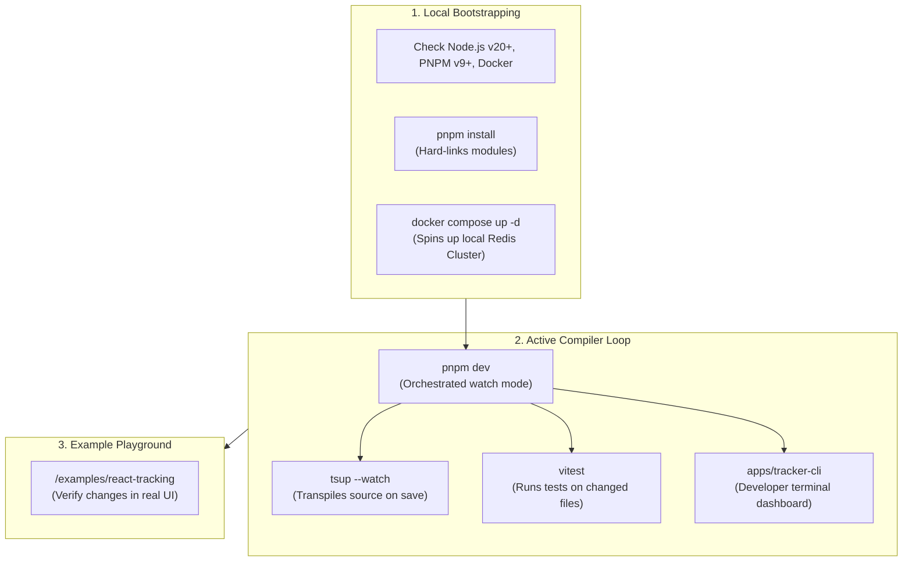

# 29 - Developer Experience

This document establishes the developer experience (DX) standards, local development workflows, workspace orchestration commands, example playgrounds, and git submission templates for Motus.

---

## Purpose
This document defines the developer experience guidelines for the Motus project. It outlines local environments setup, task commands, git branching naming standards, and pull request workflows designed to facilitate contributor onboarding.

---

## Goals
*   **Single-Command Bootstrapping:** Allow developers to install dependencies and configure local services with a single command.
*   **Rapid Development Loops:** Utilize build caching to minimize compilation wait times.
*   **Standardize Contributions:** Enforce consistent branch naming, changelogs formatting, and pull request checklists.
*   **Provide Example Playgrounds:** Offer sandbox examples inside the repository to test changes locally.

---

## Scope
These guidelines govern onboarding, local environment setups, script executions, and pull request submissions for all workspace contributors.

---

## Design Decisions

### 1. Local Development Workflow
The local development pipeline uses Docker to run dependencies and Turborepo to orchestrate builds in watch mode:



### 2. Task Orchestration via Turborepo
Motus standardizes on **Turborepo** to manage workspace pipelines.
*   **Dependency-Aware Task Execution:** When a developer runs a task (e.g. `build`), Turborepo resolves the package dependency graph to compile dependencies (like `@motus/types`) before compiling target entry points (like `@motus/server`).
*   **Local Caching:** Turborepo hashes file states. If a package's files have not changed, running the build task retrieves outputs from the local cache, reducing rebuild times.

### 3. Sandbox Playgrounds
*   **Examples Directory:** The `/examples/` folder contains functional sample projects (such as a basic React tracking app) that consume local workspace packages using the `workspace:*` protocol.
*   **Manual Verification:** Developers can test changes to real-time APIs (Socket.io/Redis) locally using these sandboxes before pushing updates.

### 4. Contribution Rules and Changeset Audits
*   **Branch Naming Conventions:** Contributors use feature-specific branches (e.g. `feat/`, `fix/`, `docs/`) targeting the `main` branch.
*   **Changeset Requirement:** If a pull request modifies code inside `/packages/`, the developer must run `pnpm changeset` to generate a markdown file detailing the version impact. The CI validation checks for this file and blocks merges if it is missing.

---

## Alternatives Considered

### 1. Manual Script Sequencing (Without Turborepo)
*   **Approach:** Run custom npm scripts sequentially (e.g. `pnpm --filter @motus/types run build && pnpm --filter @motus/core run build...`).
*   **Why Rejected:** Manual script management is fragile and slow. Developers would need to manually adjust scripts when dependencies change, and the build process would lack performance-enhancing compilation caching.

### 2. Lerna / Nx
*   **Approach:** Use Lerna or Nx for workspace caching and task running.
*   **Why Rejected:** While capable, Lerna and Nx introduce extensive configurations and large dependencies. Turborepo is light-weight, configures with a single `turbo.json` file, and integrates with the pnpm package manager.

---

## Tradeoffs

*   **Docker Dependency:** Running integration tests and local development servers requires Docker to spin up a Redis cluster. While this adds dependency overhead for the developer's local machine, it is necessary to guarantee behavior parity with the production environment.

---

## Recommended Standards

### 1. Baseline Developer Scripts Catalog
These common scripts are exposed in the root `package.json`:
```json
"scripts": {
  "setup": "pnpm install && docker compose up -d",
  "build": "turbo run build",
  "dev": "turbo run dev --parallel",
  "test": "turbo run test",
  "test:watch": "turbo run test:watch",
  "typecheck": "turbo run typecheck",
  "lint": "turbo run lint",
  "format": "prettier --write \"**/*.{ts,js,json,md}\"",
  "changeset": "changeset"
}
```

### 2. Pull Request Template (`.github/pull_request_template.md`)
```markdown
## Description
Provide a concise summary of the changes introduced by this pull request.

## Type of Change
- [ ] Bug fix (non-breaking change which fixes an issue)
- [ ] New feature (non-breaking change which adds functionality)
- [ ] Breaking change (fix or feature that would cause existing functionality to change)
- [ ] Documentation update

## Checklist
- [ ] I have read the [Contributing Guidelines](CONTRIBUTING.md).
- [ ] I have added tests that prove my fix is effective or that my feature works.
- [ ] I have executed local checks (`pnpm lint`, `pnpm typecheck`, `pnpm build`) and all checks pass.
- [ ] I have created a changeset file by running `pnpm changeset` (required if any packages are modified).
```

### 3. Git Branching Naming Standard
*   Features: `feat/<scope>-<description>` (e.g. `feat/matching-wave-timeouts`)
*   Fixes: `fix/<scope>-<description>` (e.g. `fix/redis-lock-leak`)
*   Docs: `docs/<description>` (e.g. `docs/update-observability-metrics`)

---

## Risks
*   **Stale Local Documentation:** Outdated onboarding guides can cause friction for new contributors. This is managed by run-testing local installation scripts on clean systems prior to major version releases.
*   **Docker Service Failures:** Local database containers can fail due to port conflicts. This is addressed by documenting troubleshooting patterns in the setup guides.

---

## Future Considerations
*   **GitHub Codespaces Setup:** Providing a pre-configured `.devcontainer/` folder to bootstrap a complete development environment (including Node, pnpm, Docker, and Redis) inside a secure browser-based VM.
