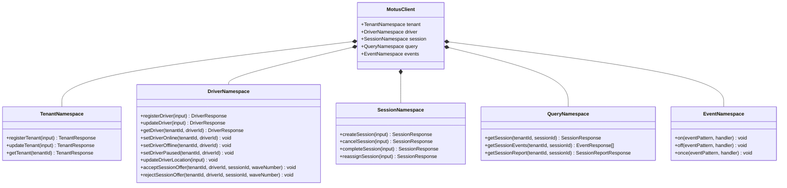

# 31 - SDK API Design

This document details the public API surface area of the Motus SDK. It defines the logical client signatures, input/output validation behaviors, error conditions, and event subscription methods.

---

## SDK Architecture & Organisation

The Motus SDK exposes structured operations partitioned into functional namespaces. It provides synchronous and asynchronous client integrations for backend orchestrators and client devices.



---

## SDK API Group Specifications

### 1. Tenant APIs

#### registerTenant
*   **Signature:** `registerTenant(input: RegisterTenantInput) -> Promise<TenantResponse>`
*   **Purpose:** Registers a new enterprise workspace partition with specific matching policies.
*   **Validation Rules:**
    *   Tenant name must be provided (non-empty).
    *   Matching strategy must match a valid enumeration value.
*   **Error Conditions:** `MOTUS_INVALID_ARGUMENT`, `MOTUS_CAPACITY_EXCEEDED`, `MOTUS_INTERNAL_ERROR`.
*   **Idempotency Requirements:** Idempotency required. Re-submitting the same payload with the same key returns the existing registered tenant profile.

#### updateTenant
*   **Signature:** `updateTenant(input: UpdateTenantInput) -> Promise<TenantResponse>`
*   **Purpose:** Modifies existing matching rules, retry policies, or geofenced zones.
*   **Validation Rules:**
    *   Tenant ID must exist.
*   **Error Conditions:** `MOTUS_TENANT_NOT_FOUND`, `MOTUS_INVALID_ARGUMENT`.
*   **Idempotency Requirements:** Idempotent by state convergence. Multiple invocations result in the same final tenant configuration.

#### getTenant
*   **Signature:** `getTenant(tenantId: TenantId) -> Promise<TenantResponse>`
*   **Purpose:** Fetches current configurations for the specified tenant partition.
*   **Error Conditions:** `MOTUS_TENANT_NOT_FOUND`.
*   **Idempotency Requirements:** Naturally idempotent (read-only query).

---

### 2. Driver APIs

#### registerDriver
*   **Signature:** `registerDriver(input: RegisterDriverInput) -> Promise<DriverResponse>`
*   **Purpose:** Registers a driver profile with capacity parameters and vehicle types.
*   **Validation Rules:**
    *   Driver capacity must be $\ge 1$.
*   **Error Conditions:** `MOTUS_INVALID_ARGUMENT`, `MOTUS_TENANT_NOT_FOUND`.
*   **Idempotency Requirements:** Idempotency required. Re-submitting the same registration ID returns the existing driver profile.

#### updateDriver
*   **Signature:** `updateDriver(input: UpdateDriverInput) -> Promise<DriverResponse>`
*   **Purpose:** Modifies operational configurations for an existing driver (e.g. capacity limits, vehicle classification).
*   **Validation Rules:**
    *   Driver ID must exist.
*   **Error Conditions:** `MOTUS_DRIVER_NOT_FOUND`, `MOTUS_INVALID_ARGUMENT`.
*   **Idempotency Requirements:** Idempotent by state convergence.

#### getDriver
*   **Signature:** `getDriver(tenantId: TenantId, driverId: DriverId) -> Promise<DriverResponse>`
*   **Purpose:** Retrieves the current state, load, and presence information of a driver.
*   **Error Conditions:** `MOTUS_DRIVER_NOT_FOUND`.
*   **Idempotency Requirements:** Naturally idempotent (read-only query).

#### setDriverOnline
*   **Signature:** `setDriverOnline(tenantId: TenantId, driverId: DriverId) -> Promise<void>`
*   **Purpose:** Activates the driver's presence, making them eligible for wave offers.
*   **Error Conditions:** `MOTUS_DRIVER_NOT_FOUND`.
*   **Idempotency Requirements:** Idempotent. Multiple online requests preserve the `ONLINE` status.

#### setDriverOffline
*   **Signature:** `setDriverOffline(tenantId: TenantId, driverId: DriverId) -> Promise<void>`
*   **Purpose:** Disconnects the driver presence, rejecting and releasing any active offers or locks.
*   **Error Conditions:** `MOTUS_DRIVER_NOT_FOUND`.
*   **Idempotency Requirements:** Idempotent.

#### setDriverPaused
*   **Signature:** `setDriverPaused(tenantId: TenantId, driverId: DriverId) -> Promise<void>`
*   **Purpose:** Suspends wave offers for the driver while maintaining connection status.
*   **Error Conditions:** `MOTUS_DRIVER_NOT_FOUND`, `MOTUS_INVALID_TRANSITION`.
*   **Idempotency Requirements:** Idempotent.

#### updateDriverLocation
*   **Signature:** `updateDriverLocation(input: UpdateDriverLocationInput) -> Promise<void>`
*   **Purpose:** Ingests raw GPS location data for driver spatial indexing and geofence evaluation.
*   **Validation Rules:**
    *   Coordinates must fall within valid geographic ranges.
    *   Timestamp must be in UTC.
*   **Error Conditions:** `MOTUS_DRIVER_NOT_FOUND`, `MOTUS_INVALID_ARGUMENT`.
*   **Idempotency Requirements:** Idempotent by timestamp sequencing (late-arriving coordinates are discarded).

#### acceptSessionOffer
*   **Signature:** `acceptSessionOffer(tenantId: TenantId, driverId: DriverId, sessionId: SessionId, waveNumber: Integer) -> Promise<void>`
*   **Purpose:** Submits an acceptance decision for a session assignment offer in an active wave.
*   **Validation Rules:**
    *   Target wave must match the active wave index on the session.
*   **Error Conditions:** `MOTUS_LOCK_ACQUISITION_FAILED`, `MOTUS_INVALID_TRANSITION`, `MOTUS_DRIVER_BUSY`.
*   **Idempotency Requirements:** Strictly idempotent. If the offer has already been accepted by this driver, subsequent calls return success. If accepted by another driver or expired, a conflict error is returned.

#### rejectSessionOffer
*   **Signature:** `rejectSessionOffer(tenantId: TenantId, driverId: DriverId, sessionId: SessionId, waveNumber: Integer) -> Promise<void>`
*   **Purpose:** Declines a wave offer, triggering immediate progressive escalation to alternative candidates.
*   **Error Conditions:** `MOTUS_LOCK_ACQUISITION_FAILED`, `MOTUS_INVALID_TRANSITION`.
*   **Idempotency Requirements:** Idempotent.

---

### 3. Session Command APIs

#### createSession
*   **Signature:** `createSession(input: CreateSessionInput) -> Promise<SessionResponse>`
*   **Purpose:** Initializes a new tracking/dispatch session in the `CREATED` state.
*   **Validation Rules:**
    *   Pickup and destination locations must be provided and valid.
*   **Error Conditions:** `MOTUS_INVALID_ARGUMENT`, `MOTUS_TENANT_NOT_FOUND`.
*   **Idempotency Requirements:** Idempotency key required. Subsequent calls with the same key return the same session record.

#### cancelSession
*   **Signature:** `cancelSession(input: CancelSessionInput) -> Promise<SessionResponse>`
*   **Purpose:** Terminates an ongoing session, releasing any driver reservation.
*   **Validation Rules:**
    *   Session ID must exist.
*   **Error Conditions:** `MOTUS_SESSION_NOT_FOUND`, `MOTUS_INVALID_TRANSITION`.
*   **Idempotency Requirements:** Idempotent. Subsequent calls return the cancelled session payload.

#### completeSession
*   **Signature:** `completeSession(input: CompleteSessionInput) -> Promise<SessionResponse>`
*   **Purpose:** Marks the session as completed, stopping tracking and generating the final telemetry report.
*   **Validation Rules:**
    *   Session status must be `IN_PROGRESS`.
*   **Error Conditions:** `MOTUS_SESSION_NOT_FOUND`, `MOTUS_INVALID_TRANSITION`.
*   **Idempotency Requirements:** Idempotent.

#### reassignSession
*   **Signature:** `reassignSession(input: ReassignSessionInput) -> Promise<SessionResponse>`
*   **Purpose:** Manually breaks an existing driver assignment and returns the session to the `SEARCHING` state.
*   **Error Conditions:** `MOTUS_SESSION_NOT_FOUND`, `MOTUS_INVALID_TRANSITION`.
*   **Idempotency Requirements:** Idempotent.

---

### 4. Query APIs

#### getSession
*   **Signature:** `getSession(tenantId: TenantId, sessionId: SessionId) -> Promise<SessionResponse>`
*   **Purpose:** Reads the active properties and status of a session.
*   **Idempotency Requirements:** Naturally idempotent.

#### getSessionEvents
*   **Signature:** `getSessionEvents(tenantId: TenantId, sessionId: SessionId) -> Promise<EventResponse[]>`
*   **Purpose:** Retrieves the timeline of state changes and client actions recorded for the session.
*   **Idempotency Requirements:** Naturally idempotent.

#### getSessionReport
*   **Signature:** `getSessionReport(tenantId: TenantId, sessionId: SessionId) -> Promise<SessionReportResponse>`
*   **Purpose:** Compiles the telemetry travel logs, duration measurements, and final distance calculation.
*   **Error Conditions:** `MOTUS_SESSION_NOT_FOUND`, `MOTUS_INVALID_TRANSITION` (if the session is not completed).
*   **Idempotency Requirements:** Naturally idempotent.

---

### 5. Event APIs

#### on / off / once
*   **Signature:**
    *   `on(eventPattern: String, handler: Function) -> void`
    *   `off(eventPattern: String, handler: Function) -> void`
    *   `once(eventPattern: String, handler: Function) -> void`
*   **Purpose:** Registers or unsubscribes callbacks for real-time events based on event name patterns (wildcards supported).
*   **Validation Rules:**
    *   `eventPattern` must conform to standard event namespace notation.
    *   `handler` must be a valid executable routine.

---

## Illustrative TypeScript Contracts

Below are illustrative signatures representing the SDK client contract:

```typescript
export interface MotusSDKClient {
  tenant: {
    registerTenant(input: RegisterTenantInput): Promise<TenantResponse>;
    updateTenant(input: UpdateTenantInput): Promise<TenantResponse>;
    getTenant(tenantId: string): Promise<TenantResponse>;
  };
  driver: {
    registerDriver(input: RegisterDriverInput): Promise<DriverResponse>;
    updateDriver(input: UpdateDriverInput): Promise<DriverResponse>;
    getDriver(tenantId: string, driverId: string): Promise<DriverResponse>;
    setDriverOnline(tenantId: string, driverId: string): Promise<void>;
    setDriverOffline(tenantId: string, driverId: string): Promise<void>;
    setDriverPaused(tenantId: string, driverId: string): Promise<void>;
    updateDriverLocation(input: UpdateDriverLocationInput): Promise<void>;
    acceptSessionOffer(tenantId: string, driverId: string, sessionId: string, waveNumber: number): Promise<void>;
    rejectSessionOffer(tenantId: string, driverId: string, sessionId: string, waveNumber: number): Promise<void>;
  };
  session: {
    createSession(input: CreateSessionInput): Promise<SessionResponse>;
    cancelSession(input: CancelSessionInput): Promise<SessionResponse>;
    completeSession(input: CompleteSessionInput): Promise<SessionResponse>;
    reassignSession(input: ReassignSessionInput): Promise<SessionResponse>;
  };
  query: {
    getSession(tenantId: string, sessionId: string): Promise<SessionResponse>;
    getSessionEvents(tenantId: string, sessionId: string): Promise<EventResponse[]>;
    getSessionReport(tenantId: string, sessionId: string): Promise<SessionReportResponse>;
  };
  events: {
    on(pattern: string, handler: (event: any) => void): void;
    off(pattern: string, handler: (event: any) => void): void;
    once(pattern: string, handler: (event: any) => void): void;
  };
}
```

---

## Versioning Considerations

### Versioning Policy for SDK API Design
*   **Additive Changes:** Adding a new API method to a namespace (e.g. `query.getActiveDrivers()`) or introducing an optional parameter to an existing method is backward-compatible.
*   **Breaking Changes:** Modifying required input arguments, renaming methods (e.g., changing `setDriverOnline` to `onlineDriver`), or shifting a method from one namespace to another (e.g., moving `getSessionReport` from `query` to `session`) is a breaking change.
*   **Deprecation Rules:** Obsolete methods will be marked using TS doc tags (`@deprecated`) and trigger console warnings at runtime. They must remain in the SDK for at least one major release lifecycle before deletion.
*   **Compatibility Matrix:** SDK major versions are tied to Server API compatibility. A version compatibility map must be exposed in package documentation.
