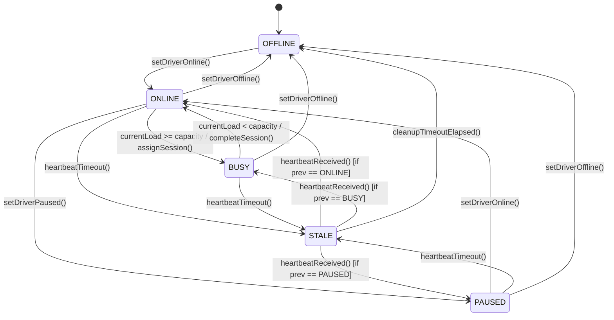
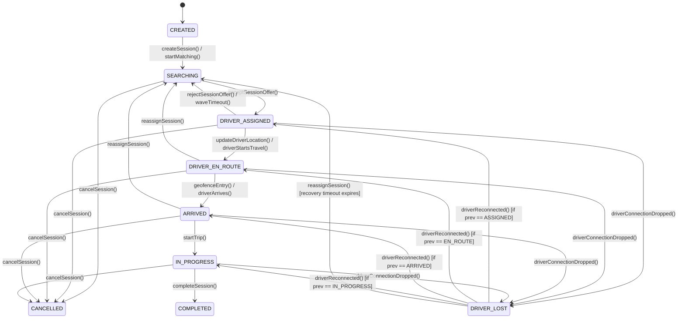

# 36 - State Machines

This document defines the formal behavioral contracts, state transition matrices, invariants, and failure scenarios for the two main state machines of the Motus system: Driver Presence and Dispatch Sessions.

---

## Driver Presence State Machine

Governs the operational status of driver resources connected to the real-time presence cache.

### 1. Driver Transition Matrix
| Source State | Event (Trigger) | Target State | Invariants & Conditions | Emitted Event |
| :--- | :--- | :--- | :--- | :--- |
| `OFFLINE` | `setDriverOnline` | `ONLINE` | Driver registered with tenant | `driver.online` |
| `ONLINE` | `assignSession` | `BUSY` | `currentLoad` reaches `capacity` | - |
| `ONLINE` | `setDriverPaused` | `PAUSED` | Driver is not reserved | `driver.paused` |
| `ONLINE` | `heartbeatTimeout`| `STALE` | No ping within stale interval | `driver.offline` (delayed) |
| `ONLINE` | `setDriverOffline`| `OFFLINE`| Immediate socket closure | `driver.offline` |
| `BUSY` | `unassignSession` | `ONLINE` | `currentLoad` falls below `capacity` | - |
| `BUSY` | `heartbeatTimeout`| `STALE` | No ping within stale interval | `driver.offline` (delayed) |
| `PAUSED` | `setDriverOnline` | `ONLINE` | Driver resumes availability | `driver.online` |
| `STALE` | `heartbeatReceived`| *Previous* | Restores to state cached in memory | `driver.online` |
| `STALE` | `cleanupTimeout`  | `OFFLINE` | Recovery window expires | `driver.offline` |

### 2. Invalid Driver Transitions
*   `OFFLINE` $\rightarrow$ `BUSY`: Driver must first become `ONLINE` and receive an offer before entering `BUSY`.
*   `PAUSED` $\rightarrow$ `BUSY`: Drivers must explicitly resume to `ONLINE` to be eligible for assignment evaluation.

---

## Dispatch Session State Machine

Coordinates the journey lifecycle, matching, and tracking process of an individual session.

### 1. Session Transition Matrix
| Source State | Event (Trigger) | Target State | Invariants & Conditions | Emitted Event |
| :--- | :--- | :--- | :--- | :--- |
| `CREATED` | `startMatching` | `SEARCHING` | Matching engine initialized | `session.searching` |
| `SEARCHING` | `acceptOffer` | `DRIVER_ASSIGNED`| Driver accepted wave offer | `session.assigned` |
| `SEARCHING` | `cancelSession` | `CANCELLED` | Manual cancellation | `session.cancelled` |
| `DRIVER_ASSIGNED` | `driverStartsTravel`| `DRIVER_EN_ROUTE`| Driver location updates move | `session.state.changed` |
| `DRIVER_ASSIGNED` | `driverDisconnect` | `DRIVER_LOST` | Presence monitor registers stale | `session.driver_lost` |
| `DRIVER_ASSIGNED` | `waveTimeout` | `SEARCHING` | Wave expired without acceptance | `dispatch.wave.completed`|
| `DRIVER_EN_ROUTE` | `driverArrived` | `ARRIVED` | Location geofence triggered | `session.arrived` |
| `ARRIVED` | `startTrip` | `IN_PROGRESS` | Manual pickup confirmation | `session.started` |
| `IN_PROGRESS` | `completeTrip` | `COMPLETED` | Destination geofence/manual | `session.completed` |
| `DRIVER_LOST` | `driverReconnect` | *Previous* | Restores state using cache | `session.state.changed` |
| `DRIVER_LOST` | `reassignSession` | `SEARCHING` | Recovery window timeout elapsed | `session.searching` |

### 2. Invalid Session Transitions
*   `CREATED` $\rightarrow$ `DRIVER_ASSIGNED`: A session cannot bypass matching and search processes.
*   `IN_PROGRESS` $\rightarrow$ `SEARCHING`: An active trip in fulfillment cannot be returned directly to open matching. It must first be reassigned or cancelled.
*   `COMPLETED` $\rightarrow$ `CANCELLED`: Terminal states are final and irreversible.

---

## State Machine Failure & Recovery Scenarios

### 1. Rapid Connection Dropping (Flapping)
If a driver connects and disconnects repeatedly within seconds, the state machine leverages timestamps. Location updates with historical timestamps (lower than the cached state timestamp) are discarded, preventing the driver from toggling repeatedly between `STALE` and `ONLINE`.

### 2. Driver Lost Recovery Timeout
When a session enters `DRIVER_LOST` due to a driver disconnection during fulfillment, a recovery window (default: $180$ seconds) starts:
*   If the driver reconnects and sends a location heartbeat within $180$ seconds, the session state is restored.
*   If the window expires, the engine triggers `reassignSession()`, releasing the driver profile (marking it offline) and returning the session to `SEARCHING` to find another candidate.

---

## Versioning Considerations

### Versioning Policy for State Machines
*   **Additive Changes:** Adding a new sub-state (e.g. `ARRIVED_PICKUP` vs `ARRIVED_DELIVERY`) is considered backward-compatible if it behaves as a logical child of an existing state.
*   **Breaking Changes:** Deleting a state, modifying the valid transition pathways (e.g. blocking manual cancellation during `IN_PROGRESS`), or changing invariant rules is breaking.
*   **Deprecation Rules:** When deprecating a transition route, it will remain supported but emit telemetry validation warnings. Deprecated states are fully removed only in major contract editions.
*   **Compatibility Matrix:** System event payloads mapping to state change notifications (`session.state.changed`) must preserve the historic string state name values.
