# 37 - Extensibility Contracts

This document defines the platform-independent interfaces and operational contracts for supporting extension points within the Motus engine. 

---

## Extension Interface Specifications

```mermaid
classDiagram
    class MatchingProvider {
        +scoreCandidates(Session, Driver[]) CandidateScore[]
    }
    class EtaProvider {
        +calculateEta(Coordinates, Coordinates) EtaResult
    }
    class GeofencingProvider {
        +isPointInZone(Coordinates, Zone) Boolean
    }
    class TelemetryProvider {
        +shouldSample(Coordinates, Coordinates, Duration) Boolean
    }
    class EventAdapter {
        +publish(EventResponse) void
    }
    class NotificationProvider {
        +sendOffer(DriverId, Assignment) void
        +clearOffer(DriverId, AssignmentId) void
    }
```

---

### 1. Custom Matching Provider
Allows tenants to override default spatial candidate ranking algorithms.
*   **Interface Contract:** `scoreCandidates(session: Session, candidates: Driver[]) -> CandidateScore[]`
*   **Inputs:**
    *   `session`: The active `Session` aggregate details.
    *   `candidates`: Array of eligible `Driver` records located within range.
*   **Outputs:** An array of scored elements, where each item contains `driverId` (String) and `score` (Double, higher is better).
*   **Error Handling:** The engine isolates matching exceptions. If the custom provider throws an error, the matching pipeline logs a telemetry warning and falls back to the default `DISTANCE` matching strategy to prevent session starvation.
*   **Lifecycle:** Evaluated dynamically at the start of each dispatch wave.
*   **Versioning Expectations:** Minor contract upgrades must pass new session fields as optional parameters in the input object.

---

### 2. ETA Provider
Plugs in external routing services (e.g. OSRM, Google Maps API) to compute real-time travel duration estimates.
*   **Interface Contract:** `calculateEta(origin: Coordinates, destination: Coordinates) -> EtaResult`
*   **Inputs:**
    *   `origin`: Start coordinate block.
    *   `destination`: End coordinate block.
*   **Outputs:**
    *   `durationSeconds` (Integer): Estimated transit time.
    *   `distanceMeters` (Double): Calculated path distance.
*   **Error Handling:** If the routing provider times out (exceeds $500$ms) or returns an error, the engine falls back to straight-line distance calculations.
*   **Lifecycle:** Instantiated once at startup; executed concurrently during candidate evaluation loops.

---

### 3. Geofencing Provider
Customizes geometric checks to validate coordinates against boundaries.
*   **Interface Contract:** `isPointInZone(point: Coordinates, zone: Zone) -> Boolean`
*   **Inputs:**
    *   `point`: Subject coordinates.
    *   `zone`: Operating boundary zone.
*   **Outputs:** `Boolean` indicating intersection.
*   **Error Handling:** If execution fails, the engine assumes the coordinates are outside the geofence to prevent unauthorized dispatch access.
*   **Lifecycle:** Triggered synchronously on location update ingestion.

---

### 4. Telemetry Provider
Customizes the route path sampling calculations, controlling coordinate storage density.
*   **Interface Contract:** `shouldSample(lastSampledLocation: Coordinates, newLocation: Coordinates, elapsedDuration: Duration) -> Boolean`
*   **Inputs:**
    *   `lastSampledLocation`: The coordinate of the last recorded telemetry point.
    *   `newLocation`: The coordinate of the incoming location update.
    *   `elapsedDuration`: Time delta since the last sample.
*   **Outputs:** `Boolean` indicating if the point should be appended to the session trace.
*   **Error Handling:** Exceptions default to saving the telemetry point to prevent data loss.
*   **Lifecycle:** Executed inline during location updates for active sessions.

---

### 5. Event Adapter
Routes outbound outbox events to external queues, message brokers, or webhook clients.
*   **Interface Contract:** `publish(event: EventResponse) -> void`
*   **Inputs:**
    *   `event`: Fully structured, immutable event payload conforming to `EventResponse`.
*   **Outputs:** `void` (asynchronous acknowledgement).
*   **Error Handling:** Must implement internal retry logic (e.g. exponential backoff). The core engine will log a critical warning and write event records to an internal fallback log if the adapter remains unavailable.
*   **Lifecycle:** Active throughout system lifecycle. Handles shutdown requests by flushing queues.

---

### 6. Future Notification Provider
Dispatches assignment offers to drivers (e.g., Apple APNs, Firebase Cloud Messaging, SMS gateways).
*   **Interface Contract:**
    *   `sendOffer(driverId: DriverId, offer: Assignment) -> void`
    *   `clearOffer(driverId: DriverId, assignmentId: String) -> void`
*   **Inputs:**
    *   `driverId`: Target driver.
    *   `offer` / `assignmentId`: Detail payload of the wave assignment.
*   **Outputs:** `void`
*   **Error Handling:** Failures to deliver notifications are caught. The engine will wait for the wave timeout window to expire or for presence heartbeats to transition the driver stale, moving the offer to secondary candidates.
*   **Lifecycle:** Initialized on bootstrap. Invoked by the wave distribution engine.

---

## Versioning Considerations

### Versioning Policy for Extensibility Contracts
*   **Additive Changes:** Adding optional properties to inputs (e.g., adding `trafficConditions` parameter to `ETA Provider` input) is backward-compatible. Providers must implement defaults for missing arguments.
*   **Breaking Changes:** Modifying method signatures (e.g. changing return type format), adding required fields, or changing expected return constraints (e.g., expecting `EtaProvider` to return route polylines) represents a breaking change.
*   **Deprecation Rules:** When an interface method is slated for removal, a new method should be introduced alongside it. Providers must migrate within a minor release period before the old signature is deleted.
*   **Compatibility Matrix:** Custom extensions must explicitly register their supported API version string on initial handshake/binding.
