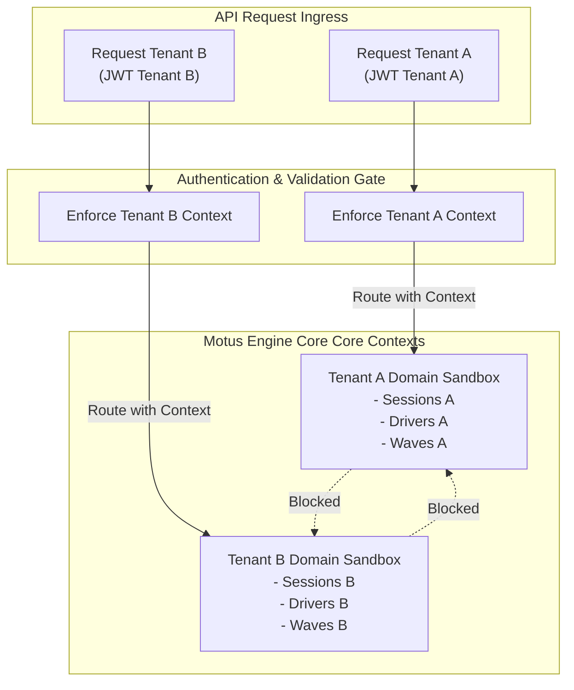

# 38 - Multi-Tenancy Contracts

This document establishes the behavioral boundaries, isolation rules, and security restrictions governing multi-tenant operations inside the Motus engine.

---

## Multi-Tenancy Architecture Principles

Motus operates as a logically isolated multi-tenant system. Tenant data boundaries are enforced at the application layer, ensuring that tenants share execution runtime resources without data leaks.

---

## Multi-Tenant Operational Contracts

### 1. Tenant Ownership & Context
*   **Tenant Partition:** Every request executed by the Motus SDK or API must occur within the context of a validated `TenantId`.
*   **Context Propagation:** The system propagates the tenant context across all internal execution paths (e.g. matching loops, telemetry processing, outbox distribution).

### 2. Resource Scoping & Ownership
*   **Exclusive Ownership:** Every domain entity—including `Driver`, `Session`, `Zone`, `TelemetryPoint`, `DispatchWave`, and `Assignment`—is owned by exactly one Tenant.
*   **Immutable Scoping:** Once created, a resource's `TenantId` is immutable. Resources cannot be reassigned or transferred between tenants.

### 3. Isolation & Cross-Tenant Restrictions
*   **Query Isolation:** Queries requesting lists of drivers, sessions, or events must require a `TenantId` parameter and return only resources matching that tenant context.
*   **Command Isolation:** Command requests trying to update or modify a resource (e.g., `updateDriverLocation` or `cancelSession`) must validate that the target resource belongs to the tenant context of the caller. Attempts to modify cross-tenant resources will throw a `MOTUS_SESSION_NOT_FOUND` or `MOTUS_DRIVER_NOT_FOUND` error to prevent resource existence disclosure.
*   **Interference Prevention:** Operational parameters (e.g. driver capacity limits, geofence zones, matching strategies) are strictly evaluated inside the respective tenant context. Geofence queries for a driver belonging to Tenant A are never checked against zone coordinates belonging to Tenant B.

### 4. Session & Allocation Isolation
*   **Matching Sandboxing:** The matching engine must isolate candidate evaluation. A driver registered under Tenant A cannot be scored, ranked, locked, or assigned to a session created by Tenant B.
*   **Wave Sandboxing:** Active notification waves are isolated. Offering notification signals must only route to drivers registered under the matching tenant ID.

### 5. Event Isolation
*   **Outbound Routing:** Every published event envelope must contain the originating `tenantId` in its metadata headers.
*   **Consumer Partitioning:** Integrators subscribing to events can configure filters to restrict ingestion to events originating from their specific tenant ID.

### 6. Validation Requirements
*   **Token Verification:** Incoming API and WebSocket requests must supply a JWT containing a validated `tenant_id` claim matching the payload `tenantId` property.
*   **Payload Boundary Check:** If a request payload contains references to other entities (e.g., `RegisterDriverRequest` referencing a tenant), the system must validate that all references align with the authenticated tenant context.

---

## Versioning Considerations

### Versioning Policy for Multi-Tenancy Contracts
*   **Additive Changes:** Adding optional multi-tenant configuration parameters (e.g., custom tenant rate limits) is safe and backward-compatible.
*   **Breaking Changes:** Any change that weakens tenant isolation (e.g., permitting cross-tenant driver sharing or pooling of matching lists) is a breaking change.
*   **Deprecation Rules:** If a multi-tenant validation flag or configuration property is scheduled for removal, it must remain supported but generate administrative deprecation logs for at least one major release cycle.
*   **Compatibility Matrix:** The multi-tenant runtime boundary checks must be verified as part of the core test suites for all major and minor release candidates.
