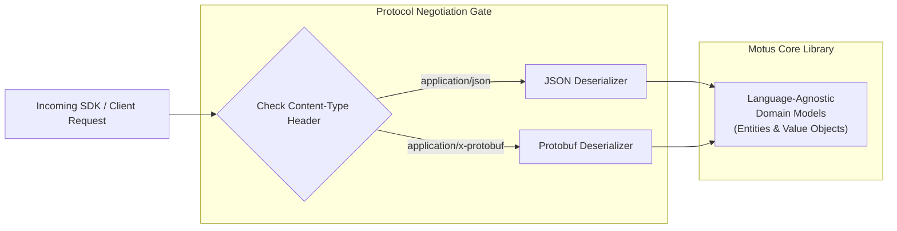

# 39 - Serialization Strategy

This document details the serialization contracts, date standards, identifier patterns, and backward compatibility rules for data exchange within the Motus engine.

---

## Data Representations

### 1. JSON Representation
*   **Default Format:** JavaScript Object Notation (JSON) is the canonical serialization format for all public REST APIs, WebSocket channels, event payloads, and SDK interfaces.
*   **Key Casing:** Keys must use **camelCase** formatting (e.g. `matchingStrategy`, `waveTimeoutSeconds`). Uppercase is reserved for enum values and error codes.
*   **Null vs. Omitted Fields:** Optional fields that contain no value should be omitted from payloads rather than sent as `null` to minimize payload footprint and clarify default parameters.

### 2. Date & Time Handling
To prevent timezone conversion drift, all date-time attributes must follow the ISO 8601 extended UTC format:
*   **Format:** `YYYY-MM-DDTHH:mm:ss.sssZ`
*   **TimeZone:** Coordinated Universal Time (UTC) exclusively, designated by the `Z` suffix.
*   **Precision:** Standard millisecond precision is required.
*   **Example:** `"2026-06-11T13:12:00.184Z"`

### 3. Identifier Schema
Identifiers use structured, type-prefixed strings to assist in debugging and logging clarity.
*   **Tenant ID Prefix:** `tnt_` (e.g., `tnt_quickdelivery`)
*   **Driver ID Prefix:** `drv_` (e.g., `drv_driver409`)
*   **Session ID Prefix:** `ses_` (e.g., `ses_trip2841`)
*   **Event ID Format:** Standard UUIDv4 without prefixes (e.g., `d25390e1-7c98-4d51-9ef2-4fcfd841b80c`).

---

## Backward Compatibility & Deserialization Rules

To allow rolling cluster updates where node versions differ:
1.  **Unknown Properties:** Parsers must ignore unrecognized JSON properties during deserialization.
2.  **Schema Stability:** Payload structures cannot modify existing data types (e.g. converting an integer to a float or a coordinates object to an array).
3.  **Strict Defaulting:** Deserializers must inject configured fallback defaults if optional parameters are omitted in incoming requests.

---

## Future Protocol Migration Strategy

While JSON is the default serialization protocol, the Motus contracts are structured to allow migration to high-efficiency binary serialization protocols (e.g. Protocol Buffers, FlatBuffers) in future releases.

### 1. Protocol Negotiation
Clients can negotiate binary formatting by supplying the standard HTTP `Content-Type` and `Accept` headers:
*   `Accept: application/x-protobuf`
*   `Content-Type: application/x-protobuf`

### 2. ID Mapping Compatibility
To maintain structural consistency, the binary message field tags must map directly to JSON property names, preserving semantic representation.

---

## Versioning Considerations

### Versioning Policy for Serialization Strategy
*   **Additive Changes:** Adding new fields to JSON or new protobuf tags is a minor version change (`v1.1.0`).
*   **Breaking Changes:** Modifying date formats (e.g. shifting to Unix epochs), changing key casings (e.g. camelCase to snake_case), or removing identifier prefixes represents a major breaking change.
*   **Deprecation Rules:** Replaced fields must remain populated by serializer code for at least one major lifecycle, with documentation pointing client integrators to the revised payload attributes.
*   **Compatibility Matrix:** Schema validator code must test payload inputs against both historical and updated schemas to verify backward parser compatibility.
