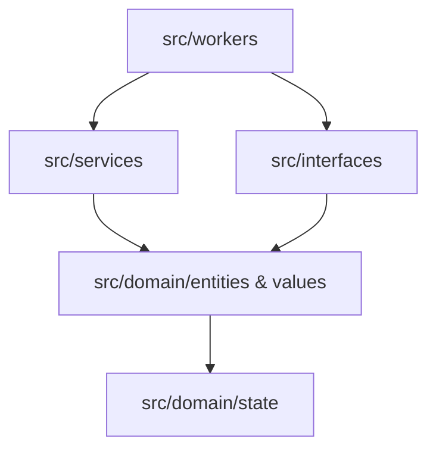
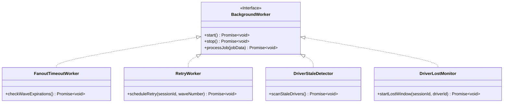

# 42 - Core Internal Design

This document details the internal architecture, module folder structure, boundaries, and background worker designs of the `@motus/core` package.

---

## Package Responsibilities

The `@motus/core` package is the pure, framework-agnostic domain engine of Motus. It houses:
1. **Domain Aggregates & Entities:** Core stateful domain models (`Session`, `Driver`, `Tenant`).
2. **Domain Services:** Stateless mathematical or logical coordinators (`MatchingPipeline`, `GeofencePolygonValidator`, `TelemetrySampler`).
3. **Internal Interface Ports:** Strict abstract definitions of persistence and infrastructural components (`ISessionRepository`, `IDriverRepository`, `ILockManager`, `IEtaProvider`, `IEventBus`).
4. **Background Worker Logic:** Coordination blocks for asynchronous processes (timeouts, stale presence checks, retries, and cleanup).

---

## Module Boundaries & Internal Folder Structure

To enforce separation of concerns and prevent circular dependencies, `@motus/core` organizes code in a clean architecture layered structure:

```
@motus/core/
├── src/
│   ├── domain/                  # Pure domain entities, value objects, and invariants
│   │   ├── entities/            # Tenant, Driver, Session, SessionReport
│   │   ├── values/              # Coordinate, Location, TelemetryPoint, EventEnvelope
│   │   └── state/               # State machines (Presence, Session transitions)
│   ├── services/                # Stateless domain services
│   │   ├── matching/            # MatchingPipeline, Filters, Rankers
│   │   ├── telemetry/           # TelemetrySampler, Compression
│   │   └── geofence/            # GeofencePolygonValidator (Ray-casting)
│   ├── interfaces/              # Dependency Injection Ports (Repositories, Locks)
│   │   ├── persistence/         # ISessionRepository, IDriverRepository, ITenantRepository
│   │   ├── coordination/        # ILockManager, IEtaProvider
│   │   └── events/              # IEventBus, IEventSubscriber
│   └── workers/                 # Orchestrators for asynchronous processes
│       ├── fanout/              # FanoutTimeoutWorker, RetryWorker
│       ├── presence/            # DriverStaleDetector, DriverLostMonitor
│       └── cleanup/             # CleanupWorker
```

### Dependency Direction Rules



1. **Unidirectional Dependency:** Outer layers (workers, services) can import from inner layers (domain, interfaces). Domain models are completely isolated and must never import services or interfaces.
2. **Strict Abstract Inversion:** Outer packages (like `@motus/redis` or `@motus/socketio`) implement the boundaries defined in `src/interfaces/`. `@motus/core` never imports code from other packages except `@motus/types`.
3. **Circular Dependency Prevention:**
   * Handled through static linting analysis (using ESLint rules like `import/no-self-import` and `import/no-cycle`).
   * No service can import another service at the same layer. If coordination is needed, it must be performed by a worker or an orchestrating coordinator.

---

## Background Worker Architecture

Many core capabilities rely on delayed execution, scheduling, or periodic monitoring. `@motus/core` defines the coordination logic for these asynchronous routines.



### 1. FanoutTimeoutWorker
*   **Responsibility:** Monitors active dispatch waves. If a wave does not receive a driver acceptance before its expiration (e.g., 8 seconds), this worker expires the wave, releases reservation locks, and signals the coordinator to advance to the next wave.
*   **Scheduling Model:** Uses a reliable distributed scheduler backend (e.g., Redis-backed delayed queues or event-driven timeouts).
*   **Failure Recovery:** If the worker node dies, another worker node picks up the expired wave from the distributed queue.

### 2. RetryWorker
*   **Responsibility:** Orchestrates cooling periods and matching retry loops when a matching wave fails to yield an accepted candidate. It triggers radius expansions (e.g., incrementing search by 2km) and schedules the next candidate evaluation cycle.
*   **Idempotency:** Driven by atomic session updates. If the session state has already transitioned out of `SEARCHING` (e.g., manual cancellation occurred during the retry delay), the retry task terminates early without action.

### 3. DriverStaleDetector
*   **Responsibility:** Scans the active driver set to detect missed heartbeats. If a driver does not publish a location update within 120 seconds, they are transitioned to the `STALE` state, and their geo-index coordinates are cleared.
*   **Horizontal Scaling:** Utilizes a sliding-window sorted set in Redis where the score is the driver's last heartbeat timestamp. Multiple worker pods execute a range query (`ZRANGEBYSCORE`) with a distributed lock to avoid concurrent processing collisions.

### 4. DriverLostMonitor
*   **Responsibility:** Watches sessions where the driver drops connection during fulfillment (state `DRIVER_LOST`). It coordinates the 180-second recovery grace period. If the period expires without driver reconnection, it executes `reassignSession()`.
*   **Scheduling Model:** Schedules a delayed event. On execution, it confirms if the driver is still offline. If so, it updates the session state back to `SEARCHING`.

### 5. CleanupWorker
*   **Responsibility:** Prunes expired data, completed session keys, and cleans telemetry buffers. It deletes the temporary telemetry streams from Redis 24 hours after a session ends.

---

## Concurrency Concerns

1. **Double Processing:** Multiple server nodes running workers simultaneously could attempt to process the same wave timeout or driver stale event. To prevent this, every execution is guarded by a distributed mutual-exclusion lock (`ILockManager`) or managed via a message broker consumer group.
2. **State Races:** If a session is cancelled while the `RetryWorker` evaluates candidates, the write transaction is guarded by optimistic locking: checking the session state matches `SEARCHING` before applying adjustments.

---

## Failure Scenarios

*   **Worker Interruption:** If a background worker node crashed mid-job, the state must remain consistent. This is achieved by registering the jobs in a persistent queue (e.g. Redis Stream or BullMQ-like FIFO queue) with acknowledgment hooks. If a worker drops, the lock expires and the job is automatically re-queued for delivery to a healthy node.
*   **Database Partitioning / Clock Drift:** Worker nodes rely on consistent time metrics. Standard UTC timestamps are used for all database records, and critical timers (like wave expirations) enforce absolute timeouts relative to records rather than node-local system clocks.

---

## Tradeoffs

*   **Stateless In-Memory Core vs. Shared Persistence:** `@motus/core` is strictly stateless, delegating storage entirely to `src/interfaces/persistence/`. This makes core algorithms easy to unit test and scale, but introduces serialization and remote procedural call latencies as data must be retrieved from the repository layer before executing calculations.

---

## Future Enhancements

*   **Dynamic Worker Partitioning:** Assigning workers to specific geographic zone clusters (e.g., NY-East worker handles NY coordinates, SF-West handles SF coordinates) to localize cache hits and reduce cross-region Redis operations.
