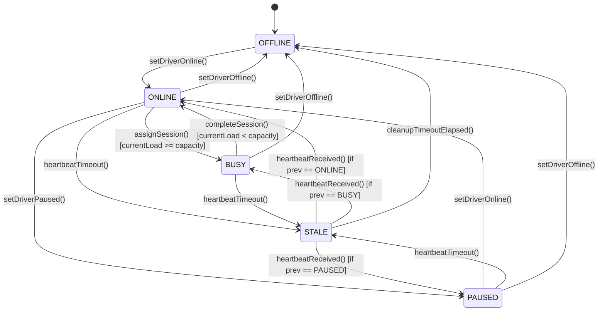
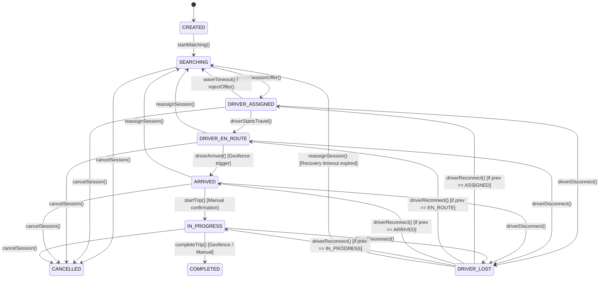

# 43 - State Machine Internal Design

This document describes the design, transition validation layers, guards, and recovery logic for the Driver Presence and Dispatch Session state machines within `@motus/core`.

---

## 1. Driver Presence State Machine

Governs the lifecycle of physical courier resources connected to the system.

### State Transition Diagram



### Transition Specifications & Guards

| Event (Trigger) | Source State | Target State | Guards & Invariants | Emitted Event |
| :--- | :--- | :--- | :--- | :--- |
| `setDriverOnline` | `OFFLINE` | `ONLINE` | Tenant registration exists. Capacity is positive. | `driver.online` |
| `setDriverOnline` | `PAUSED` | `ONLINE` | Current active load is evaluated. | `driver.online` |
| `assignSession` | `ONLINE` | `BUSY` | `currentLoad + 1 >= capacity`. Lock validation passed. | - |
| `assignSession` | `ONLINE` | `ONLINE` | `currentLoad + 1 < capacity`. Increments `currentLoad`. | - |
| `setDriverPaused` | `ONLINE` | `PAUSED` | `currentLoad == 0`. Cannot pause active couriers. | `driver.paused` |
| `heartbeatTimeout`| `ONLINE` / `BUSY` / `PAUSED` | `STALE` | Expired location ping threshold reached (>120s). | `driver.offline` (delayed) |
| `heartbeatReceived`| `STALE` | *Previous* | Loads and restores cached `previousPresenceStatus`. | `driver.online` / `driver.busy` |
| `cleanupTimeoutElapsed`| `STALE` | `OFFLINE` | Driver stale recovery grace window expired (>180s). | `driver.offline` |
| `setDriverOffline` | Any State | `OFFLINE` | Immediate client disconnection request. | `driver.offline` |

### Invalid Transitions & Handling
*   **PAUSED to BUSY:** A paused driver cannot accept assignments. Attempts to assign a paused driver trigger an immediate `INVALID_DRIVER_STATE` guard error and abort the matching wave.
*   **OFFLINE to BUSY:** Direct assignments are blocked. A driver profile must register location coordinates and transition to `ONLINE` before candidate matching is allowed.

---

## 2. Dispatch Session State Machine

Coordinates the lifecycle of a dispatch journey from order entry through fulfillment.

### State Transition Diagram



### Transition Specifications & Guards

| Event (Trigger) | Source State | Target State | Guards & Invariants | Emitted Event |
| :--- | :--- | :--- | :--- | :--- |
| `startMatching` | `CREATED` | `SEARCHING` | Valid pick-up and drop-off coordinates exist. | `session.searching` |
| `acceptSessionOffer`| `SEARCHING` | `DRIVER_ASSIGNED`| Driver holds valid, active wave reservation lock. | `session.assigned` |
| `waveTimeout` | `DRIVER_ASSIGNED` | `SEARCHING` | Wave timeline expired before driver confirmation. | `dispatch.wave.expired` |
| `driverStartsTravel`| `DRIVER_ASSIGNED` | `DRIVER_EN_ROUTE` | Valid driver location update registered. | `session.state.changed` |
| `driverArrived` | `DRIVER_EN_ROUTE` | `ARRIVED` | Location intersects pick-up geofence. | `session.arrived` |
| `startTrip` | `ARRIVED` | `IN_PROGRESS` | Manual confirmation coordinate verified. | `session.started` |
| `completeTrip` | `IN_PROGRESS` | `COMPLETED` | Destination geofence crossed or manual confirmation. | `session.completed` |
| `driverDisconnect` | `DRIVER_ASSIGNED` / `DRIVER_EN_ROUTE` / `ARRIVED` / `IN_PROGRESS` | `DRIVER_LOST` | Presence monitor registers driver heartbeat failure. | `session.driver_lost` |
| `driverReconnect` | `DRIVER_LOST` | *Previous* | Restores session state from cached status indicator. | `session.state.changed` |
| `reassignSession` | `DRIVER_LOST` / `DRIVER_EN_ROUTE` / `ARRIVED` | `SEARCHING` | Grace period expired. Unbinds driver and increments load. | `session.searching` |
| `cancelSession` | Any except `COMPLETED`/`CANCELLED` | `CANCELLED` | Order cancellation requested. Unbinds active driver. | `session.cancelled` |

### Invalid Transitions & Handling
*   **COMPLETED to CANCELLED:** Terminal states are immutable. Requests to cancel a completed session trigger a `TERMINAL_STATE_MUTATION` error.
*   **CREATED to DRIVER_ASSIGNED:** A driver cannot be assigned directly without transitioning through the `SEARCHING` phase to confirm matching wave lock coordinates.

---

## 3. State Machine Driver Lost Recovery Behavior

When a driver disconnected mid-route during active fulfillment, the session enters `DRIVER_LOST`:
1.  **State Stashing:** The engine records the current state (e.g., `DRIVER_EN_ROUTE`, `ARRIVED`, or `IN_PROGRESS`) into the `previousSessionState` database field.
2.  **Grace Period Activation:** A background scheduler initiates a 180-second window.
3.  **Reconnection Check:** 
    *   If the driver reconnects and emits a valid coordinate heartbeat within 180 seconds, the engine loads `previousSessionState`, transitions the session back to that state, and halts the countdown.
    *   If the timer expires, `reassignSession()` is executed:
        *   The system releases the driver profile, decrementing their current load.
        *   The session returns to `SEARCHING` state.
        *   A new matching wave sequence starts.

---

## Failure Scenarios

*   **Concurrency Collision:** If two client events arrive simultaneously (e.g., a driver accepts an offer while the server registers a wave timeout), the state machine execution is wrapped in a transaction with optimistic locking (verifying `state == 'SEARCHING'` before applying changes).
*   **Data Corruption during Restore:** If the `previousSessionState` value is missing or corrupt during recovery from `DRIVER_LOST`, the state machine falls back to `SEARCHING` to ensure session completion is not permanently blocked.

---

## Tradeoffs

*   **Explicit vs. Implicit States:** Storing previous states in metadata during `DRIVER_LOST` introduces small database overhead but makes debugging clean. The alternative (implicitly calculating states based on location proximity) increases computational overhead and is prone to errors if coordinates are inaccurate.

---

## Implementation Notes

*   State machine transition checks should be implemented using a strict configuration map:
    ```typescript
    const sessionTransitions = {
      CREATED: ['SEARCHING'],
      SEARCHING: ['DRIVER_ASSIGNED', 'CANCELLED'],
      DRIVER_ASSIGNED: ['DRIVER_EN_ROUTE', 'SEARCHING', 'DRIVER_LOST', 'CANCELLED'],
      // ... rest
    };
    ```
    This lookup validation ensures that any invalid event requests are caught before database writes occur.
