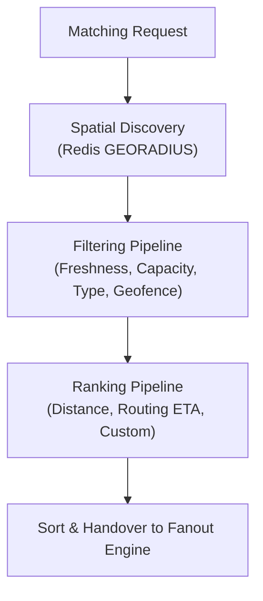
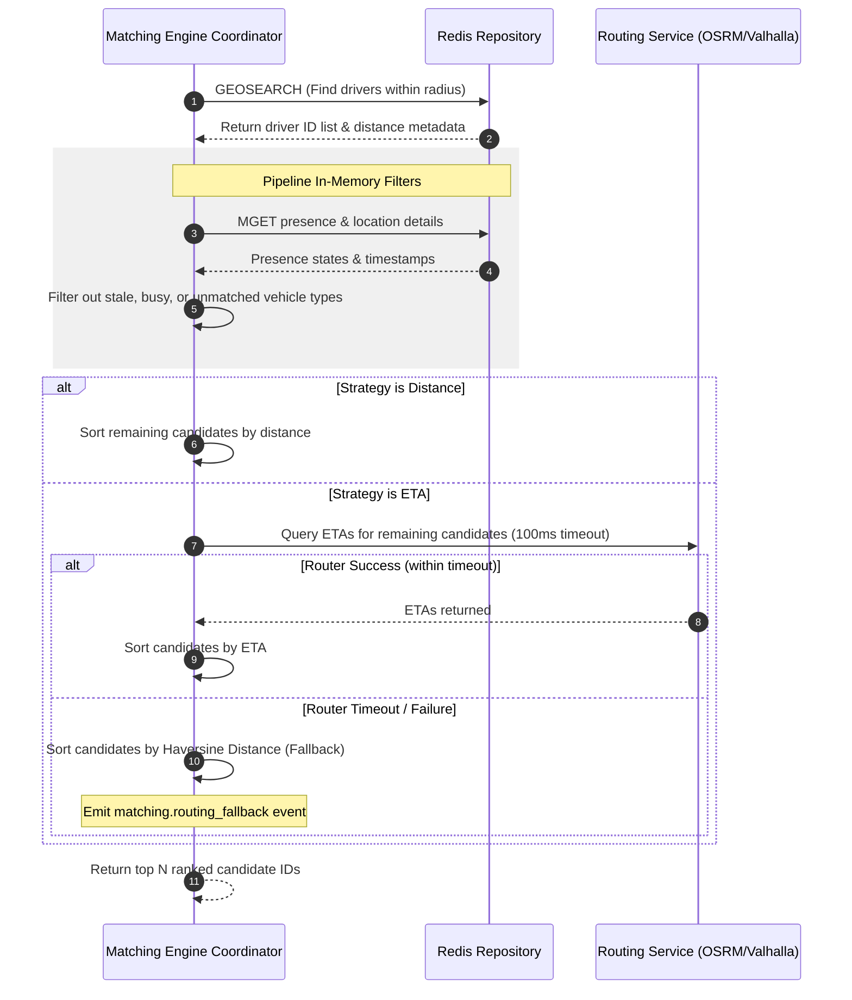

# 44 - Matching Engine Internal Design

This document details the internal design and pipeline execution of the Motus Matching Engine, including performance latency targets and fallback models.

---

## Capabilities & Goals

The Matching Engine identifies, filters, and prioritizes nearby drivers eligible to fulfill a given session dispatch request. It is structured as an ordered execution pipeline:

---

## Execution Flow

### 1. Candidate Discovery
*   **Action:** Locates active drivers within spatial proximity of the pickup coordinate.
*   **Implementation:** Executes a geospatial query against the tenant's driver location index:
    `GEORADIUSBYMEMBER` or `GEOSEARCH` on key `motus:tenant:{tenantId}:drivers:locations`.
*   **Parameters:** Center coordinates, search radius (e.g., 5000m), and search limit (capped at 100 closest drivers to reduce downstream computational load).

### 2. Filtering Pipeline
Calculated in `@motus/core` using a sequential filter array:
*   **Location Freshness Filter:** Fetches the location details of each candidate. Discards driver if `currentTime - location.updatedAt > 120s`.
*   **Capacity Filter:** Fetches the driver's presence hash. Discards if `status != 'ONLINE'` or `currentLoad >= capacity`.
*   **Vehicle Type Filter:** Compares session requirement attributes (e.g., `hasRefrigeration`, `vehicleSize`) with driver profile metadata.
*   **Geofence Zone Filter:** Asserts that both the driver location and the pickup coordinate are within the bounds of active operational polygons using a ray-casting intersection check.

### 3. Ranking Pipeline
Once a filtered pool of candidates is obtained, they are sorted using one of three strategies:
*   **Distance Strategy (Haversine):** Sorts drivers by spherical straight-line distance.
*   **ETA Strategy (Routing Engine):**
    *   Queries `IEtaProvider` with coordinate pairs for candidates (driver coordinates as sources, pickup coordinate as destination).
    *   **Fallback Path:** If the routing API times out or fails, the engine falls back to the **Distance Strategy** automatically, logs the incident, and raises a telemetry warning.
*   **Custom Strategy:** Applies scoring functions based on shift durations, driver ratings, and past acceptance ratios.

---

## Performance & Latency Targets

To ensure responsive real-time dispatches, the matching execution enforces strict latency budgets:

| Stage | Target Latency | P99 Budget | Description |
| :--- | :--- | :--- | :--- |
| **Candidate Discovery** | < 20ms | < 50ms | Spatial index querying from Redis cluster. |
| **Filtering Pipeline** | < 30ms | < 80ms | In-memory filtering of 50-100 candidates. |
| **Ranking Pipeline** | < 100ms | < 150ms | ETA calculation (including external routing requests). |
| **Matching Completion** | < 150ms | < 250ms | End-to-end matching query execution. |
| **Fanout Initiation** | < 20ms | < 50ms | Reservation lock acquisition and WebSocket emit. |

To protect the P99 budget, external ETA API requests are capped with a strict **100ms timeout threshold**. If a response is not received within this limit, the fallback strategy triggers instantly.

---

## Sequence Diagram (Matching Pipeline Execution)

---

## Failure Scenarios

*   **Zero Candidates Discovered:** If the spatial search yields no results, the engine fires a `matching.no_candidates` event. The Session Manager catches this and schedules a retry wave with an expanded radius (e.g. 5km -> 8km) after a cooldown period.
*   **Routing API Latency Spike:** Handled by wrapping the OSRM/Valhalla client call in a Promise wrapper with a timeout trigger.

---

## Tradeoffs

*   **Strict ETA vs. Haversine Sorting:** Querying a real-time routing engine (OSRM/Google Maps) provides exact travel times, but requires network calls and adds latency. Haversine distance calculations are fast (<1ms) but don't account for roads or traffic. Enforcing the short API timeout ensures reliability at the expense of absolute accuracy during route engine degradation.
