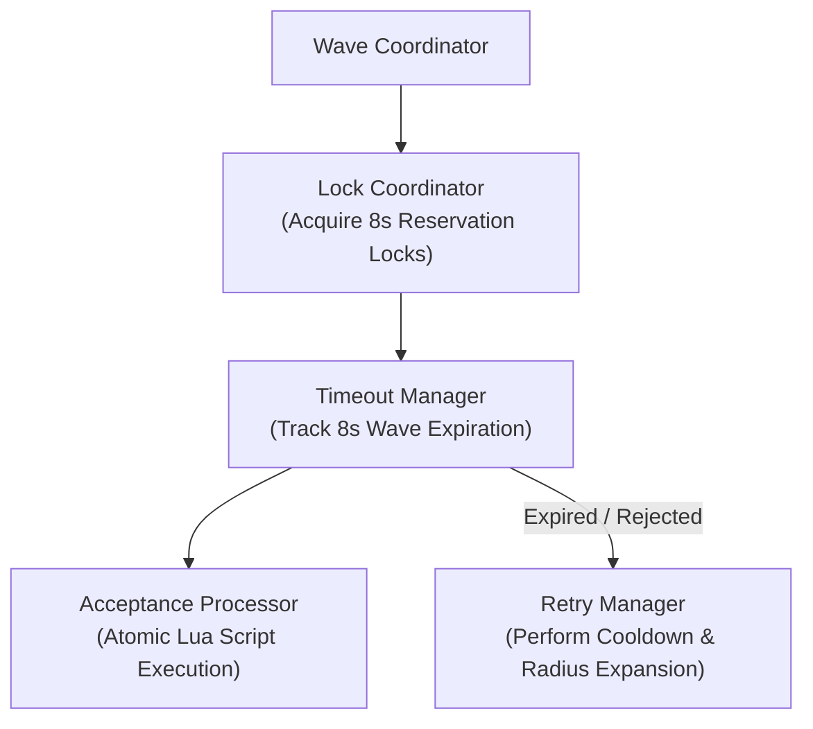
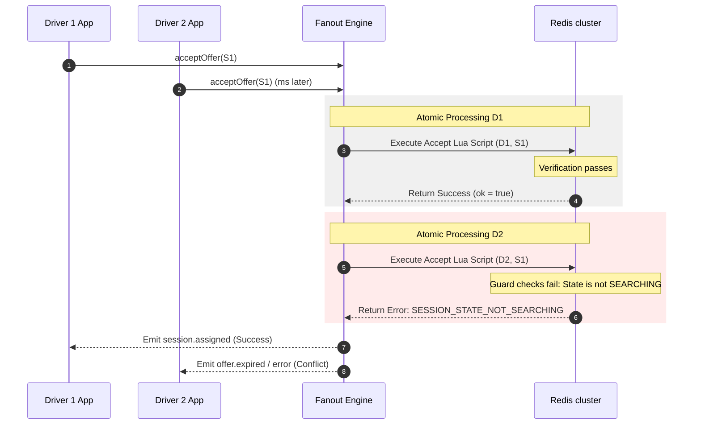

# 45 - Fanout Engine Internal Design

This document details the progressive wave dispatch orchestration, candidate reservation locks, timeout mechanisms, and atomic offer acceptance processing within the `@motus/core` Fanout Engine.

---

## Architecture & Responsibilities

The Fanout Engine handles the progressive distribution of dispatch offers to candidate drivers in sequential, time-limited waves.

*   **Wave Coordinator:** Groups candidates into sequential tiers (e.g. Wave 1, Wave 2) based on tenant configuration settings.
*   **Lock Coordinator:** Reserves candidates atomically in Redis prior to emitting offer events, preventing overlapping assignments.
*   **Timeout Manager:** Tracks wave expiration timelines asynchronously using non-blocking queues or event schedulers.
*   **Acceptance Processor:** Processes incoming client confirmation requests. Executes transactional transitions via Lua scripts.
*   **Retry Manager:** Coordinates backoff delays and initiates matching retries with expanded search radii if waves remain unfulfilled.

---

## Detailed Mechanics

### 1. Progressive Dispatch Waves
*   **Segment Formation:** The coordinator splits the sorted list of candidates from the Matching Pipeline into groups. For example, with `maxCandidatesPerWave = 3`:
    *   **Wave 1:** Candidates 1, 2, 3
    *   **Wave 2:** Candidates 4, 5, 6
*   **Lifecycle of a Wave:**
    1.  Acquire reservation locks for all candidates in the active wave.
    2.  If successful, emit `dispatch.offer` to the selected driver rooms.
    3.  Register a timeout task for 8 seconds.
    4.  If a driver accepts, cancel the timeout, release other locks, and assign.
    5.  If the timeout expires or all candidates reject, release the locks and start the next wave.

### 2. Lock Coordinator
Before an offer is broadcast, the system acquires an exclusive reservation lock for each candidate driver in Redis.
*   **Key:** `motus:tenant:{tenantId}:lock:driver:{driverId}`
*   **Value:** `{sessionId}`
*   **TTL:** 8 seconds (coinciding with the wave duration window).
*   **Action:** Prevents concurrent matching runs from discovering or dispatching to this driver while their active offer is pending.

### 3. Acceptance Processor (Race Condition Handling)
Acceptances are processed via an atomic Lua script executed against Redis. This guarantees consistency and solves race conditions where two drivers try to accept the same offer, or a driver accepts an offer that has already expired.

### 4. Radius Expansion & Retries
If all wave tiers are exhausted (i.e. all candidates timed out or rejected the offer), the `RetryWorker` initiates an escalation:
*   **Backoff Delay:** The engine enters a cooling period (e.g. 10 seconds) to prevent looping queries when supply is dry.
*   **Radius Increment:** Calculates an expanded search radius based on the retry configuration (e.g., initial 5km + 2km per retry).
*   **Matching Trigger:** Runs the matching pipeline again using the new parameters.
*   **Exhaustion Limit:** If the max waves limit (e.g., 5 retry waves or max radius of 15km) is reached, matching terminates, the session transitions to `SEARCHING` timeout, and emits a `session.failed_no_driver` event.

---

## Failure Scenarios

*   **Explicit Candidate Rejection:** If a driver declines an offer, the lock key `motus:tenant:{tenantId}:lock:driver:{driverId}` is deleted immediately. This returns the driver to the online pool, and the engine evaluates if all other wave candidates have responded. If so, it advances to the next wave immediately without waiting for the 8-second timeout.
*   **Redis Node Downtime during Lock Acquisition:** If the lock coordinator fails to write to Redis, the fanout attempt fails. The session remains in `SEARCHING`, and the background scheduler retries the wave.

---

## Tradeoffs

*   **Locking vs. Parallel Invites (Uber-style vs. Taxi-style):**
    *   *Lock-based (Motus design):* Only one session can offer to a driver at any time. This avoids driver confusion (receiving multiple offers but having them disappear) and guarantees assignment consistency, but limits dispatch throughput.
    *   *Parallel invites:* Exposing a single session to 10 drivers simultaneously creates a race to click "Accept" first. This increases acceptance speeds but degrades driver experience. The lock-based approach is chosen to prioritize courier satisfaction and transaction reliability.
