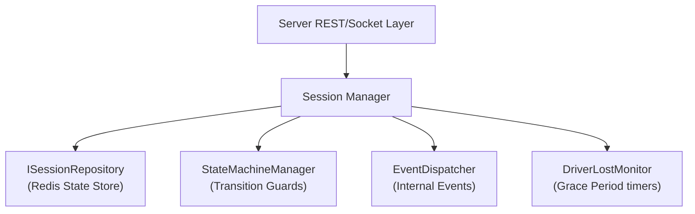
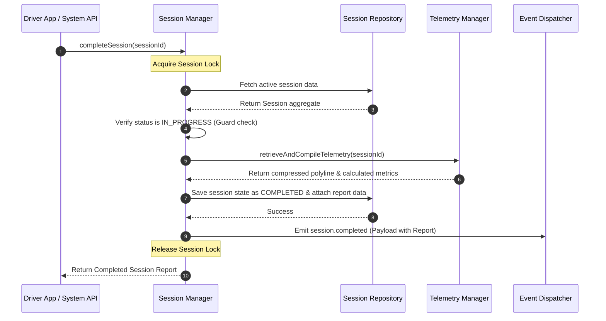

# 46 - Session Manager Internal Design

This document describes the design and coordination mechanics of the Session Manager within `@motus/core`.

---

## Responsibilities

The Session Manager orchestrates the lifecycle of dispatch sessions. It handles:
1. **Creation & Initialization:** Validates requests, builds session aggregates, and persists them.
2. **State Transition Controls:** Inspects and validates status changes against state machines.
3. **Driver Assignment & Reassignment:** Coordinates driver binding, lock releases, and re-routing.
4. **Fulfillment Events:** Collects pickup, arrival, and completion signals.
5. **Driver Lost Recovery Orchestration:** Triggers recovery delay workers when connections drop.

---

## Component Collaboration Model

---

## Execution Flow Details

### 1. Session Creation & Setup
*   **Trigger:** REST API `POST /tenants/:id/sessions`.
*   **Action:**
    1.  Validates pickup/destination coordinates.
    2.  Creates the `Session` aggregate with state `CREATED`.
    3.  Persists the session record to Redis (`ISessionRepository.save`).
    4.  Calls `startMatching()`, which transitions state to `SEARCHING`, triggers domain event `session.searching`, and forwards the session to the **Matching Engine**.

### 2. State Mutation Process
Every state update follows a transactional sequence:
1.  **Read-Modify-Write Lock:** Acquire a distributed session lock (e.g. `motus:tenant:{tenantId}:lock:session:{sessionId}`) to serialize operations.
2.  **State Load:** Fetch the current state from `ISessionRepository`.
3.  **Transition Check:** Query `StateMachineManager` to check if `currentState -> targetState` is valid. If invalid, throw `InvalidStateTransitionException` and release the lock.
4.  **Save State:** Persist the mutated state.
5.  **Event Broadcast:** Emit the corresponding event (e.g., `session.state.changed`) to the internal event bus.
6.  **Release Lock:** Release the session lock.

### 3. Driver Lost Handling & Recovery
*   **Drop Detection:** The gateway detects a socket disconnect and calls `sessionManager.handleDriverDisconnect(driverId)`.
*   **State Shift:** The Session Manager finds active sessions bound to this driver, stashes their current state, and transitions them to `DRIVER_LOST`.
*   **Timer Trigger:** The manager schedules a `DriverLostMonitor` delayed task (180 seconds).
*   **Resolution:**
    *   *Reconnection:* If the driver reconnects within 180 seconds, the manager restores the stashed state and cancels the countdown.
    *   *Timeout:* If the countdown expires, the manager triggers `reassignSession()`, releasing the driver profile and shifting the session state back to `SEARCHING` to find another candidate.

### 4. Cancellation Flow
*   **Trigger:** REST API request `POST /sessions/:id/cancel` or driver abandonment.
*   **Action:**
    1.  Acquires session lock.
    2.  Transitions state to `CANCELLED`.
    3.  If a driver is assigned, decrements their current load and updates their presence to `ONLINE` (if they were busy).
    4.  Releases any active candidate wave locks.
    5.  Publishes `session.cancelled` event.
    6.  Notifies the **Tracking Manager** to terminate active WebSocket rooms.

---

## Sequence Diagram (Session Complete Flow)

---

## Failure Scenarios

*   **Concurrent Assignment Accept and Session Cancellation:** If a client cancels a session at the exact moment a candidate accepts, the distributed lock serializes the operations. The first one to acquire the lock completes (e.g. session becomes `CANCELLED`), and the subsequent request receives a validation mismatch error (e.g. `SESSION_STATE_NOT_SEARCHING`) and aborts gracefully.
*   **Repository Write Failure:** Wrap all update processes in try-catch-finally blocks to guarantee the session lock is released even if database connectivity drops mid-operation.

---

## Tradeoffs

*   **Locking Overhead:** Acquiring session locks for every state transition adds database round-trips. However, this is necessary to ensure state integrity during concurrent socket and REST updates.
