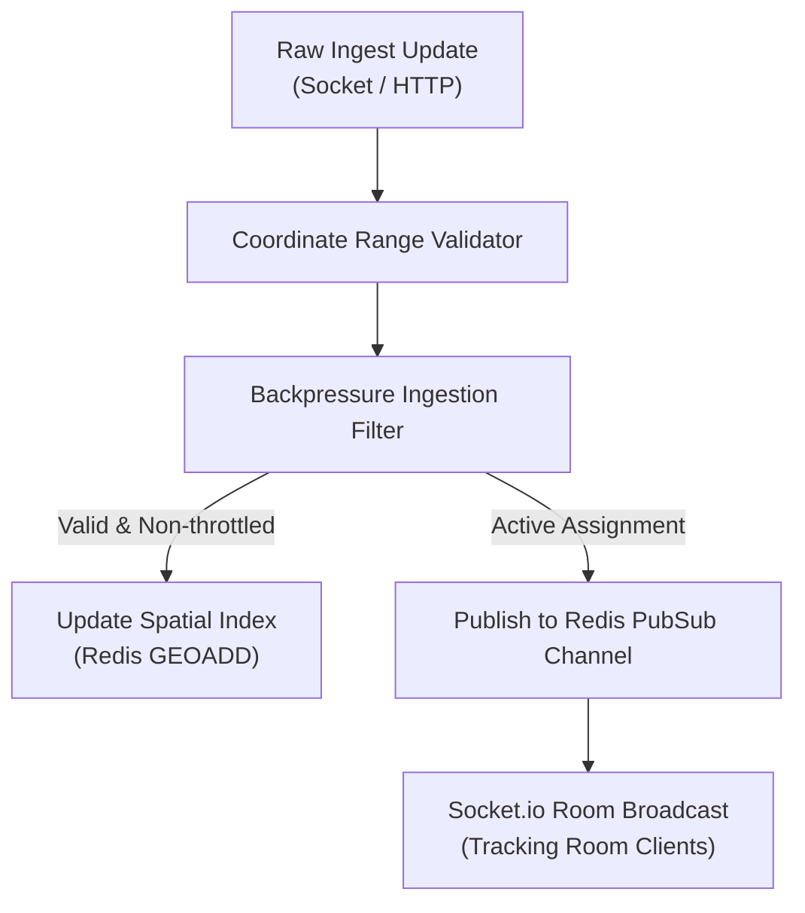
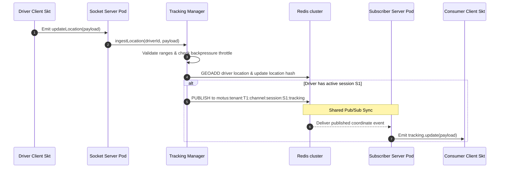

# 47 - Tracking Manager Internal Design

This document details the internal design and pipeline execution of the Motus Tracking Manager, which coordinates real-time location ingestion, spatial index updates, and live pub/sub broadcasting.

---

## Capabilities & Responsibilities

The Tracking Manager coordinates active spatial routing streams:
1. **Location Ingestion:** Parses and validates raw GPS coordinates received from driver sockets or API gateways.
2. **Spatial Indexing:** Updates driver positions in the geohash Sorted Set.
3. **Live Broadcasting:** Publishes coordinates to active Redis Pub/Sub channels.
4. **Subscription Management:** Tracks which connection sockets are registered to receive location updates.
5. **Backpressure Handling:** Throttles incoming updates to protect network and CPU resources.

---

## Architectural Workflow

---

## Technical Specifications

### 1. Ingestion Validation
Incoming coordinates must conform to strict boundaries:
*   `latitude`: range $[-90, 90]$
*   `longitude`: range $[-180, 180]$
*   `bearing`: range $[0, 360]$
*   `speed`: non-negative meters per second.
*   `timestamp`: must not be in the future (>500ms beyond server clock) or older than the last stored location update (rejects stale, late-arriving UDP packets).

### 2. Spatial Index updates
Every valid location ping updates the active index:
*   **Command:** `GEOADD` on key `motus:tenant:{tenantId}:drivers:locations` with the driver's latitude, longitude, and `driverId` member name.
*   **Driver Details:** The manager also writes coordinates to the driver location details hash `motus:tenant:{tenantId}:driver:{driverId}:location` using `HSET` with a TTL of 300 seconds.

### 3. Location Broadcasting & Pub/Sub
If the driver is bound to an active session, coordinates are broadcast:
*   **Channel Naming:** `motus:tenant:{tenantId}:channel:session:{sessionId}:tracking`
*   **Redis Operation:** `PUBLISH` the serialized location payload to the session channel.
*   **Socket Room Integration:** Gateway pods subscribe to the Redis channel. When a coordinate arrives, they emit it to all sockets in the Socket.io room `tenant:{tenantId}:session:{sessionId}`.

### 4. Backpressure Handling
To prevent system saturation under high driver densities:
*   **Time Throttling:** If the driver has sent an update within the last 1.0 second, subsequent pings are parsed but skipped for broadcasting, unless the location represents a critical state change (e.g. crossing a geofence).
*   **Speed-Based Backpressure:** If `speed == 0` (driver is stationary), the ingestion worker throttles updates to a 5-second interval, reducing network overhead.

### 5. Subscription Cleanup
When a session moves to `COMPLETED` or `CANCELLED`:
1.  Emit a final `session.terminated` message to the tracking room.
2.  Call `disconnectSockets(true)` to disconnect client sockets and clear memory.
3.  The gateway node unsubscribes from the Redis Pub/Sub tracking channel.

---

## Sequence Diagram (Location Ingest & Broadcast)

---

## Failure Scenarios

*   **Out-of-Order Packets:** Mobile networks can deliver older coordinates after newer ones. The validator discards incoming pings if the packet timestamp is less than the `updatedAt` field of the cached location details hash.
*   **Redis Pub/Sub Socket Drops:** If a gateway node loses connection to Redis, the subscription is lost. The readiness probe will catch this, and client sockets will reconnect to an online node.

---

## Tradeoffs

*   **Pub/Sub vs. Streams for Live Tracking:** Pub/Sub is transient (fire-and-forget), whereas Streams are persistent. We use Pub/Sub for live location updates because it has sub-millisecond latencies and low memory overhead. If a client disconnects, they query the REST endpoint `/sessions/:id` to catch up, then rejoin the Pub/Sub channel. This keeps Redis memory clean.
