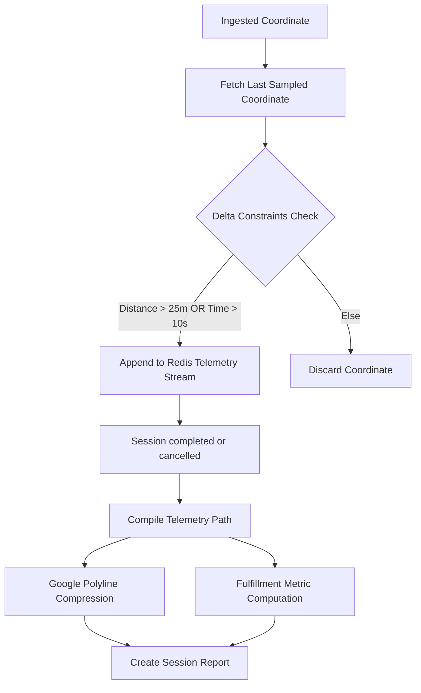
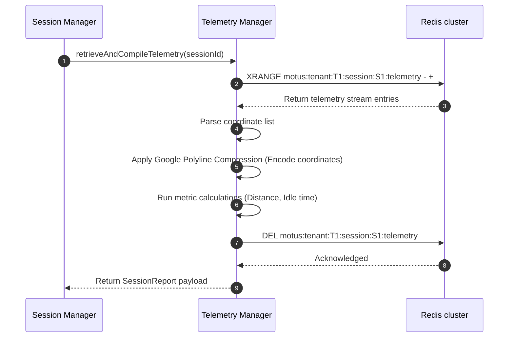

# 48 - Telemetry Manager Internal Design

This document details the internal design, sampling math, path collection, metrics computation, and compression algorithms of the Telemetry Manager in `@motus/core`.

---

## Capabilities & Responsibilities

The Telemetry Manager manages the historical trajectory path records of sessions:
1. **Adaptive Sampling:** Filters coordinate updates (25m / 10s delta rule) to reduce storage footprint.
2. **Buffer Collection:** Appends validated coordinates to a persistent session telemetry stream.
3. **Google Polyline Compression:** Compresses raw paths into compact strings.
4. **Fulfillment Metric Aggregation:** Calculates total distance, duration, idle times, and average speeds.
5. **Reconnection Recovery:** Processes locally buffered updates chronologically upon driver reconnect.

---

## Architectural Data Flow

---

## Technical Specifications

### 1. Sampling Algorithm
To prevent memory leaks and reduce RAM consumption by up to 90%, the `TelemetrySampler` filters incoming coordinates.
Let $P_n$ be the incoming coordinate and $P_{\text{last}}$ be the last successfully sampled coordinate.
*   **Distance Guard (Haversine Formula):**
    $$d = \text{Haversine}(P_n, P_{\text{last}})$$
    If $d > 25 \text{ meters}$, the point is accepted.
*   **Time Guard:**
    $$\Delta t = t_n - t_{\text{last}}$$
    If $\Delta t > 10 \text{ seconds}$, the point is accepted.
*   If both guards fail, the coordinate is discarded.

### 2. Path Storage
*   **Key:** `motus:tenant:{tenantId}:session:{sessionId}:telemetry`
*   **Structure:** `Redis Stream` (XADD)
*   **Fields:** `time`, `lat`, `lng`, `speed`, `bearing`, `accuracy`.
*   **TTL Policy:** 24 hours. The stream is pruned and deleted once a session ends and the final report is compiled.

### 3. Google Polyline Encoding
Converts a sequence of coordinate pairs into a single ASCII string using the Google Polyline Algorithm. This reduces payload size by ~80% before event dispatching and external reporting.
*   *Implementation:*
    *   Compute differences between successive coordinates.
    *   Multiply each decimal value by $1 \times 10^5$ and round to the nearest integer.
    *   Convert to binary, apply bitwise shifts, and map to printable ASCII characters.

### 4. Metrics Aggregation
The `MetricAggregator` calculates session metrics:
*   **Total Distance ($D_{\text{total}}$):**
    $$D_{\text{total}} = \sum_{i=1}^{m-1} \text{Haversine}(P_i, P_{i+1})$$
*   **Total Duration ($T_{\text{total}}$):**
    $$T_{\text{total}} = T_{\text{end}} - T_{\text{start}}$$
*   **Idle Duration:** Sum of intervals where the vehicle speed was below a configured threshold:
    $$T_{\text{idle}} = \sum \Delta t_j \quad \text{where } \text{speed}_j < 1.0 \text{ m/s}$$
*   **Average Speed:**
    $$\text{Avg Speed} = \frac{D_{\text{total}}}{T_{\text{total}}}$$

---

## Sequence Diagram (Telemetry Aggregation)

---

## Failure Scenarios

*   **Buffering on Reconnect:** During a cell network outage, the driver's device buffers coordinates locally. Upon reconnect, the client emits the entire array. The `TelemetrySampler` processes this array sequentially in timestamp order, applying the 25m/10s filters to ensure path accuracy without duplicates.
*   **Missing Telemetry Data:** If a session ends with zero telemetry points (e.g. driver lost instantly), the report is generated with empty coordinates and zeroed metrics to prevent compilation failures.

---

## Tradeoffs

*   **Lossy vs. Lossless Paths:** The 25m / 10s threshold skips small driver movements (like parking adjustments). This is an intentional tradeoff to prevent high memory usage in Redis when processing thousands of concurrent dispatches.
