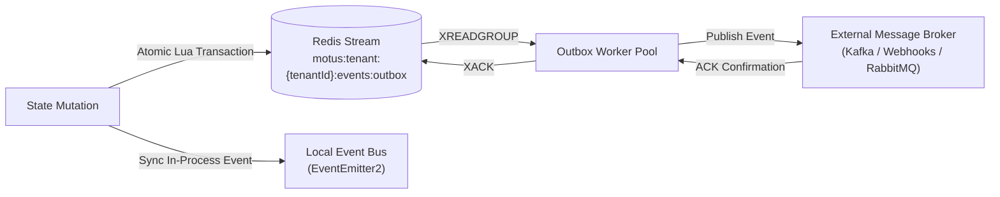

# 49 - Event System Design & Analysis

This document describes the design, execution, and persistence strategy of the Motus Event System, including an architectural evaluation of the primary event transport options.

---

## Architectural Evaluation: Event Backbone Strategies

We evaluated two options for event persistence and outbox handling:

### Option A: Traditional Relational Transactional Outbox
*   *Mechanism:* Events are written to an `outbox` table in the database in the same transaction as state updates, then polled by a worker.
*   *Pros:* Strict atomic consistency (relational ACID transaction ensures the outbox write succeeds if and only if the state update succeeds).
*   *Cons:* High write amplification, polling overhead on relational tables, and low performance under sub-second event ingestion loads.

### Option B: Redis Streams-based Outbox (Selected Design)
*   *Mechanism:* State updates are saved in Redis hashes, and events are appended to a Redis Stream (`motus:events:outbox`) inside a single pipeline or Lua script execution. A background worker group consumes this stream using `XREADGROUP` and publishes events to external message brokers.
*   *Pros:* Low latency, high throughput (supports 100k+ writes/sec), built-in consumer groups, and support for message acknowledgments (`XACK`).
*   *Cons:* Redis does not support multi-shard transactions across different hash slots unless keys are co-located using hash tags.

### Decision & Justification
**Option B (Redis Streams-based Outbox)** is selected. To guarantee atomicity, all keys for a tenant's session are forced onto the same Redis cluster slot using hashtag naming conventions:
`motus:tenant:{tenantId}:[key]`.
This allows atomic updates using multi-key Lua scripts that update the session status hash and append to the event stream in a single transaction, avoiding database polling overhead.

---

## System Architecture



---

## Technical Specifications

### 1. Internal Event Bus
*   **Mechanism:** Uses `EventEmitter2` for fast, in-process routing.
*   **Usage:** Coordinates reactions within the process space (e.g. telling the WebSocket server to join a client to a room when a session transitions to assigned).
*   **Performance:** Sub-millisecond execution. Handlers are non-blocking to prevent event loop delay.

### 2. Domain Events (CloudEvents Compliance)
All external events are serialized using the CloudEvents format:
```json
{
  "specversion": "1.0",
  "id": "evt_72a19b88-cfb2-4ea5-8b38-e6b8c9d2f664",
  "source": "/motus/engine/node-4",
  "type": "motus.session.state_changed.v1",
  "datacontenttype": "application/json",
  "time": "2026-06-11T12:00:00.000Z",
  "tenantid": "tenant_12345",
  "data": {
    "sessionId": "session_f839c092",
    "oldState": "SEARCHING",
    "newState": "DRIVER_ASSIGNED",
    "driverId": "driver_d98341"
  }
}
```

### 3. Event Recovery & Group Consumption
*   **Consumer Groups:** Outbox workers are registered in a Redis Stream consumer group (`outbox-dispatcher-group`).
*   **Acknowledgment:** Workers fetch events using `XREADGROUP`. Once the external broker (Kafka/RabbitMQ) confirms receipt, the worker calls `XACK` to remove the message from the pending list (PEL).
*   **Recovery Worker:** A background process scans the stream's pending list using `XPENDING` for messages that have been unacknowledged for more than 30 seconds, and re-assigns them to active workers to guarantee at-least-once delivery.

### 4. Event Versioning Policy
*   **Major Revisions:** Encoded in the event type name (e.g., `motus.session.state_changed.v1` -> `motus.session.state_changed.v2`). Different versions run side-by-side during rolling upgrades.
*   **Minor Revisions:** Permitted as long as they are backward-compatible. This includes adding new optional fields to the `data` object. Field removals or changes to field data types are strictly treated as breaking and require a major version change.

---

## Failure Scenarios

*   **External Broker Outage:** If Kafka or the Webhook endpoint experiences downtime, the outbox worker retries delivery with exponential backoff. The events remain safely stored in the Redis Stream outbox, guaranteeing at-least-once delivery once the broker recovers.
*   **Duplicate Deliveries:** Due to the at-least-once delivery guarantee, network issues can cause duplicate emissions. Consuming systems must process events idempotently by tracking the unique CloudEvent `id`.
