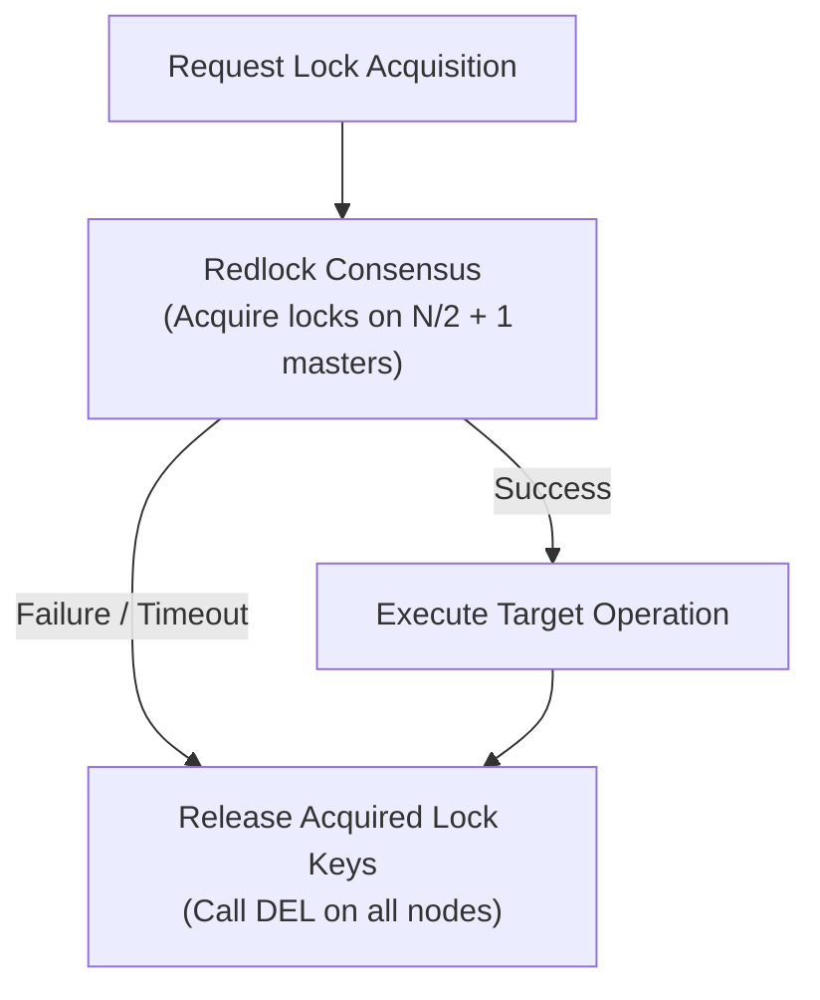

# 51 - Locking Strategy

This document details the distributed locking patterns, key schemas, lease durations, deadlock prevention rules, and Redlock consensus mechanics within the Motus cluster.

---

## Lock Catalog & Schemas

| Lock Type | Redis Key Pattern | Lease Duration (TTL) | Retry Strategy | Purpose |
| :--- | :--- | :--- | :--- | :--- |
| **Driver Wave Reservation Lock** | `motus:tenant:{tenantId}:lock:driver:{driverId}` | 8,000 ms | No retry (fail fast) | Exclusively reserves a driver candidate for an active wave offer. |
| **Session Mutation Lock** | `motus:tenant:{tenantId}:lock:session:{sessionId}` | 5,000 ms | Retry: 3 attempts, 100ms backoff | Serializes session state changes (e.g. cancellation vs acceptance). |
| **Driver Lost Reassignment Lock** | `motus:tenant:{tenantId}:lock:lost:{sessionId}` | 10,000 ms | Retry: 5 attempts, 200ms backoff | Prevents concurrent driver-lost monitors from trigger reassignment twice. |

---

## Lock Execution Models

### 1. Driver Wave Reservation Lock
*   **Acquisition:** Acquired prior to broadcasting an offer wave to driver sockets.
*   **Mechanism:** Written via `SET key value NX PX 8000`. The value is set to the matching `sessionId`.
*   **Expiration Behavior:** If a driver does not respond within 8 seconds, the lock expires automatically. If the driver attempts to accept after expiration, the Lua acceptance script checks if the lock value matches, detects the expiration, and rejects the write.

### 2. Session Mutation Lock
*   **Acquisition:** Acquired by the Session Manager when initiating state transitions.
*   **Mechanism:** Standard Redlock algorithm.
*   **Deadlock Prevention:** Enforces a strict lease timeout of 5 seconds. This guarantees that if a server node crashes mid-transaction, the session lock is automatically freed.

### 3. Driver Lost Reassignment Lock
*   **Acquisition:** Acquired by the `DriverLostMonitor` when the 180-second recovery window expires.
*   **Purpose:** Ensures that only one node processes the session reassignment flow, releasing the driver profile and reverting the session state.

---

## Redlock Cluster Consensus Mechanics

To guarantee safety across a multi-node Redis Cluster:
1.  **Node Acquisition:** The locking client attempts to acquire the lock key on all $N$ independent master nodes sequentially.
2.  **Quorum Validation:** A lock is considered acquired if the client writes to a majority of nodes ($N/2 + 1$) in less time than the lease duration.
3.  **Clock Drift Margin:** The effective lock validity time is calculated by subtracting the time elapsed during acquisition and a clock drift margin:
    $$\text{Validity Time} = \text{TTL} - \text{Acquisition Time} - \text{Clock Drift Margin}$$
4.  **Rollback on Failure:** If the quorum is not met, the client executes a `DEL` across all master nodes to clean up partial states.

---

## Deadlock Prevention Rules

1.  **Strict Lock Ordering:** Under no circumstances should a thread attempt to acquire a driver lock while holding a session lock, or vice versa. The sequence must always be:
    *   *Dispatch Ingest:* Acquire Session Lock $\rightarrow$ Release Session Lock $\rightarrow$ Run Matching $\rightarrow$ Acquire Candidate Driver Lock $\rightarrow$ Execute Lua script.
2.  **Bounded Retries:** All locks (except driver reservation locks) utilize bounded retry limits (max 3-5 times) with randomized backoff (jitter) to prevent lock starvation.
3.  **Automatic Lease Expirations:** All locks must be set with a TTL. Infinite lock durations are prohibited.

---

## Failure Scenarios

*   **Server Node Crash with Lock Held:** If a server node crashes while holding a `session` lock, the lock remains active until its 5-second TTL expires. Subsequent updates block until the TTL clears.
*   **Split-Brain / Clock Drift Race:** In the event of extreme clock drift where one master expires a key early, Redlock's $N/2 + 1$ quorum check prevents double-bookings.
