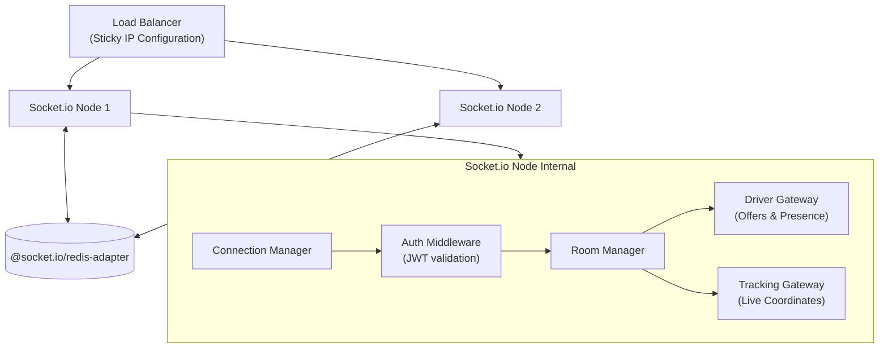
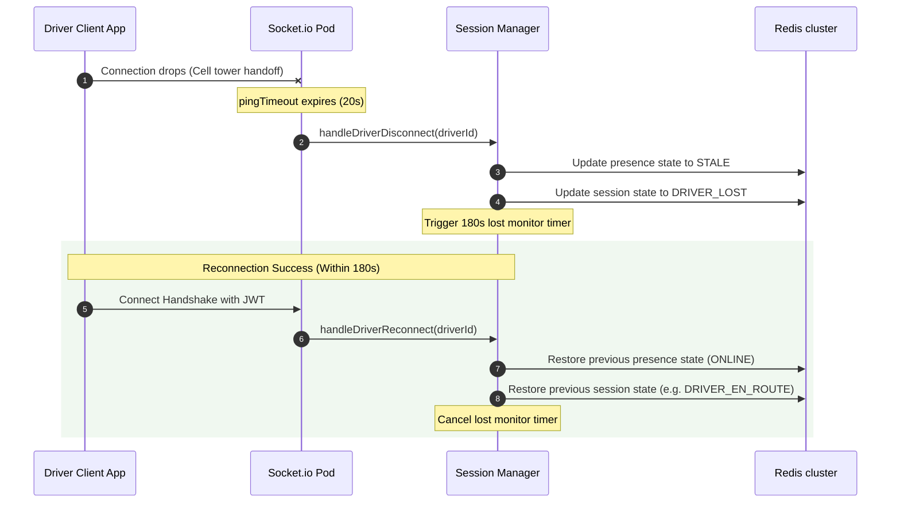

# 52 - Socket.IO Internal Design

This document details the internal design of the `@motus/socketio` package, including client management, horizontal scaling adapters, disconnect recovery, and the transport abstraction layer.

---

## Real-Time Transport Abstraction Layer

To ensure Motus remains transport-agnostic, the socket gateway is decoupled from core business logic using the `ITransportGateway` interface:

```typescript
export interface ITransportGateway {
  emitToDriver(tenantId: string, driverId: string, eventName: string, payload: any): Promise<boolean>;
  emitToSessionRoom(tenantId: string, sessionId: string, eventName: string, payload: any): Promise<void>;
  disconnectDriver(tenantId: string, driverId: string): Promise<void>;
  broadcastTrackingUpdate(tenantId: string, sessionId: string, coordinate: any): Promise<void>;
}
```

While Socket.IO is the initial implementation of this interface, this design enables future transports (e.g. native WebSockets, Server-Sent Events (SSE), or MQTT) to be added without modifying `@motus/core`.

---

## Gateway Architecture



---

## Technical Specifications

### 1. Connection Manager
*   **Responsibility:** Manages active socket sessions.
*   **Authentication Middleware:** Undergoes a JWT verification handshake.
    *   Extracts `tenantId`, `role` (`DRIVER`, `CUSTOMER`, `ADMIN`), and `userId` (`driverId`).
    *   Attaches metadata to the socket context (`socket.data`).
    *   Rejects connection if signature, tenant registration, or expiry checks fail.

### 2. Room Manager
Groups sockets into isolated communication channels:
*   **Driver Private Room:** `tenant:{tenantId}:driver:{driverId}`
    *   *Usage:* Exclusive dispatch wave offers and cancellations.
*   **Session Tracking Room:** `tenant:{tenantId}:session:{sessionId}`
    *   *Usage:* Live coordinate broadcasts.

### 3. Horizontal Scaling (Redis Adapter Integration)
*   **Package:** `@socket.io/redis-adapter`
*   **Mechanism:** Coordinates room broadcasts across multiple pods.
*   *Workflow:* When a driver on Node A updates their location, Node A publishes the coordinate. If a customer tracking that session is connected to Node B, the Redis Adapter publishes the event to Redis, which routes it to Node B for broadcasting to the customer's socket.
*   **Load Balancing:** Sticky sessions are required at the ingress layer (e.g., NGINX, HAProxy) to handle HTTP polling upgrades.

### 4. Disconnect Recovery
*   **Heartbeat Monitor:** Configures `pingTimeout = 20s` and `pingInterval = 10s`.
*   **State Cleanups:** If a socket disconnects, the server schedules a cleanup:
    1.  If the client is a driver, they are transitioned to `STALE` in the presence cache if they do not reconnect within 120 seconds.
    2.  If the driver has an active session, the session transitions to `DRIVER_LOST`.
    3.  If they reconnect within the recovery window, the state is restored.

---

## Sequence Diagram (Disconnect & Recovery Flow)



---

## Failure Scenarios

*   **Redis Adapter Disconnection:** If the Redis cluster partition fails, the nodes cannot synchronize room events. A local fallback is implemented: nodes continue to broadcast events to locally connected clients, and the readiness probe returns an error to divert new ingress traffic.
