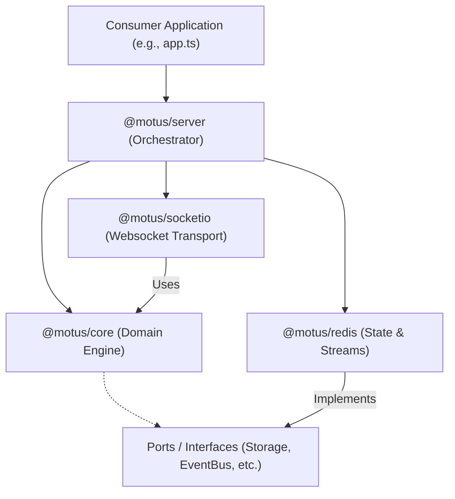
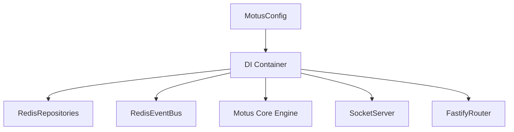
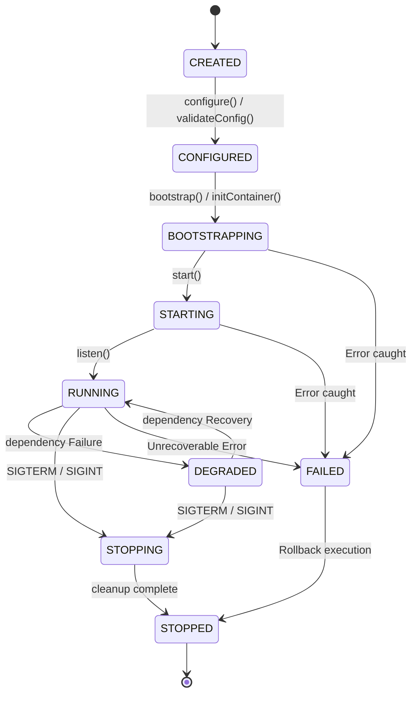
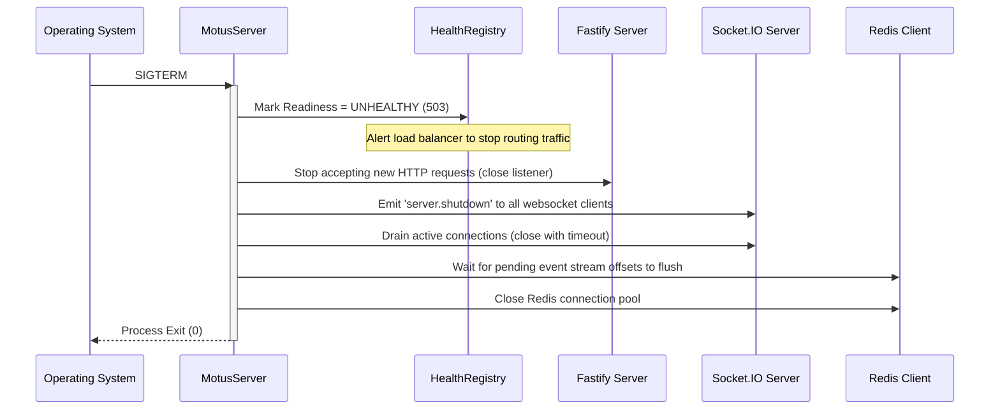
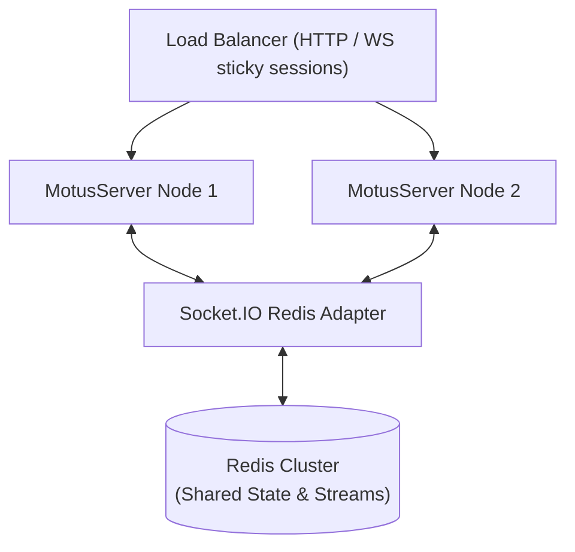

# 53 - Server Internal Design

This document details the internal architecture and implementation specification of the `@motus/server` package. It acts as the authoritative blueprint for building the main bootstrap, routing, and lifecycle orchestrator.

---

## 1. Package Mission & Boundaries

The `@motus/server` package serves as the outer orchestration layer of the Motus system. It binds the domain-rich, database-agnostic engine (`@motus/core`) with the physical persistence layer (`@motus/redis`) and the websocket communication layer (`@motus/socketio`).

### Context and Relationships


*   **Relationship with `@motus/core`**: The server instantiates the core namespaces (`TenantNamespace`, `DriverNamespace`, `SessionNamespace`, `QueryNamespace`, `EventNamespace`) and registers the concrete storage adapters into the core ports (`ITenantRepository`, `IDriverRepository`, `ISessionRepository`, `IEventBus`).
*   **Relationship with `@motus/redis`**: The server loads the Redis configuration, instantiates the `RedisClientManager`, and sets up the event subscription loop (Redis Streams and Pub/Sub).
*   **Relationship with `@motus/socketio`**: The server hosts the `SocketServer` and hooks the WebSocket gateway to receive updates from the core dispatch workers and route them to driver/client sockets.

### Domain Boundaries
*   **What belongs here**:
    *   HTTP Route definition and Fastify plugin integration.
    *   Configuration compilation, loading hierarchy, and validation.
    *   Dependency Injection wiring and bootstrap coordination.
    *   System signals mapping (`SIGTERM`, `SIGINT`) and graceful shutdown orchestration.
    *   Health checks aggregation (Startup, Liveness, and Readiness endpoints).
    *   OpenTelemetry and Prometheus metric server bindings.
*   **What MUST NOT belong here**:
    *   Database connection details or Lua script serialization (belongs to `@motus/redis`).
    *   WebSocket routing, packet serialization, or subscription management (belongs to `@motus/socketio`).
    *   Core logic like driver state machines, matching algorithm scoring, or wave dispatch rules (belongs to `@motus/core`).

---

## 2. Public API Design

The public API is designed to allow developers to spin up a Motus server with a simple builder pattern while retaining full extensibility. To maintain a transport-agnostic and infrastructure-agnostic architecture, the server depends exclusively on interface definitions exported from `@motus/types/extensions`.

### Pluggable Namespace Integration
All core extension contracts are packaged under a dedicated `@motus/types/extensions` namespace, separating core entities from hook adapters:
- `ITransportAdapter`
- `EventAdapter`
- `TelemetryProvider`
- `MatchingProvider`
- `GeofencingProvider`
- `EtaProvider`

### ITransportAdapter Interface Definition
This interface resides inside `@motus/types/extensions` to separate the server package from the concrete Socket.IO adapter layer:

```typescript
export interface ITransportAdapter {
  start(): Promise<void>;
  stop(): Promise<void>;
  broadcast(room: string, event: string, payload: any): void;
  broadcastToTenant(tenantId: string, event: string, payload: any): void;
  emitToDriver(driverId: string, event: string, payload: any): void;
  onClientEvent(event: string, handler: (socketId: string, payload: any) => Promise<void> | void): void;
  disconnectClient(socketId: string, closeUnderlying?: boolean): void;
}
```

### Primary Builder Contracts

```typescript
// packages/server/src/public/ServerOptions.ts
import { ServerConfig, RedisConfig, SocketConfig, TelemetryConfig, MatchingConfig, FanoutConfig } from '@motus/types';

export interface MotusServerOptions {
  server: ServerConfig;
  redis: RedisConfig;
  socket: SocketConfig;
  telemetry: TelemetryConfig;
  matching: MatchingConfig;
  fanout: FanoutConfig;
}

// packages/server/src/public/MotusServer.ts
import { DependencyContainer } from '../internal/container/DependencyContainer.js';

export class MotusServer {
  private readonly container: DependencyContainer;
  private isStarted: boolean = false;

  constructor(container: DependencyContainer) {
    this.container = container;
  }

  public async start(): Promise<void> {
    // Coordinate startup
  }

  public async stop(): Promise<void> {
    // Coordinate shutdown
  }

  public getContainer(): DependencyContainer {
    return this.container;
  }
}

// packages/server/src/public/MotusServerBuilder.ts
import { MotusModule } from './Module.js';
import { 
  MatchingProvider, 
  GeofencingProvider, 
  EtaProvider, 
  TelemetryProvider, 
  EventAdapter, 
  ITransportAdapter, 
  ITenantRepository, 
  IDriverRepository, 
  ISessionRepository 
} from '@motus/types';

export class MotusServerBuilder {
  private readonly modules: MotusModule[] = [];
  private optionsOverrides: Partial<MotusServerOptions> = {};
  private customMatchingProvider?: MatchingProvider;
  private customGeofenceProvider?: GeofencingProvider;
  private customEtaProvider?: EtaProvider;
  private customTelemetryProvider?: TelemetryProvider;
  private customTransport?: ITransportAdapter;
  private customEventAdapter?: EventAdapter;
  private customTenantRepo?: ITenantRepository;
  private customDriverRepo?: IDriverRepository;
  private customSessionRepo?: ISessionRepository;

  public setOptions(options: Partial<MotusServerOptions>): this {
    this.optionsOverrides = { ...this.optionsOverrides, ...options };
    return this;
  }

  public registerModule(module: MotusModule): this {
    this.modules.push(module);
    return this;
  }

  public registerTransport(adapter: ITransportAdapter): this {
    this.customTransport = adapter;
    return this;
  }

  public registerStorage(tenantRepo: ITenantRepository, driverRepo: IDriverRepository, sessionRepo: ISessionRepository): this {
    this.customTenantRepo = tenantRepo;
    this.customDriverRepo = driverRepo;
    this.customSessionRepo = sessionRepo;
    return this;
  }

  public registerEventAdapter(adapter: EventAdapter): this {
    this.customEventAdapter = adapter;
    return this;
  }

  public registerTelemetry(provider: TelemetryProvider): this {
    this.customTelemetryProvider = provider;
    return this;
  }

  public registerMatchingProvider(provider: MatchingProvider): this {
    this.customMatchingProvider = provider;
    return this;
  }

  public registerGeofencingProvider(provider: GeofencingProvider): this {
    this.customGeofenceProvider = provider;
    return this;
  }

  public registerEtaProvider(provider: EtaProvider): this {
    this.customEtaProvider = provider;
    return this;
  }

  public async build(): Promise<MotusServer> {
    // 1. Load configuration
    // 2. Instantiate DI Container
    // 3. Register Modules and custom providers
    // 4. Initialize Dependency Container
    // 5. Return MotusServer instance
  }
}
```

---

## 3. Dependency Injection Strategy

To construct the complex dependency graph clean and testable, `@motus/server` defines a local, type-safe container.



*   **Service Registration & Resolution**: Services are registered against injection tokens (Symbols or string descriptors) and resolved at startup.
*   **Dependency Ownership**: The container owns the instantiations of all services. Singleton policies are enforced by default.
*   **Module Loading Order**:
    1. Infrastructure Providers (Redis configuration, Connection Pools).
    2. Core Port Adaptations (Repositories, Lock Managers, Event Buses).
    3. Core Engine namespaces (Tenant, Session, Driver Managers).
    4. Integration Gateways (Websocket, HTTP Controller routing).
*   **Circular Dependency Prevention Policy**: Enforced by building a directed acyclic graph (DAG) during registration. If cycles are detected (e.g. A depends on B and B depends on A), a `CircularDependencyException` is thrown before starting services.

---

## 4. Configuration Architecture

The configuration merges multiple inputs, enforcing runtime constraints and default settings. Authentication parameters (such as secrets or keys) belong strictly to the consumer application's authentication registry and are completely absent from the core server configuration blocks.

### Configuration Ownership Matrix

| Configuration Block | Owner Module | Default Source | Override Source | Runtime Mutability | Precedence |
| :--- | :--- | :--- | :--- | :--- | :--- |
| `server` | `@motus/server` | `DEFAULT_SERVER_CONFIG` | Env (`MOTUS_PORT`, `MOTUS_HOST`, `MOTUS_LOG_LEVEL`) | Immutable (Requires Restart) | Env > Default |
| `redis` | `@motus/redis` | `DEFAULT_MOTUS_REDIS_CONFIG` | Env (`MOTUS_REDIS_NODES`) | Immutable (Requires Restart) | Env > Default |
| `socket` | `@motus/socketio` | `DEFAULT_SOCKET_CONFIG` | Config File (`motus.json`) | Immutable (Requires Restart) | File > Default |
| `telemetry` | `TelemetryModule` | `DEFAULT_TELEMETRY_CONFIG` | Redis Hash Override | Mutable (Polled dynamically) | Tenant Override > File > Default |
| `matching` | `CoreModule` | `DEFAULT_MATCHING_CONFIG` | Redis Hash Override | Mutable (Polled dynamically) | Tenant Override > File > Default |
| `fanout` | `CoreModule` | `DEFAULT_FANOUT_CONFIG` | Redis Hash Override | Mutable (Polled dynamically) | Tenant Override > File > Default |

*   **Precedence Rule**: Tenant-specific configuration overrides fetched from `IConfigurationProvider` override all default and static configurations.

### Configuration Hot-Reload Policy
For runtime-mutable parameters (such as telemetry sample intervals, matching search boundaries, and wave sizes):
1. **Caching Engine**: Tenant configuration configurations returned by `IConfigurationProvider` are cached in-memory inside the active server worker instances for a default duration of 60 seconds (Time-To-Live). This limits high-frequency lookup load on the persistence store.
2. **Invalidation Pub/Sub**: When an administrator updates a tenant override config, the database service publishes a `tenant.config.updated` notification via the Redis event bus.
3. **Immediate Eviction**: All server nodes subscribing to the channel invalidate their memory cache for the targeted `tenantId` instantly. The next transaction maps to fresh overrides from Redis.
4. **Active Session Mutation**: Ongoing tracking sessions adapt dynamically to new parameters (e.g. updating location sampling frequency or search radius values) during their subsequent coordinate check cycle.

---

## 5. Lifecycle State Machine

The server maintains a strict, stateful lifecycle state machine that handles safe setup, degrades on connection failures, and closes cleanly under load balancer triggers.

### States Definition
- `CREATED`: The server instance is initialized. Options are parsed.
- `CONFIGURED`: AJV validation of configuration has succeeded. The environment is resolved.
- `BOOTSTRAPPING`: DI container is registered. Modules are running their dependency check hooks.
- `STARTING`: Web server listeners (Fastify HTTP, Socket.IO port) are initialized.
- `RUNNING`: Web gateways are listening, routing requests, and health probes return OK.
- `DEGRADED`: A non-critical sub-component is offline (e.g., Telemetry reporting, OSRM Eta engine timeouts).
- `STOPPING`: The server caught SIGTERM/SIGINT. It has entered the graceful draining period.
- `STOPPED`: All listeners have successfully closed. Connections have been released.
- `FAILED`: Unrecoverable error encountered. Rollback actions run, then process exits.

### Transition Model


### Failure Transition Behavior
If any error is caught during transition, the engine switches to the `FAILED` state. It calls a rollback runner that clears ports, drops connection handles, and aborts pending outbox streams before closing the process with exit code `1`.

---

## 6. Shutdown Lifecycle

On receiving a termination signal (`SIGTERM`, `SIGINT`), the server triggers a graceful teardown flow to prevent message loss or client disruption.



*   **Graceful Draining**: The server waits up to a configurable shutdown timeout (e.g., `SHUTDOWN_TIMEOUT_MS = 10000`) for active HTTP connections to complete and socket connections to drop.
*   **Worker Termination**: Background processors are cancelled gracefully using standard cancellation tokens (`AbortSignal`).

---

## 7. Module System & Governance

To maintain decoupled, cohesive modules, the system uses a pluggable `MotusModule` contract.

### Pluggable Transport Abstraction
To ease swapping in alternative realtime transport adapters (e.g. raw WebSockets, Server-Sent Events, or MQTT) in future releases, a distinct `TransportModule` is introduced:

```typescript
export interface TransportModule extends MotusModule {
  readonly transportType: 'websocket' | 'sse' | 'mqtt' | 'grpc';
  getTransportAdapter(container: DependencyContainer): ITransportAdapter;
}
```

*   **`SocketIOModule`**: Implements `TransportModule` and registers Socket.IO-specific connections and gateways.
*   **`CoreModule`**: Contains business engine logic, managers, and ports. Must **never** depend on transport modules (`SocketIOModule`, Fastify server routes).
*   **`RedisModule`**: Data adapters. Only depends on `@motus/core` ports and `@motus/types`. No dependencies on HTTP or WebSocket transports are allowed.
*   **Module dependency graph is validated as a Directed Acyclic Graph (DAG) during bootstrap**: Before entering the `STARTING` phase, the container evaluates registration sequences. If cycles are detected or a required module is missing, the bootstrapper aborts the startup.

```typescript
// packages/server/src/public/Module.ts
import { DependencyContainer } from '../internal/container/DependencyContainer.js';
import { MotusServerBuilder } from './MotusServerBuilder.js';

export interface MotusModule {
  readonly name: string;
  readonly dependencies: readonly string[]; // Expresses required modules
  configure?(builder: MotusServerBuilder): void | Promise<void>;
  onBootstrap?(container: DependencyContainer): void | Promise<void>;
  onShutdown?(container: DependencyContainer): void | Promise<void>;
}
```

---

## 8. Infrastructure Registration

Infrastructure adapters plug into the container through standard port interfaces.

```typescript
export interface InfrastructureProvider {
  name: string;
  ping(): Promise<boolean>;
  close(): Promise<void>;
}
```

*   **Redis Integration**: Handled by `@motus/redis`. The server instantiates the `RedisClientManager` and validates connectivity during bootstrap.
*   **Socket.IO Integration**: Configures the WebSocket listener. The concrete implementation depends on `ITransportAdapter` and delegates scaling through `@socket.io/redis-adapter` structures.
*   **External Providers**: Custom geofencing providers, ETA calculators (such as OSRM or Google Maps), and candidate scoring matching providers are registered through the `MotusServerBuilder`.

---

## 9. Health & Readiness Framework

The server exposes dedicated health-check probes on HTTP, which can be scraped by container orchestrators (e.g., Kubernetes).

### Probe Classifications
1.  **Startup Probe (`GET /health/startup`)**: Verifies that configuration loading, dependency injection, and initial file caching have finished. Runs once at container boot.
2.  **Liveness Probe (`GET /health/liveness`)**: Runs frequently. Confirms that the event loop latency remains under 100ms and that application memory usage does not exceed limits.
3.  **Readiness Probe (`GET /health/readiness`)**: Runs continuously. Executes health-checks across Redis connection pools, WebSocket cluster adapters, and third-party geofence/ETA APIs.

### Health Aggregation and Degraded States
- **`HEALTHY`**: All probes pass. Return `200 OK`.
- **`DEGRADED`**: A non-critical sub-dependency fails (e.g., metrics telemetry publisher buffer backlog is high). The probe returns `200 OK` but includes a degraded health manifest to alert operations dashboards.
- **`UNHEALTHY`**: A critical dependency fails (e.g., Redis offline). The probe returns `503 Service Unavailable` immediately, causing the load balancer to pull the server instance out of the traffic pool.

---

## 10. Observability Integration & Governance

The server provides built-in instrumentation targeting OpenTelemetry and Prometheus.

### Observability Ownership Matrix

| Observability Type | Scope / Component | Owner Package / Layer | Description |
| :--- | :--- | :--- | :--- |
| **Metrics** | API Request Latency / HTTP Responses | `@motus/server` (Fastify routes) | Logs REST controller latencies. |
| **Metrics** | Web Socket Connections / Traffic | `@motus/socketio` (Gateway) | Tracks active socket connections, errors, and message sizes. |
| **Metrics** | Domain Events / Queue backlogs | `@motus/redis` / `@motus/core` | Captures engine state changes and pending stream entries. |
| **Tracing** | Boundary Request Spans | `@motus/server` | Starts root trace contexts for API invocations. |
| **Tracing** | Real-time Packet Spans | `@motus/socketio` | Spans incoming WebSocket transport event frames. |
| **Tracing** | Execution / Database Transaction Spans | `@motus/core` & `@motus/redis` | Starts child spans tracking matching engine logic and Redis roundtrips. |
| **Logging** | Boot, Process Signal, & Ingress Logs | `@motus/server` | Outputs startup sequences and request paths. |
| **Logging** | Connection / Transport Status Logs | `@motus/socketio` | Reports driver connection limits and client disconnect events. |
| **Logging** | Data Store & Stream Consumer Logs | `@motus/redis` | Diagnoses connection pool warnings and outbox offsets. |
| **Logging** | State Transition & Core Logic Logs | `@motus/core` | Reports domain engine activity and validation errors. |

### Prometheus Metrics Exposed (`GET /metrics`)
*   `motus_api_request_duration_seconds{method, route, status}`: REST endpoint latency.
*   `motus_socket_connection_total{tenantId, clientType}`: Active WS connection count.
*   `motus_driver_presence_total{tenantId, status}`: Count of active/inactive drivers.
*   `motus_session_states_total{tenantId, state}`: Session metrics state distribution.
*   `motus_event_bus_latency_seconds{eventName}`: Latency between event generation and bus dispatch.

### Distributed Tracing
All incoming HTTP calls and WebSocket messages carry trace contexts (W3C Trace Context headers). Spans trace request pathways through validation, controllers, storage transactions, matching execution, and final event dispatch.

---

## 11. Security Architecture

Security is structured along boundaries between the platform core and the user-facing gateways.

```
Consumer Client ──> [Tenant Verification Hook] ──> [Authorization Check] ──> [Schema Check] ──> Core Services
```

*   **Decoupled Authentication Hooks**: `@motus/server` contains **no default authentication/JWT validation implementation**. Authentications are completely handled by the consumer application by registering a custom implementation of `IAuthenticator`.
*   **Security Boundaries**: The server expects the registered `IAuthenticator` to resolve connection cookies, JWTs, or headers and return an `AuthContext` comprising:
    *   `tenantId`: The verified tenant context.
    *   `driverId`: Optional (if the socket belongs to an active driver).
    *   `userId`: Unique system user context.
    *   `roles`: Access authorization scopes.
*   **Tenant Isolation**: Fastify routing middlewares intercept requests and verify that the tenant resource context in the URI matches the token payload. Cross-tenant queries are blocked before processing.

---

## 12. Multi-Tenant Runtime Model

Multi-tenancy is native to the system architecture.

### Tenant Lifecycle
- **Registration**: Registering tenant structures, configuration policies, and schema version metadata via `POST /tenants`.
- **Activation / Deactivation**: A state controller manages tenant states (`ACTIVE`, `SUSPENDED`, `DEACTIVATED`). Sockets and API routes for deactivated tenants reject requests instantly.
- **Resource Quotas**: Enforced at the gateway layer:
  - Max concurrent tracking sessions.
  - Active driver connection limits.
  - API rate-limiting buckets (leaky bucket algorithm scoped per tenant).
### Isolation Guarantees
  - *Data Isolation*: All Redis calls are scoped under `tenant:<id>:` namespaces.
  - *Process Isolation*: AsyncLocalStorage stores request contexts, eliminating leaks between concurrent user loops.
  - *Queue Isolation*: Each tenant has separate Redis stream partition groups. A delay or backlog on Tenant A does not degrade processing performance for Tenant B.

---

## 13. Event Ownership & Versioning Matrix

The event infrastructure establishes clear, predictable boundaries for internal event flows.

### Event Ownership Matrix

| Event Name | Producer | Consumer(s) | Delivery Guarantee | Ordering Guarantee | Retry Ownership | DLQ Ownership |
| :--- | :--- | :--- | :--- | :--- | :--- | :--- |
| `driver.location.updated` | Driver WebSocket Gateway (`@motus/socketio`) | `RedisDriverRepository`, `TelemetryManager` | At-least-once | Ordered by timestamp per driver | Gateway Client Retry | `motus:dlq:<tenant>:location` |
| `telemetry.sampled` | `TelemetryManager` (`@motus/core`) | `RedisTelemetryRepository`, Client Gateway | At-least-once | Chronological per session | Core Telemetry Worker | `motus:dlq:<tenant>:telemetry` |
| `session.started` | `SessionManager` (`@motus/core`) | `RedisSessionRepository`, Webhooks, Socket Gateway | At-least-once | Chronological per session | Outbox Publisher | `motus:dlq:<tenant>:events` |
| `session.cancelled` | `SessionManager` (`@motus/core`) | `RedisSessionRepository`, Webhooks, Socket Gateway | At-least-once | Chronological per session | Outbox Publisher | `motus:dlq:<tenant>:events` |
| `session.completed` | `SessionManager` (`@motus/core`) | `RedisSessionRepository`, Report Generator | At-least-once | Chronological per session | Outbox Publisher | `motus:dlq:<tenant>:events` |
| `dispatch.wave.started` | `MatchingEngine` (`@motus/core`) | `DriverGateway` WS Broadcast | At-least-once | None (parallel waves allowed) | Dispatch Wave Worker | `motus:dlq:<tenant>:dispatch` |
| `offer.accepted` | `MatchingEngine` (`@motus/core`) | `SessionManager` (`@motus/core`), Driver Gateway | Exactly-once (via Redis lock) | Atomic sequence per session | Controller (Atomic Lua) | Immediate error propagation |

*   **Ordering Guarantee**: Events are ordered using a monotonically increasing sequence or timestamp per entity ID (driver or session). Event stream consumers process events in partition-key sequence (hashed on `driverId` or `sessionId`).
*   **DLQ Policy**: Dead-letter queues utilize dedicated Redis Streams (`motus:dlq:*`) where failed messages are parked for manual administration replay.

### Event Versioning Governance
- **`eventVersion` field**: Every event envelope contains an `eventVersion` field holding the semantic version string of the event payload schema (e.g. `"1.0.0"`).
- **Backward Compatibility Rules**:
  - *Additive Rule*: Fields added to schemas must be marked optional. Removing fields or changing types is forbidden in minor changes.
  - *Unknown Fields*: Consumer deserializers must ignore and discard unrecognized properties in the event envelope without throwing errors.
- **Deprecation Policy**: Obsolete fields will be marked deprecated and populated alongside replacements for at least 6 months before complete deletion.
- **Ownership of Schema Evolution**: Schema schemas and changes are governed by the Technical Steering Committee (TSC) via RFC reviews. Major versions trigger changes to the major component of `eventVersion` and route path changes.

---

## 14. Scalability & Deployment

`@motus/server` is designed for horizontal scalability, allowing stateless nodes to scale out.



### Rolling Deployments
*   Kubernetes rolling updates (e.g. `maxSurge = 25%`, `maxUnavailable = 0`) are utilized.
*   **Zero-Downtime Approach**:
    1. During rolling deployment, the target node receives a SIGTERM.
    2. The node immediately transitions to `STOPPING` state, marking `/health/readiness` unhealthy. Load balancers redirect new incoming traffic.
    3. Active HTTP requests are gracefully completed.
    4. Sockets receive a server-side control frame `server.shutdown`, prompting client disconnections.
*   **Socket.IO Client Recovery**: Sockets disconnect and initiate connection attempts using an exponential backoff retry mechanism with random jitter to prevent "thundering herd" load spikes. Since session and location states reside in the shared Redis cluster, clients connect to new server instances and resume tracking seamlessly.

---

## 15. Package Structure

To enforce clean API boundaries, `@motus/server` separates public-facing contracts and build wrappers from internal routing implementations.

```
packages/server/
├─ src/
│  ├─ public/            # Explicitly exported public APIs (Consumer visible)
│  │  ├─ MotusServer.ts
│  │  ├─ MotusServerBuilder.ts
│  │  ├─ ServerOptions.ts
│  │  └─ Module.ts
│  ├─ internal/          # Hidden implementation details (Internal only)
│  │  ├─ bootstrap/      # Bootstrapper state machine
│  │  ├─ container/      # Dependency injection engine
│  │  ├─ configuration/  # AJV parser, config loading
│  │  ├─ modules/        # Module implementations (Core, Redis, etc.)
│  │  ├─ health/         # Startup, Liveness, Readiness probes
│  │  ├─ observability/  # Metrics exporters and tracing hooks
│  │  ├─ runtime/        # Multi-tenant context and isolations
│  │  └─ server/         # Fastify app, route definitions, controllers
│  │     ├─ controllers/
│  │     └─ routes/
│  └─ index.ts           # Re-exports ONLY contents of src/public/
├─ package.json
└─ tsconfig.json
```

---

## 16. Failure Recovery Matrix

The server handles specific infrastructure and runtime failures with defensive recovery strategies.

| Failure Type | Immediate Impact | Mitigation / Recovery Strategy | Health & Readiness Impact |
| :--- | :--- | :--- | :--- |
| **Startup Failure** | Port conflict or invalid schema config validation | Fail-fast, log schema validation paths, and exit with code `1`. | Process dies; container orchestrator alerts. |
| **Partial Dependency Failure** | External Geofencing or ETA provider times out | Catch timeouts in matching, fallback to distance-based calculations, and log warnings. | Readiness remains active, marks health as `DEGRADED`. |
| **Module Init Failure** | Module throws error during `onBootstrap` hook | Execute server rollback process (stop active modules in reverse-boot order) and throw error. | System fails-fast and exits with code `1`. |
| **Transport Failure** | WebSocket server listener crashes | Log critical error, terminate local client sessions, and attempt to re-bind port up to 3 times. | If failed 3 times, throw fatal error to trigger container restart. |
| **Telemetry Outage** | Telemetry stream buffers are full or unreachable | Buffer locations in memory up to quota, drop oldest telemetry samples if quota exceeded. | Marks health as `DEGRADED`. |

---

## 17. Performance Targets

The server design targets high-scale production constraints:

*   **Startup Time**: `< 1500ms` from program start to network port binding.
*   **Graceful Shutdown**: Draining HTTP and Socket connections within `< 5000ms`.
*   **Health Probe Overhead**: `< 10ms` response latency for health checks under normal loads.
*   **DI Resolution Overhead**: `< 0.05ms` per container resolve query.

---

## 18. Testing Strategy

*   **Testing Scope**:
    *   **Unit Tests**: Verify the custom DI Container (registration, scopes, circular prevention) and configuration parsing.
    *   **Integration Tests**: Run the Fastify engine with mock storage repositories and mock WebSocket servers to validate route controllers and validation responses.
    *   **Lifecycle Hook Tests**: Verify that `start()` and `stop()` sequences correctly connect and disconnect mock databases.
    *   **Multi-node Tests**: Simulate rolling deploys and Redis clustering environments.

---

## 19. Implementation Roadmap

Development follows a strict bottom-up dependency roadmap:

```
Phase 1 ──> Phase 2 ──> Phase 3 ──> Phase 4 ──> Phase 5 ──> Phase 6 ──> Phase 7 ──> Phase 8
```

### Phase-by-Phase Details

*   **Phase 1: Foundations & Configuration**
    *   *Dependencies*: None.
    *   *Acceptance Criteria*: Correctly load and validate configurations using AJV schema compilation; print diagnostics for missing variables.
*   **Phase 2: Custom DI Container**
    *   *Dependencies*: Phase 1.
    *   *Acceptance Criteria*: Registers and resolves interfaces cleanly; detects and rejects circular dependencies with explicit exceptions.
*   **Phase 3: Module Architecture & Governance**
    *   *Dependencies*: Phase 2.
    *   *Acceptance Criteria*: Verifies module dependencies via validation hooks on startup; boots modules in DAG sequence.
*   **Phase 4: Fastify HTTP Controllers**
    *   *Dependencies*: Phase 3.
    *   *Acceptance Criteria*: Exposes `/tenants`, `/drivers`, `/sessions` routes, successfully validating parameters.
*   **Phase 5: Lifecycles & Draining**
    *   *Dependencies*: Phase 4.
    *   *Acceptance Criteria*: Transits from `CREATED` to `RUNNING` and shuts down cleanly under SIGTERM without dropping active requests.
*   **Phase 6: Transport Gateway Integration**
    *   *Dependencies*: Phase 5.
    *   *Acceptance Criteria*: WebSocket clients connect, authenticate via `IAuthenticator` hooks, and bind to `RedisEventBus`.
*   **Phase 7: Health & Readiness Framework**
    *   *Dependencies*: Phase 6.
    *   *Acceptance Criteria*: Correctly returns degraded and unhealthy responses on `/health` routes when dependencies are modified.
*   **Phase 8: Production Hardening & Observability**
    *   *Dependencies*: Phase 7.
    *   *Acceptance Criteria*: Exposes `/metrics`, propagates OpenTelemetry trace spans, and performs rolling zero-downtime upgrades.

### Monorepo Package Readiness Criteria
Before starting implementation:
1. Verify all types in `@motus/types` compile and are clean.
2. Confirm `@motus/core` ports interface files are complete.
3. Validate `@motus/socketio` gateway endpoints and `@motus/redis` client connections are unit-tested and stable.

---

## 20. Package Readiness Checklist

Before implementation of the `@motus/server` package begins, the following conditions must be satisfied:

- [ ] **Public APIs Reviewed**: The public interfaces (`MotusServer`, `MotusServerBuilder`, `Module`) are verified for types and ease of use.
- [ ] **No Boundary Violations**: Code structures verify that the core engine and persistence layers contain no dependencies linking upwards to Fastify or Socket.IO routing implementations.
- [ ] **Lifecycle Validation**: Lifecycle states transition sequence (`CREATED` -> `CONFIGURED` -> `BOOTSTRAPPING` -> `STARTING` -> `RUNNING` -> `STOPPING` -> `STOPPED`) is documented and rollback steps defined.
- [ ] **Health Probes Checked**: Startup, Liveness, and Readiness routes map to the state machine metrics accurately.
- [ ] **Multi-Tenant Isolation**: Request routing validation checks map data paths to isolated Redis namespaces and process contexts.
- [ ] **Transport Abstraction Verified**: The server relies strictly on the `ITransportAdapter` interface declared in `@motus/types` rather than concrete `@motus/socketio` packages, guaranteeing transport-agnostic deployment.

---

## 21. Readiness Review

### Identified Risks
*   *WebSocket Sticky Sessions*: Without session affinity configured on the load balancer, websocket connection state recovery might degrade due to clients landing on incorrect server instances during rolling deployments.
*   *Fastify Plugin Loading Order*: Incorrect plugin order (e.g., loading CORS after controllers) can leave API endpoints insecure or non-functional.

### Production Checklist
- [ ] Run validation schemas against representative development/production configuration profiles.
- [ ] Configure SIGTERM wait periods in orchestration charts (e.g. registration charts/deployment scripts) to match the shutdown draining timeouts.
- [ ] Configure Prometheus dashboard targets to scrape `/metrics`.
- [ ] Define rate-limiting thresholds per tenant context to prevent resource depletion.
