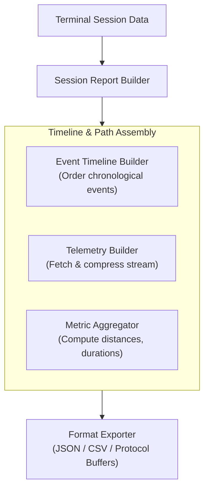
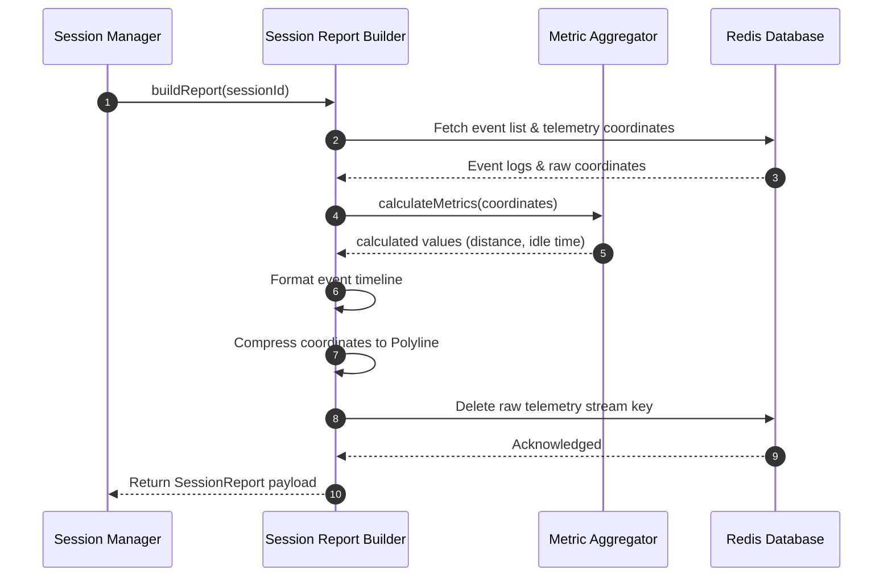

# 54 - Report Generation Internal Design

This document details the internal design, metric equations, and compilation pipeline used by the Session Report Generator to build post-session audit reports.

---

## Capabilities & Structure

The Session Report Generator compiles raw historical logs into a structured audit document once a session reaches a terminal state (`COMPLETED` or `CANCELLED`).



---

## Technical Specifications

### 1. Metric Aggregator Math
The `MetricAggregator` calculates operational performance metrics:

*   **Total Distance ($D_{\text{total}}$):**
    Calculated by summing spherical Haversine distances between sequential telemetry points $P_i$:
    $$D_{\text{total}} = \sum_{i=1}^{m-1} \text{Haversine}(P_i, P_{i+1})$$
    where:
    $$\text{Haversine}(P_1, P_2) = 2 R \arcsin\left(\sqrt{\sin^2\left(\frac{\Delta \phi}{2}\right) + \cos(\phi_1)\cos(\phi_2)\sin^2\left(\frac{\Delta \lambda}{2}\right)}\right)$$
    $\phi$ is latitude in radians, $\lambda$ is longitude in radians, and $R = 6371000 \text{ meters}$.

*   **Total Duration ($T_{\text{total}}$):**
    $$T_{\text{total}} = t_{\text{completed}} - t_{\text{started}}$$

*   **Fulfillment Duration ($T_{\text{fulfillment}}$):**
    $$T_{\text{fulfillment}} = t_{\text{completed}} - t_{\text{assigned}}$$

*   **Idle Duration ($T_{\text{idle}}$):**
    Accumulates time segments where vehicle speed fell below a configured threshold:
    $$T_{\text{idle}} = \sum (t_{j+1} - t_j) \quad \text{where } \text{speed}_j < 1.0 \text{ m/s}$$

*   **Average Speed ($V_{\text{avg}}$):**
    $$V_{\text{avg}} = \frac{D_{\text{total}}}{T_{\text{total}}}$$

### 2. Event Timeline Builder
*   **Action:** Merges system transitions and driver coordinates chronologically.
*   **Workflow:**
    1. Loads the session event stream from Redis: `motus:tenant:{tenantId}:session:{sessionId}:events`.
    2. Sorts events by timestamp.
    3. Formats entries into a structured timeline array:
       ```json
       {
         "timestamp": 1781222400000,
         "event": "session.assigned",
         "durationFromStartSeconds": 12,
         "metadata": { "driverId": "driver_123" }
       }
       ```

### 3. Telemetry Path Builder
*   **Action:** Fetches the session's coordinate history, applies Google Polyline compression, and cleans up the raw Redis stream.
*   **Workflow:**
    1. Reads coordinates from the Redis Stream: `motus:tenant:{tenantId}:session:{sessionId}:telemetry`.
    2. Runs the coordinates through Google Polyline encoding.
    3. Includes the compressed polyline string in the final report payload.
    4. Deletes the raw telemetry stream from Redis to reclaim memory.

### 4. Export Formats
*   **JSON Format (Default):** Standard nested structure containing metrics, timeline, and the compressed polyline. Used for REST responses and domain events.
*   **CSV Format:** Flat representation of metrics and the timeline. Used for bulk analytical reports.

---

## Sequence Diagram (Report Compiling Flow)



---

## Failure Scenarios

*   **Outage During Completion Cleanup:** If the server node crashes after saving the report but before deleting the raw telemetry stream, a temporary leak occurs. This is mitigated by the 24-hour TTL on the telemetry stream key, which guarantees eventual deletion by Redis.
*   **Report Generation for Cancelled Sessions:** Sessions cancelled before a driver is assigned will have zero coordinates. The Report Builder handles this by skipping distance/ETA metrics and generating a report with zeroed values.
