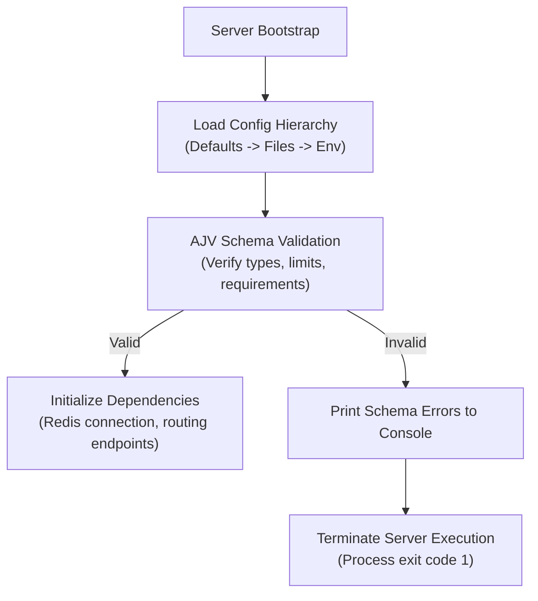

# 55 - Configuration Design

This document details the configuration interfaces, validation rules, default values, and precedence hierarchy used across all Motus packages.

---

## Configuration Precedence Hierarchy

To allow flexible deployment configurations, Motus evaluates configuration parameters in a strict hierarchical order of precedence:

```
Defaults (Built-in constants)
  └── → Configuration Files (config.json / config.yaml)
        └── → Environment Variables (process.env)
              └── → Runtime Overrides (Tenant-specific database values)
```

1. **Defaults:** Fallback hardcoded values defined within `@motus/core`.
2. **Configuration Files:** Static configuration files loaded during initialization if present.
3. **Environment Variables:** Used for container orchestration (e.g. Kubernetes configmaps and secrets).
4. **Runtime Overrides:** Dynamic, tenant-specific parameters loaded from the database (e.g. custom matching strategies, search radius limits, retry policies).

---

## Configuration Schema & Default Values

### 1. Server Configuration (`@motus/server`)
Exposed via environment variables:
*   `PORT` (number): HTTP server port. Default: `3000`.
*   `HOST` (string): HTTP bind interface. Default: `0.0.0.0`.
*   `JWT_SECRET` (string): Signature key for validation. Required.
*   `LOG_LEVEL` (string): Console logging levels (`debug`, `info`, `warn`, `error`). Default: `info`.

### 2. Redis Configuration (`@motus/redis`)
Manages connection pooling and clustering:
*   `REDIS_NODES` (array/string): Comma-separated list of redis host:port nodes. Default: `127.0.0.1:6379`.
*   `REDIS_PASSWORD` (string): Password authentication. Default: `none`.
*   `REDIS_CLUSTER_MODE` (boolean): Enables cluster sharding routing. Default: `false`.
*   `REDIS_MAX_CONNECTIONS` (number): Max pool connection limit. Default: `50`.

### 3. Socket Gateway Configuration (`@motus/socketio`)
*   `SOCKET_PATH` (string): Ingress route pathway. Default: `/socket.io`.
*   `PING_INTERVAL` (number): Client heartbeat ping delay in milliseconds. Default: `10000` (10s).
*   `PING_TIMEOUT` (number): Socket connection drop timeout in milliseconds. Default: `20000` (20s).

### 4. Telemetry Configuration (`@motus/core` / telemetry)
*   `TELEMETRY_SAMPLE_DISTANCE_METERS` (number): Distance delta threshold. Default: `25`.
*   `TELEMETRY_SAMPLE_INTERVAL_SECONDS` (number): Time delta threshold. Default: `10`.
*   `TELEMETRY_STREAM_TTL_SECONDS` (number): Telemetry stream retention. Default: `86400` (24h).

### 5. Matching & Fanout Defaults
*   `MATCHING_DEFAULT_STRATEGY` (string): Sorting logic selection (`distance` or `eta`). Default: `distance`.
*   `MATCHING_INITIAL_RADIUS_METERS` (number): Initial search radius. Default: `5000` (5km).
*   `MATCHING_MAX_RADIUS_METERS` (number): Maximum radius limit. Default: `15000` (15km).
*   `FANOUT_WAVE_SIZE` (number): Candidate notification count per wave. Default: `3`.
*   `FANOUT_WAVE_TIMEOUT_SECONDS` (number): Offer expiration timer. Default: `8`.

---

## Validation Lifecycle & Startup Behavior

Configuration validation is executed during the server bootstrap phase:



1. **Bootstrap Load:** The server reads environment variables and parses files using dotenv and yaml loaders.
2. **Schema Validation:** The merged object is validated against an AJV schema registry.
3. **Fail-Fast Policy:** If any required fields are missing or configuration values are outside valid ranges (e.g. `FANOUT_WAVE_SIZE < 1`), the bootstrap phase throws a validation error, logs the schema path discrepancy, and terminates the process with exit code `1`.

---

## Failure Scenarios

*   **Invalid Configuration Supplied to Container:** If Kubernetes deploys a pod with an invalid variable, the validation schema catches it immediately, causing the pod to fail-fast. This prevents the container from entering a crash loop that is hard to diagnose.
*   **Stale Runtime Configuration Overrides:** If a tenant configuration format is updated but a client continues to send old parameters, the database parser filters out unknown overrides and falls back to default values.
